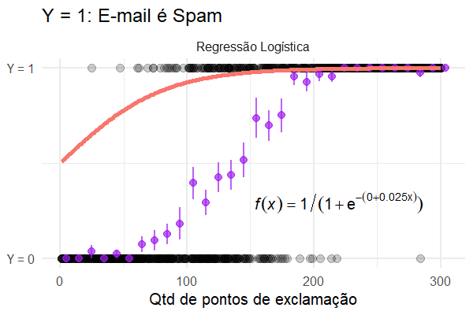
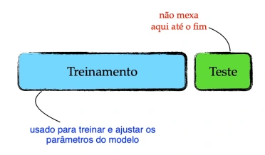
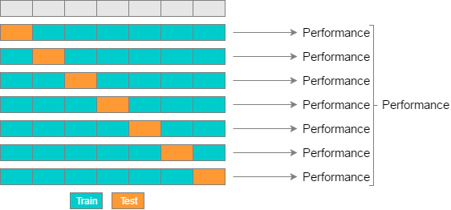
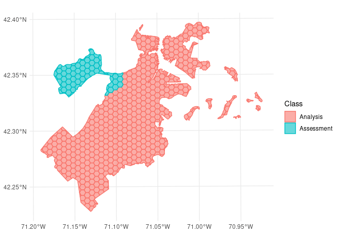
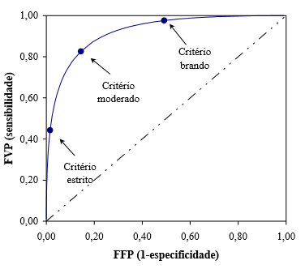
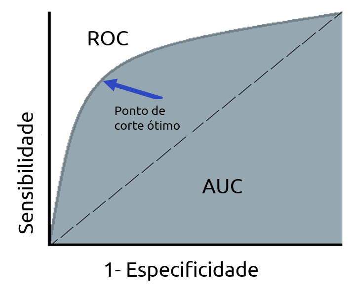
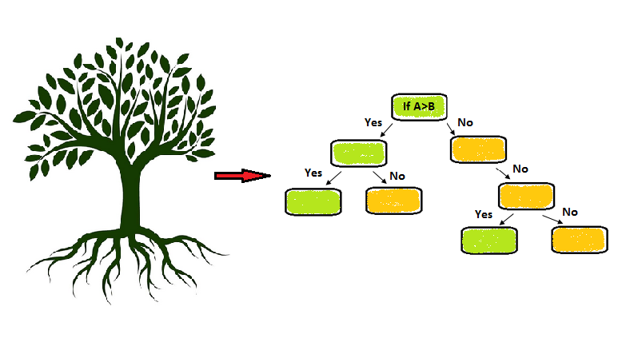
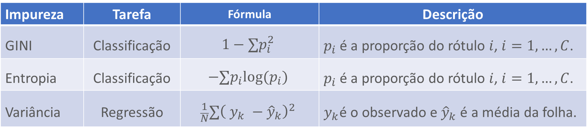
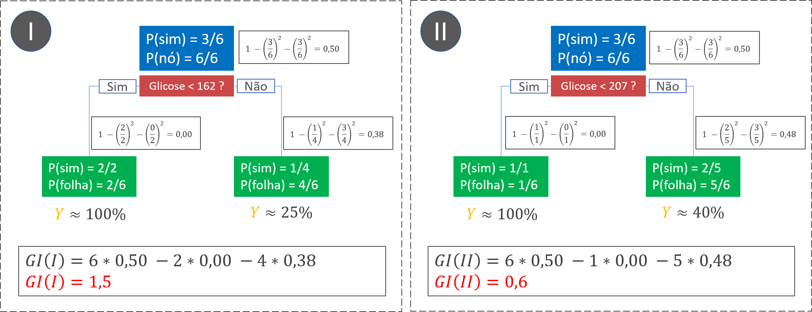
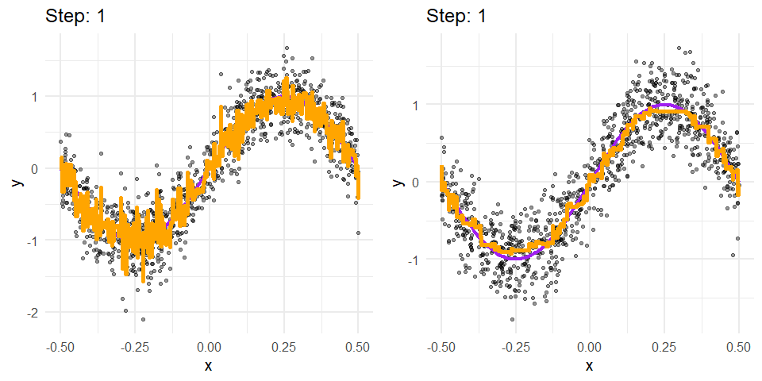

class: inverse, center, middle

background-image: url(img/logo.png)
background-position: 50% 15%
background-size: 30%

# <br><br> Machine Learning

### Workshop Ciência de Dados 
### OOBr + Constat

---

```{r setup, include=FALSE}
options(htmltools.dir.version = FALSE)

knitr::opts_chunk$set(
  fig.width=9, fig.height=3.5, fig.retina=3,
  out.width = "100%",
  cache = FALSE,
  echo = FALSE,
  message = FALSE, 
  warning = FALSE,
  hiline = TRUE
)
```

```{r xaringan-themer, include=FALSE, warning=FALSE}
library(xaringanthemer)
style_mono_accent(
  base_color = "#0A1E3C",
  code_highlight_color = "#00FFFF",
  text_bold_color = "#32A0FF",
  link_color = "#FAC80F",
  text_font_google = google_font("Lato", "300", "300i"),
  header_font_google = google_font("Ubuntu")
)
library(ggplot2)
library(magrittr)
library(knitr)
library(tidyverse)
library(ISLR)
library(kableExtra)
library(rpart)
library(dplyr)
adv <- read_csv("static/data/Advertising.csv") %>%
  rename(vendas = sales)
```

### Sobre nós
.pull-left[

<br><br><br>Contato:
`r fontawesome::fa("envelope", fill = "#0A1E3C")` <a href="mailto:elias.junior_@outlook.com">elias.junior_@outlook.com</a>
`r fontawesome::fa("github", fill = "#0A1E3C")` <a href="http://github.com/eliasrribeiro">@eliasrribeiro</a>
]

.pull-right[

<br><br><br>Contato:

`r fontawesome::fa("envelope", fill = "#0A1E3C")` <a href="mailto:samuel.martins7@hotmail.com">samuel.martins7@hotmail.com</a>

`r fontawesome::fa("github", fill = "#0A1E3C")` <a href="http://github.com/SammyMar">@SammyMar</a>


]

---
class: middle

### Sobre o OOBr

.pull-left[
- Plataforma interativa de **monitoramento**, **análises de dados públicos** (da saúde, socioeconômicos e ambientais) cientificamente embasadas e **disseminação de informações** relevantes na área da saúde materno-infantil. 

- Ser referência de informações acessíveis e confiáveis sobre saúde materno-infantil e ser um suporte importante para a tomada de decisões na área.

- Equipe multidisciplinar da UFES, USP e FACENS.

- Financiado pela Fundação Bill & Melinda Gates, CNPq e FAPES.
]

.pull-right[
```{r echo=FALSE, fig.align='center'}

```
]

---
class: middle

.pull-left[
### Painéis OOBr
```{r echo=FALSE, fig.align='center'}

```
]

.pull-right[
### Livro e tutoriais OOBr
```{r echo=FALSE, fig.align='center'}

```
]

.center[
#### `r fontawesome::fa("link", fill = "#0A1E3C")` [https://observatorioobstetricobr.org](https://observatorioobstetricobr.org)
]
---
class: inverse, middle

### Materiais de Referência

.pull-left[
<a href = "https://web.stanford.edu/~hastie/ISLRv2_website.pdf">
</img>
</a>
]

.pull-right[
<a href = "https://loja.curso-r.com/introduc-o-ao-machine-learning.html">
</img>
</a>
]

---
class: inverse, middle

## Machine Learning

---
class: middle

### Ciência de Dados

```{r echo=FALSE, fig.align='center', out.width = "60%"}
knitr::include_graphics("img/Unicórnios-em-Data-Science (FONTE Ricardo Cappra e Gabriel Lages).png")
```

Fonte : Ricardo Cappa e Gabriel Lages

---
class: middle

```{r echo=FALSE, fig.align='center', out.width = "70%"}
knitr::include_graphics("img/cliclo_dados.png")
```

Fonte : Ciência de Dados na Educação Pública

---
class: middle

### O que é Machine Learning ?

- Criado em 1959, por Arthur Samuel

- Aprendizado de Máquina

- Conjunto de técnicas e estratégias para análise de dados que visa gerar estimativas mais precisas para uma quantidade ou fenômeno (Max Kuhn, 2014)

---
class: middle

```{r echo=FALSE, fig.align='center', out.width = "90%"}

```

Fonte : Ironhack Blog
---

class: middle

### Exemplos de aplicação

- Streamings (Netflix, Spotify, etc)

- Bancos (Fraude, Crédito, etc)

- Diagnóstico por pixels em uma imagem

- Carro autônomo

- Pesquisas 

---
class: inverse, middle

### Aprendizado Não Supervisionado vs Aprendizado Supervisionado

---
class: middle


.pull-left[
### Supervisionado
- Metodos de Classificação e Regressão;

- O $\textit{Dataset }$ é separado em treino e teste, onde o é feito o treinamento na base treino para posteriormente serem feitos os testes de predição e avaliação da qualidade do ajuste na base teste.

]
.pull-right[
### Não Supervisionado
- Não ocorre o treinamento pela ausência da variável $\textit{target}$;

- Busca de padrões ou grupos com características em comum.
]
.center[
#### Qual abordagem usar então?
]

---
class: middle
### Modelos não Supervisionados

- Clusterização ou Agrupamentos:

 - Métodos hierárquicos;
 - Métodos por particionamento.


.pull-left[


]
.pull-right[


]
---
class: middle

###  Agrupamentos

Partimos do pressuposto que existem grupos ou clusters, com base em critérios ou características, que dão origem ao conjunto de dados.
Podemos separar em três principais métodos de separação desses clusters:

- Métodos Hierárquicos:
  - Baseado na distância dos pontos entre si.

- Métodos por Particionamentos:
  - Baseado na distância entre os pontos e os centróides


---
class: middle

### Agrupamento hierárquico
.center[
Agrupa os dados em grupos baseando-se na distância entre os pontos (Euclidiana por exemplo), até que observações mais próximas estejam alocadas em seus respectivos grupos.  
Inicialmente como entrada para algoritmos de agrupamento hierárquico, é realizada uma matriz de distâncias, ou dissimilaridade, com base na métrica de distância escolhida.   
]
.center[
  .pull-left[
  
  ]
  .pull-right[
  
  ]
]

---
class: middle
### Agrupamento hierárquico
Há duas abordagens para os agrupamentos hierárquicos, sendo elas: aglomerativa e divisiva. Sendo a aglomerativa mais difundida em virtude de seu custo computacional inferior. Os seguintes são métodos de abordagem aglomerativa: 
 
 - Método dos vizinhos mais próximos;
 
 - Método dos vizinhos mais distantes;
 
 - Método da média das distâncias;
 
 - Método do centróide;
 
 - Método de Ward.

---
class: middle
### Dendrograma

.pull-left[De forma a facilitar a visualização da alocação dos dados em grupos faremos um dendrograma. Que nada mais é que um mapeamento de quais pontos estão mais próximos e quais não estão. Seguimos os seguintes passos:
- Calcule as distâncias entre os pontos;

- Una os pontos mais próximos;

- Finalize quando todos os elementos estão contemplados e pertencem a algum grau de agrupamento.]
.pull-right[


]

---
class: middle
### Dendrograma
Podemos usar como ponto de corte para número de clusters quando o 'salto' de uma coluna para outra nas colunas de distâncias é relativamente alto.
.center[
  .pull-left[
```{r echo=FALSE, fig.height=9}
library(tidyverse)
distance_matrix <- iris[,-5] %>% 
  dist()
hclust(distance_matrix) %>% plot()
rect.hclust(hclust(distance_matrix), k = 3)
```
 ]
 .pull-right[
```{r echo=FALSE, fig.height=9}
distance_matrix <- iris[,-5] %>% 
  dist()
hclust(distance_matrix)$height[140:150] %>% barplot() 

```
 ]
]

---
class: middle
#### O que deu errado?
Possíveis fontes de variação:
- Métrica de distância;
- Regra de cálculo de distância entre dois grupos de pontos.
É indicado testar diferentes interações para cada um dos parâmetros para visualizar como essas diferentes formas interferem nos resultados obtidos, como o parâmetro 'method'.

Se trocarmos a distância para distância de Manhattan:

```{r echo=FALSE, fig.height=8, collapse=TRUE, figures-side2, fig.show="hold", out.width="50%"}
distance_matrix_m <- iris[,-5] %>% 
  dist(method = 'manhattan') #manhattan
hclust(distance_matrix_m) %>% plot()
hclust(distance_matrix_m)$height[140:150] %>% barplot() 
```

---
class: middle

###  Métodos por Particionamento (K-means)

K-means ou K-médias, são modelos que se baseiam na presença de centróides, repartindo o conjunto de dados em grupos, onde cada observação é agregada no cluster com centróide mais próximo.
Os centróides são alocados de forma a minimizar a soma dos quadrados das distâncias entre os pontos e seus respectivos centros. Formalmente:

Dado $\textbf{X} = (x_1,x_2,...,x_n)$, onde cada $x_i$ é um vetor d-dimensional, e $k$ equivalente ao número de grupos, sendo $\textbf{S} = \{S_1,S_2,...,S_k\}$ cada um desses grupos, queremos:

$$\underset{S}{\textrm{arg min}}\sum^k_{i=1}\sum_{x \in  S_i} || x -\mu_i||^2$$


```{r echo=FALSE, fig.height=5, collapse=TRUE, figures-side, fig.show="hold", out.width="50%"}

library(tidymodels)
library(ggplot2)
set.seed(1231)
iris %>% 
  select(-Species) %>% 
  kmeans(center = 3) %>% 
  augment(iris) %>% 
  ggplot(
  aes(Petal.Length,
      Petal.Width,
      color = .cluster)) + 
  geom_point()
iris %>% 
  ggplot(
  aes(Petal.Length,
      Petal.Width,
      color = Species)) + 
  geom_point()
    
```


---
class: middle
### K-means
E se usarmos outro tipo de dados? qual seria o resultado? Testaremos com um conjunto de dados gerado no R.

.pull-left[
```{r echo=FALSE, fig.height=8}
set.seed(1234)
dados_circulo <- tibble(
  X = runif(2000, -1, 1),
  Y = runif(2000, -1, 1)
) |>
  filter(X^2 + Y^2 <= 0.2 | (X^2 + Y^2 <= 0.8 & X^2 + Y^2 >= 0.6))

qplot(dados_circulo$X, dados_circulo$Y)
```
]
.

---
class: middle
### K-means
E se usarmos outro tipo de dados? qual seria o resultado? Testaremos com um conjunto de dados gerado no R.

.pull-left[
```{r echo=FALSE, fig.height=8}
set.seed(1234)
dados_circulo <- tibble(
  X = runif(2000, -1, 1),
  Y = runif(2000, -1, 1)
) |>
  filter(X^2 + Y^2 <= 0.2 | (X^2 + Y^2 <= 0.8 & X^2 + Y^2 >= 0.6))

qplot(dados_circulo$X, dados_circulo$Y)
```
]
.pull-right[
```{r echo=FALSE, fig.height=8}
dados_com_clusters_k <- dados_circulo |>
  mutate(
    .cluster = factor(kmeans(dados_circulo, centers = 2)$cluster)
  )
centroides <- kmeans(dados_circulo,2)$centers
dados_com_clusters_k |>
  ggplot(aes(x = X, y = Y, color = .cluster)) +
  geom_point() + 
   geom_point(aes(x = centroides[1,1], y = centroides[1,2]), color = "red", size = 5)+
   geom_point(aes(x = centroides[2,1], y = centroides[2,2]), color = "red", size = 5)


```

]

---
class: middle
####  o que deu errado?
O k-means se baseia na distância dos pontos para com os centróides, logo, tipos de grupos como esses ele possui dificuldades para classificação, o melhor método no caso seria utilizar o modelo de classificação hierárquico. Veja como fica:
.pull-left[
```{r echo=FALSE, fig.height=8}
set.seed(1234)
dados_circulo <- tibble(
  X = runif(2000, -1, 1),
  Y = runif(2000, -1, 1)
) |>
  filter(X^2 + Y^2 <= 0.2 | (X^2 + Y^2 <= 0.8 & X^2 + Y^2 >= 0.6))

qplot(dados_circulo$X, dados_circulo$Y)
```
]
.pull-right[
```{r echo=FALSE, fig.height=8}

modelo_cluster_h <- factoextra::hcut(dados_circulo, k = 2, hc_method = "single")


dados_com_clusters_h <- dados_circulo |>
  mutate(
    .cluster = factor(modelo_cluster_h$cluster)
  )

dados_com_clusters_h |>
  ggplot(aes(x = X, y = Y, color = .cluster)) +
  geom_point()
```

]
---
class: inverse, middle


# Aplicação dos Métodos de Agrupamento

---
class: middle
### Objetivo
 Realizar análise de agrupamento dos municípios brasileiros com relação aos indicadores obstétricos (Ex: Porcentagem de Prematuridade, Porcentagem de Cesárea, etc.), avaliando os melhores indicadores para os agrupamentos e identificar os municípios que apresentam os piores e melhores índices.
 
O exemplo em questão se trata do trabalho de conclusão de curso da aluna Mariana Machado, a qual fez parte do OObr. 

Os dados foram obtidos pela Plataforma de Ciência de Dados aplicada à Saúde (PCDaS) da Fundação Oswaldo Cruz (Fiocruz) do banco de dados SINASC do ano de 2019.

No âmbito desse exemplo, utilizaremos apenas os métodos trabalhados no primeiro dia da oficina, e não todos os aplicados no trabalho fonte. Para visualização de todos os métodos, o trabalho se encontra disponível no site do OObr.
[(link)](https://observatorioobstetricobr.org/publicacoes/trabalho-aprendizado-estatistico-nao-supervisionado-aplicado-aos-indicadores-obstetricos-dos-municipios-do-brasil/)
---
class:  middle

### Métodos Utilizados

Agrupamentos por Particionamento:
 
 - K-médias (K-means)

Agrupamentos Hierárquicos:

 - Média das Distâncias
 
 - Centróide
 
 - Vizinho Mais Distante
 
 - Vizinho Mais Próximo
 
 - Ward 

---
class: middle
### Indicadores

Antes de realmente falarmos dos indicadores, temos que entender o conceito por trás deles:

 - Prematuridade: Parto com idade gestacional inferior a 37 semanas.
 
 - Gestação Múltipla: Gestação de dois ou mais fetos simultâneos.
 
 - Parto Cesárea: Parto onde extração do feto é por intervenção cirúrgica.
 
 - Consulta de Pré-Natal: Acompanhamento médico durante a gravidez. Ideal de 7 consultas durante o período pré-natal
 
 - Apgar: Escala proposta pela médica Virgínia Apgar que atribui pontuação a 5 sinais do recém-nascido (Frequência cardíaca, respiração, tônus muscular, irritabilidade reflexa e cor da pele). A escala varia de 0 a 10. Sendo feita no primeiro minuto após o nascimento (Apgar do primeiro minuto) e 5 minutos após(Apgar do quinto minuto).
 
 - Anomalia congênita: Alterações estruturais ou funcionais geradas na vida intrauterina.

---
class: middle
### Indicadores
Os indicadores são obtidos por percentual válido, de forma a desconsiderar os dados faltantes. Sendo eles:
 - Percentual válido de prematuridade
 
 - Percentual válido de gestações múltiplas
 
 - Percentual válido de partos cesáreas
 
 - Percentual válido de nascidos com nenhuma consulta pré-natal
 
 - Percentual válido de nascidos com 7 ou mais consultas de pré-natal
 
 - Percentual válido de Apgar do 1º minuto menor que 7
 
 - Percentual válido de Apgar do 5º minuto menor que 7
 
 - Percentual válido de nascidos com anomalia congênita
 
 - Percentual válido de nascidos com peso menor que 2500 gramas
 
 - Percentual válido de nascidos do sexo feminino
 
---
class: middle
### Dados
.center[

]

---
class: middle, inverse

#Agrupamentos

---
class: middle

## Particionamento
.center[


]
---
class: middle
### Hierárquicos
.center[


]
---
class: inverse, middle
#Avaliação dos Métodos

---
class: middle
### Métricas
Como não há conhecimento prévio sobre a real divisão dos dados, as métricas de avaliação para o modelo consideram apenas as variáveis disponíveis nos dados. As utilizadas no estudo foram:
 
 - Davies-Bouldin (DB): Ideia geral fornecer a média da similaridade entre cada grupo e seu grupo mais similar dentre os clusters obtidos. Calculando a distância média de suas observações a um valore referencial, podendo ser um medóide ou centróide. (Menor)
 
 - Dunn (D): Razão entre a separação dos grupos e a variância dentro deles. (Maior)
 
 - Silhueta (S): Considera a distância de cada ponto às observações do mesmo grupo e aos demais clusters formados. (Maior)
 
 - Calinski-Harabasz (CH): Considera a variância intragrupo de cada cluster gerado considerando a distância quadrática de cada observação ao seu valor referência, podendo esse valor ser um centróide ou medóide.(Maior)

---
Class: middle
### Particionamento


---
class: middle
### Hierárquico
.center[

]

---
class: inverse, middle
#Resultados

---
class: middle
### Resultados
.center[]
---
class: middle
### Resultados
.center[]
---
class: middle
### Resultados
Após todo o agrupamento das variáveis foi realizada uma árvore de decisão para análise de variáveis mais significativas para o modelo.
.center[

]
---
class: middle
### Resultados
.center[]
---
class: middle
### Resultados
.center[]

---
class: inverse,middle

## Aprendizado Supervisionado

---
class: middle
.pull-left[

### Regressão

- Quantidade de Vendas
- Porcentagem 
- Preço
- Peso

]
.pul-right[

### Classificação

- Bom pagador/não é bom pagador
- Diagnóstico de alguma doença/sem doença
- Pixels em imagem é cancerígeno/não é cancerígeno
- Sentimento bom/sentimento ruim

]

---
class: middle
### Aprendizado Supervisionado

Em tese, queremos encontrar uma função $f()$ de forma que $y\approx f(x)$. Exemplos :

- ___Exemplo 1___: Queremos prever a quantidade de vendas de um produto X baseado em qual mídia ele foi divulgado e qual foi o investimento sobre o mesmo.

- ___Exemplo 2___: Queremos classificar se uma pessoa vai ou não atrasar uma parcela baseado no tipo de contrato que ela fez e o valor da parcela do financiamento.

Nos exemplos:

$vendas = f(midia, investimento)$

$inadimplência = f(valor da parcela, tipo de contrato)$

Fonte: Exemplos obtidos no material do Curso-R.
---
class: middle

### Modelo de regressão linear 

$f(x) = \beta_0 + \beta_1 x_1 + \beta_2x_2$


.footnote[

Fonte: [https://alykhantejani.github.io/images/gradient_descent_line_graph.gif](https://alykhantejani.github.io/images/gradient_descent_line_graph.gif)

]

---
class: middle

### Modelo de Regressão Logística 

$log\left(\frac{p}{1-p}\right) = \beta_0 + \beta_1x_1 + \beta_2x_2$



Fonte: Material Curso-R
---
class: middle

### Desempenho vs Interpretabilidade 

```{r, fig.width=11, fig.height=7, out.width=600}
library(ggrepel)
set.seed(1)
tribble(
  ~modelo, ~`Desempenho`, ~Interpretabilidade,
  "Regressão Linear", 0, 3,
  "Regressão Logística", 0, 3, 
  "Árvore de Decisão", 1, 2.2,
  "Generalized Additive Models", 1.5, 1.5,
  "Redes Neurais, Deep Learning", 3, 1,
  "Bagging, Boosting", 3.2, 0.8,
  "SVM", 2.6, 0.5
) %>%
  ggplot(aes(x = `Desempenho`, y = Interpretabilidade)) +
  geom_text_repel(aes(label = modelo), size = 7) +
  theme_minimal(24) +
  scale_x_continuous(breaks = c(0, 3.2), labels = c("Baixo", "Alto")) +
  scale_y_continuous(breaks = c(0, 3.5), labels = c("Baixo", "Alto"))
```

Fonte: Material Curso-R
---
class: inverse,middle

## Conceitos

---
class: middle

### Pré-processamento dos dados

- Transformações não lineares nas variáveis preditoras (log, raiz quadrada, BoxCox)

- Tranformação em variáveis Dummy (para variáveis categóricas)

- Reamostragens 

- Interações entre variáveis

- Normalização em variáveis numéricas

---
class: middle

### Treino e Teste

```{r echo=FALSE, fig.align='center', out.width = "40%"}

```

Fonte da imagem: MAp
---
class: middle

### Overfitting (Sobreajuste)

- Regressão Polinomial com aumento do polinômio

$$f(x)=\beta_0+\beta_1x_i+\beta_2x_i^2+\cdots+\beta_9x_i^9 $$


Fonte: Material Curso-R

---
class: middle

### Hiperparâmetros

- Hiperparâmetros são parâmetros de modelos que devem ser definidos antes de treinar o modelo. 

- Usados para controlar o processo de aprendizado.

- Exemplos : **Random Forest**, **Redes Neurais**, **XGBoost**.

- __Grid Search__ é uma técnica usada para testar todas as combinações possíveis de hiperparâmetros. 

---
class: middle

### Regularização - LASSO

- Parâmetro regularizador para controlar a complexidade do modelo, evitando o sobreajuste.

- Função de Custo do modelo de regressão linear:

$$RMSE = \sqrt{\frac{1}{N}\sum(y_i - \hat{y_i})^2} = \sqrt{\frac{1}{N}\sum(y_i -  \color{red}{(\hat{\beta}_0 + \hat{\beta}_1x_{1i} + \dots + \hat{\beta}_px_{pi})})^2}$$
- Penalização do modelo de regressão linear:

$$RMSE_{regularizado} = RMSE + \color{red}{\lambda}\sum_{j = 1}^{p}|\beta_j|$$
- Função Custo do modelo de regressão logística: 

$$D = \frac{-1}{N}\sum[y_i \log\hat{y_i} + (1 - y_i )\log(1 - \hat{y_i})]$$
- Penalização do modelo de regressão logística:
$$D_{regularizado} = D + \color{red}{\lambda}\sum_{j = 1}^{p}|\beta_j|$$
---
class:middle

### Cross-validation (Validação Cruzada)

- Objetivo: encontrar o melhor conjunto de hiperparâmetros.

```{r echo=FALSE, fig.align='center', out.width = "70%"}

```

Fonte: ebc.cat
---
class: middle

.pull-left[

### Validação por tempo

```{r echo=FALSE, fig.align='center', out.width = "90%"}
knitr::include_graphics("img/cross_series.jpg")
```

- __modeltime.resample__
]
.pull-right[

### Validação por espaço
```{r echo=FALSE, fig.align='center', out.width = "90%"}

```

- __spacialsample__
]
---
class: middle

## Medidas para modelos de regressão

**Métrica** de erro: **R**oot **M**ean **S**quared **E**rror.

$$
RMSE = \sqrt{\frac{1}{N}\sum(y_i - \hat{y_i})^2}
$$

.pull-left[

MAE: Mean Absolute Error

$$
MAE = \frac{1}{N}\sum|y_i - \hat{y_i}|
$$

]

.pull-right[

R2: R-squared

$$
R^2 = 1 - \frac{\sum(y_i - \color{salmon}{\hat{y_i}})^2}{\sum(y_i - \color{royalblue}{\bar{y}})^2}
$$
]

---
class:middle

### Medidas para modelos de classificação

### Matriz de confusão

```{r echo=FALSE, fig.align='center', out.width = "70%"}
library(kableExtra)
tribble(
  ~Predito, ~`Negativo     `, ~`Positivo `,
  "Negativo",    "Verdadeiro Negativo (TN)", "Falso Negativo (FN)",
  "Positivo",    "Falso Positivo (FP)", "Verdadeiro Positivo (TP)"
) %>%
  kable() %>%
  kable_styling(c("bordered", "basic"), full_width = FALSE, font_size = 20) %>%
  add_header_above(c(" " = 1, "Observado" = 2), background = "white") %>%
  collapse_rows(columns = 1, valign = "top") %>%
  kableExtra::row_spec(0:2, background = "white", align = "center") %>%
  kableExtra::column_spec(1, "3in", bold = TRUE) %>%
  kableExtra::column_spec(2, "3in") %>%
  kableExtra::column_spec(3, "2in")
```

### Medidas de desempenho

$$
\begin{array}{lcc}
\mbox{acurácia}  & = & \frac{TP + TN}{TP + TN + FP + FN}\\\\
\mbox{precisão} & = & \frac{TP}{TP + FP}\\\\
\mbox{sensibilidade} &=& \frac{TP}{TP + FN}\\\\
\mbox{especificidade} &=& \frac{TN}{TN + FP}\\\\
\end{array}
$$
---
class: middle

### Curva ROC e AUC

.pull-left[

```{r echo=FALSE, fig.align='center', out.width = "90%"}

```

]

.pull-right[

```{r echo=FALSE, fig.align='center', out.width = "90%"}

```

]
---
class: inverse,middle

### Árvores de Decisão

---
class: middle

### Árvores de Decisão

```{r echo=FALSE, fig.align='center', out.width = "90%"}

```

---
class: middle

### Ganho de Informação (information gain)

$$
\mbox{GI} = N . Imp(nó) - N(esq) . Imp(esq) - N(dir) . Imp(dir)
$$

### Medidas de Impureza mais comuns

.center[

]

Fonte: Material Curso-R

---
class: middle

### Exemplo usando o GINI

.center[

]

Fonte: Material Curso-R
---
class: middle

### Hiperparâmetros

- Quantidade mínima de observações dentro de um nó.

- Profundidade

- Parâmetro mínimo de complexidade (ganho de informação)

---
class: inverse, middle

### XGBoost

---
class: middle

### XGBoost (Extreme Gradient Boosting)

- Generalização do Gradient Bosting

- Combinação de várias árvores de decisão construídas sequencialmente usando a informação da árvora passada

- Utiliza o algoritmo de descida de gradiente minimizando a função perda da árvore anterior

- Poderoso computacionalmente

- Variáveis categóricas precisam ser transformas em dummy

- Trata automaticamente valores faltantes e __multicolinearidade__
---
class: middle

### Hiperparâmetros

- Quantidade mínima de observações dentro de um nó

- Profundidade

- Quantidade de variáveis sorteadas por árvore

- Número de árvores

- Tamanho do passo

- Parâmetro Regularizador (semelhante ao parâmetro de complexidade)

- Proporção de linhas para sortear por árvore

---
class: middle

### XGBoost



Fonte: Material Curso-R
---
class: inverse, middle

### Aplicação modelo XGBoost

---
class: middle

### Predição de casos de COVID-19 em gestantes e puérperas

- SIVEP-Gripe

- Casos COVID-19 vs Não COVID-19.

- Classificar casos "não especificados".

- Dados filtrados e tratados.

- Análises estatísticas para decisão das variáveis junto com a Obstetrícia.

- __{TIDYMODELS}__

---
class: middle

No `r fontawesome::fa("r-project", fill = "#0A1E3C")`

```{r,echo=TRUE}
library(tidymodels)

data <- readRDS("data.rds")

table(data$classi_fin)
```

---
class: middle

### Bases treino e teste

```{r,echo=TRUE}
set.seed(123)

srag_split <- initial_split(
  data, 
  prob = 0.7
)

srag_train <- training(srag_split)

srag_test <- testing(srag_split)
```

---
class: middle

### Pré-Processamento

```{r,echo=TRUE}
#Recipes

xgb_rec <- recipe(classi_fin ~ ., data = srag_train) %>% 
  step_normalize(idade) %>%
  themis::step_smotenc(classi_fin,seed = 69) %>% 
  step_dummy(all_nominal(), -classi_fin)  
```

- Varios tipos de step - transformações (BoxCox,polinomial,raiz quadrada), inputação pela média, reamostragens, nivelar classes de uma variável, categorizar faltantes (NA) etc..

---
class: middle

### Pré-Processamento

```{css, echo=FALSE}
.scroll-100 {
  max-height: 200px;
  overflow-y: auto;
  background-color: inherit;
}
```

```{r,echo=TRUE, class.output="scroll-100"}
#Recipes

xgb_rec_data <- recipe(classi_fin ~ ., data = srag_train) %>% 
  step_normalize(idade) %>%
  themis::step_smotenc(classi_fin,seed = 69) %>% 
  step_dummy(all_nominal(), -classi_fin)  %>% 
  prep() %>% 
  bake(new_data=NULL)

table(xgb_rec_data$classi_fin)
```

---
class: middle

### Especificação

```{r,echo=TRUE}
xgb_spec <- boost_tree(
  trees = 1000,
  tree_depth = tune(), 
  min_n = tune(), 
  loss_reduction = tune(),                     
  sample_size = tune(), 
  mtry = tune(),         
  learn_rate = tune(),                         
) %>% 
  set_engine("xgboost") %>% 
  set_mode("classification")
```

---
class: middle

### Workflow

```{r,echo=TRUE}
xgb_wf <- workflow() %>%
  add_recipe(xgb_rec) %>%
  add_model(xgb_spec)
```

---
class: middle

.pull-left[

### Grid

```{r,echo=TRUE}
xgb_grid <- grid_max_entropy(
  tree_depth(),
  min_n(),
  loss_reduction(),
  sample_size = sample_prop(),
  finalize(mtry(), srag_train),
  learn_rate(),
  size = 30
)
```

- __grip_expand__ : você limita o espaço
]

.pull-right[

### Cross-Validation
```{r,echo=TRUE}
set.seed(456)

srag_folds <- vfold_cv(
  srag_train, 
  v = 10,
  repeats = 5
)  
```

]


---
class: middle

### Tunning 

```{r, echo=TRUE, eval=FALSE}
xgb_metrics <- metric_set(roc_auc, sensitivity, specificity, npv, ppv)

doParallel::registerDoParallel()

set.seed(1011)

xgb_res <- 
  xgb_wf %>% 
  tune_grid(
    resamples = srag_folds,
    grid = xgb_grid,
    metrics = xgb_metrics,
    control = control_grid(save_pred = TRUE)
  )
```

```{r,warning=FALSE}
xgb_res <- readRDS("tunning_smotenc_ML.rds")
```

---
class: middle

```{css, echo=FALSE}
pre {
  max-height: 300px;
  overflow-y: auto;
}

pre[class] {
  max-height: 100px;
}
```

### Melhores Hiperparâmetros

```{r,echo=TRUE}
# metrics

collect_metrics(xgb_res)
```


---
class: middle

### Melhores Hiperparâmetros

```{r,echo=TRUE}
# best hyperparameters

show_best(xgb_res, "roc_auc")

```

---
class: middle

### Melhores Hiperparâmetros

```{r,echo=TRUE}
# best auc

best_auc <- select_best(xgb_res, "roc_auc"); best_auc  
```

---
class: middle

### Finalização do Modelo

```{r,echo=TRUE}
# Best model --------------

final_xgb <- finalize_workflow(
  xgb_wf,
  best_auc
)

# Final fit model ---------

final_fit <- last_fit(
  final_xgb, 
  srag_split,
)

collect_metrics(final_fit)
```

---
class: middle

### Gráfico importância das variáveis 

```{r,echo=TRUE,warning=FALSE,message=FALSE}
library(vip)
### Gráfico de pontos
final_xgb %>%
  fit(data = srag_train) %>%
  pull_workflow_fit() %>%
  vip(geom = "point")
```
]

---
class: middle

### Gráfico importância das variáveis


```{r,echo=TRUE,warning=FALSE,message=FALSE}
final_fit %>%  
  pluck(".workflow",1) %>% 
  pull_workflow_fit() %>% 
  vip::vip(num_features=20)
```


---
class: middle

### Curva ROc


```{r, echo=TRUE, warning=FALSE,message=FALSE, out.width = "160%"}
final_fit %>% 
  collect_predictions() %>% 
  roc_curve(classi_fin,`.pred_covid-19`) %>% 
  autoplot()
```


---
class: middle

### Matriz de confusão

```{r,echo=TRUE,out.height="120%"}
conf_mat(
  data = final_fit$.predictions[[1]],
  truth = classi_fin,
  estimate = .pred_class
) %>% 
  autoplot(type = "heatmap")
```
---

class: middle

### Medidas de desempenho

.pull-left[
```{r,echo=TRUE,eval=FALSE}
library(gt)
preds <- final_fit %>% 
  collect_predictions() 

summary(conf_mat(preds, classi_fin, .pred_class)) %>%
  dplyr::select(-.estimator) %>%
  gt() %>% 
  fmt_number(columns = 2, decimals = 4)
```
]
.pull-right[
```{r,out.height="200%"}
library(gt)
preds <- final_fit %>% 
  collect_predictions() 

summary(conf_mat(preds, classi_fin, .pred_class)) %>%
  dplyr::select(-.estimator) %>%
  gt() %>% 
  fmt_number(columns = 2, decimals = 4)
```
]
---
class: middle

### Aplicação nos dados não especificados

```{r,echo=TRUE}
model <- final_xgb %>% fit(data)

saveRDS(model,"modelo_xgb.rds")

dados_nespecificado <- readRDS("dados_nespecificado.rds")

pred <- predict(model,dados_nespecificado)

dados_nespecificado$classi_fin_pred <- pred$.pred_class

table(dados_nespecificado$classi_fin_pred)
```

---
class: middle

### New Treshold

```{r,echo=TRUE}
library(probably)

thresholds <- preds %>%
  threshold_perf(classi_fin, `.pred_covid-19`, thresholds = seq(0, 1, by = 0.0025))

best_thresh <- thresholds %>%
  filter(.metric == "j_index") %>%
  filter(.estimate == max(.estimate)) %>%
  pull(.threshold) %>%
  max()

classes <- levels(preds$.pred_class)

preds_new <- preds %>%
  mutate(.new_pred_class = as.factor(ifelse(`.pred_covid-19` >= best_thresh,classes[1],classes[2]),
                                  levels = c("covid-19", "não-covid")))


final_fit$.predictions[[1]]$`.new_pred_class` = preds_new$.new_pred_class
```

---
class:middle

### Nova matriz de confusão

```{r}
conf_mat(
  data = final_fit$.predictions[[1]],
  truth = classi_fin,
  estimate = .new_pred_class
) %>%
  autoplot(type = "heatmap")

```


---
class:middle

####  Comparação dos dois

```{r}
# Comparing models -------

summary(conf_mat(preds, classi_fin, .pred_class)) %>%
  dplyr::select(-.estimator) %>%
  rename(old_threshold = .estimate) %>%
  bind_cols(.,
            summary(conf_mat(preds_new, classi_fin, .new_pred_class)) %>%
              dplyr::select(.estimate) %>%
              rename(new_threshold = .estimate)) %>%
  gt() %>%
  fmt_number(columns = c(2, 3),
             decimals = 4)
```


---
class: inverse, middle

.center[
## <br>Obrigado!
]

.pull-left[
```{r echo=FALSE, fig.align='center', fig.cap='Foto: OOBr no Instituto Butantan.'}

```
]

.pull-right[
<br><br>OOBr na web:

`r fontawesome::fa("envelope", fill = "white")` <a href="mailto:observatorioobstetricobr@gmail.com">observatorioobstetricobr@gmail.com</a>

`r fontawesome::fa("twitter", fill = "white")` [@observatorioobr](https://twitter.com/observatorioobr)

`r fontawesome::fa("instagram", fill = "white")` [@observatorioobr](https://instagram/observatorioobr) 
]