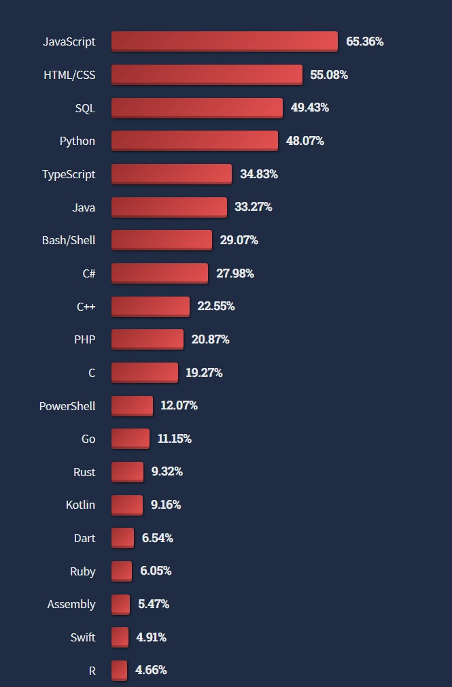
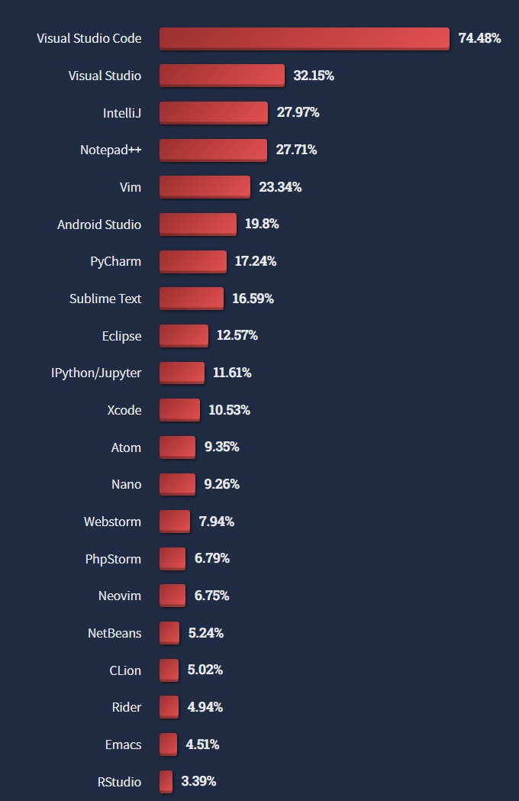
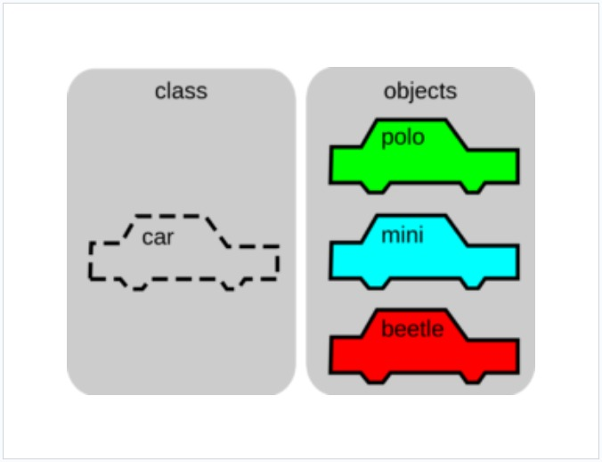
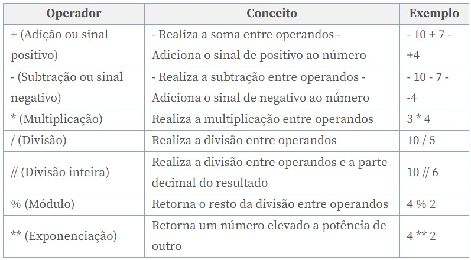
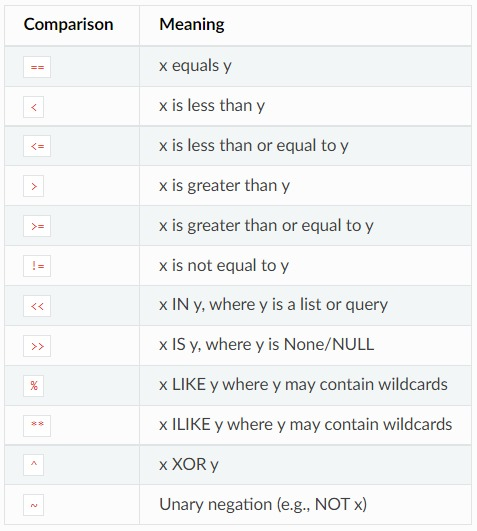
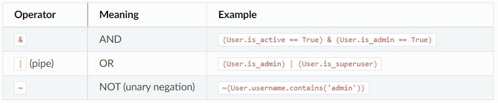
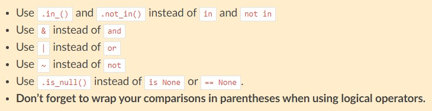

class: inverse, center, middle

background-image: url(img/logo.png)
background-position: 50% 15%
background-size: 30%

# <br><br>Python em R

### Workshop Ciência de Dados 
### OOBr + Constat

---

```{r setup, include=FALSE}
options(htmltools.dir.version = FALSE)

knitr::opts_chunk$set(
  fig.width=9, fig.height=3.5, fig.retina=3,
  out.width = "100%",
  cache = FALSE,
  echo = TRUE,
  message = FALSE, 
  warning = FALSE,
  hiline = TRUE
)
```

```{r xaringan-themer, include=FALSE, warning=FALSE}
library(xaringanthemer)
style_mono_accent(
  base_color = "#0A1E3C",
  code_inline_color = "#41BE3C",
  text_bold_color = "#32A0FF",
  link_color = "#FAC80F",
  text_font_google = google_font("Lato", "300", "300i"),
  header_font_google = google_font("Ubuntu")
)
```

```{css, echo=FALSE}
pre {
  max-height: 300px;
  overflow-y: auto;
}

.remark-slide-number {
  bottom: 95%
}
```

```{cat, engine.opts=list(file = "zoom.html")}
# ZOOM nas imagem por click do mouse
<script src="https://lab.hakim.se/zoom-js/js/zoom.js" type="text/javascript"></script>
<script type="text/javascript">
	slideshow.on( "beforeHideSlide", function( slide ) {
		zoom.out();
	} );
	slideshow.on( "afterShowSlide", function( slide ) {
		document.querySelector( ".remark-visible" ).addEventListener( "click", function( event ) {
			event.preventDefault();
			zoom.to( {element: event.target} );
		} );
	} );
</script>
```


### Sobre mim

.pull-left[

]

.pull-right[
- Graduando em Estatística na Universidade Federal do Espírito Santo (UFES).

- Apaixonado por animes, mangás e cultura japonesa.

<br><br><br>Contato:

`r fontawesome::fa("envelope", fill = "#0A1E3C")` <a href="mailto:jose.c.soares@edu.ufes.br">jose.c.soares@edu.ufes.br</a>

<!-- `r fontawesome::fa("github", fill = "#0A1E3C")` <a href="http://github.com/ornscar">@ornscar</a> -->
]

---

### Sobre o OOBr

.pull-left[
- Plataforma interativa de monitoramento, análises de dados públicos (da saúde, socioeconômicos e ambientais) cientificamente embasadas e disseminação de informações relevantes na área da saúde materno-infantil. 

- Ser referência de informações acessíveis e confiáveis sobre saúde materno-infantil e ser um suporte importante para a tomada de decisões na área.

- Equipe multidisciplinar da UFES, USP e FACENS.

- Financiado pela Fundação Bill & Melinda Gates, CNPq e FAPES.
]

.pull-right[
```{r echo=FALSE, fig.align='center'}
knitr::include_graphics("img/logo2.png")
```
]

---

.pull-left[
### Painéis OOBr
```{r echo=FALSE, fig.align='center'}
knitr::include_graphics("img/paineis.png")
```
]

.pull-right[
### Livro e tutoriais OOBr
```{r echo=FALSE, fig.align='center'}
knitr::include_graphics("img/tutoriais.png")
```
]

.center[
#### `r fontawesome::fa("link", fill = "#0A1E3C")` [https://observatorioobstetricobr.org](https://observatorioobstetricobr.org)
]

---

### Cronograma

1. Python e R.

2. Ambientes de desenvolvimento.

3. Python no RStudio.

4. Conceitos básicos de programação em Python.

5. Manipulação de bases de dados: Python vs. R.

6. Python em R Markdown e visualização de dados com Seaborn

- Material foi inspirado no curso [Python para usuários de R](https://loja.curso-r.com/python-para-ciencia-de-dados-i.html) de autoria da Curso-R.

---
class: inverse, middle, center

## Python e R

---

### O que são?

- O R é uma linguagem de programação destinada à computação estatística.

- O Python é uma linguagem de propósito geral.

--

### Similaridades

- São ambas linguagens gratuitas e de código aberto.

- São linguagens de alto nível.

- São linguagens multiparadigma.

---

### As 20 linguagens mais populares em 2022

- Fonte: [Stack Overflow Annual Developer Survey](https://survey.stackoverflow.co/2022/#technology).

```{r echo=FALSE, fig.align='center', fig.cap='Figura 1: As 20 linguagens mais populares em 2022.', out.width="38%"}

```

---

### Exemplos de utilização do Python 

- Google - [Heavy usage of Python at Google](https://stackoverflow.com/questions/2560310/heavy-usage-of-python-at-google/2561008#2561008).

- Instagram - [Web Service Efficiency at Instagram with Python](https://instagram-engineering.com/web-service-efficiency-at-instagram-with-python-4976d078e366).

- Netflix - [Python at Netflix](https://netflixtechblog.com/python-at-netflix-86b6028b3b3e).

- Pinterest - [Python included](https://stackshare.io/pinterest/pinterest).

- Spotify - [How we use Python at Spotify](https://engineering.atspotify.com/2013/03/how-we-use-python-at-spotify/).

- Reddit - [Why Reddit uses Python](https://brainsik.net/2009/why-reddit-uses-python/).

- Dropbox - [How Python Powers Dropbox](https://www.pythonpeople.nl/how-python-powers-dropbox/).

---

### Exemplos de utilização do Python

- Fonte: ESO/José Francisco Salgado (josefrancisco.org), EHT Collaboration.

```{r echo=FALSE, fig.align='center', fig.cap='Figura 2: Atacama Large Millimeter/submillimeter Array (ALMA) observando a Via Láctea. Destacado na caixa, vemos a primeira imagem do buraco negro supermassivo que encontra-se no centro da Via Láctea, o qual foi produzido pelo time de pesquisa Event Horizon Telescope (EHT) Collaboration.', out.width="70%"}

```
---
class: inverse, middle, center
## IDE - Ambiente de Desenvolvimento Integrado
---

### O que é uma IDE?

> "O ambiente de desenvolvimento integrado (IDE do inglês Integrated Development Environment), é uma ferramenta de desenvolvimento para editar o código, acessar um terminal, executar um script , debugar e compilar usando um único ambiente".
>
> -- <cite>Alura, [O que é uma IDE?](https://www.alura.com.br/artigos/o-que-e-uma-ide#:~:text=O%20ambiente%20de%20desenvolvimento%20integrado,compilar%20usando%20um%20%C3%BAnico%20ambiente.)</cite>

- São usadas com a ideia de aumentar a produtividade do trabalho.

- São construídas tendo como base uma interface gráfica de usuário (GUI), com intuito de facilitar a comunicação entre usuário e máquina.
---

### 21 Ambientes de desenvolvimento populares 

- Fonte: [Stack Overflow Annual Developer Survey](https://survey.stackoverflow.co/2022/#most-popular-technologies-new-collab-tools).

```{r echo=FALSE, fig.align='center', fig.cap='Figura 3: Os 21 ambientes de desenvolvimento mais populares em 2022.', out.width="38%"}

```
---

### RStudio

- É uma IDE feita para a linguagem R.

- Maior parte dos usuários de R Utilizam o RStudio.

- Possui interface intuitiva para usuários iniciantes.

---
class: inverse, middle, center
## Python no RStudio
---
### Como posso instalar o R?

- Um tutorial de minha autoria foi realizado em formato de post no Blog do OOBr. O post é constituído não apenas do tutorial de instalação, ele também inclui dicas e links para direcionar o leitor no aprendizado da linguagem. O conteúdo encontra-se em [Iniciando na linguagem R](https://observatorioobstetricobr.org/livro-e-tutoriais/iniciando-r/).

--

### O que devo saber antes de instalar o Python?

- O Python pode ser instalado diretamente na máquina de diversas formas, mas embora o processo de instalação seja simples, fazer o Python rodar sem problemas pode não ser algo trivial.

--

- Usuários de Python constantemente enfrentam problemas de retrocompatibilidade devido ao rápido avanço da linguagem e mudança de versões.

--

- Programas podem subitamente pararem de funcionar caso não houver o devido cuidado com a(s) versão(ões) do Python e dos pacotes sendo utilizados.

--

- Tanto o R quanto o Python são linguagens multiplataforma.
---

### O que são ambientes virtuais?

- A grosso modo, ambientes são uma junção da(s) versão(ões) da linguagem em questão e dos pacotes utilizados.

--

- Um ambiente virtual nada mais é do que um espaço isolado que serve para controlar versões da linguagem e dos pacotes utilizados no programa ou projeto, evitando problemas de retrocompatibilidade.

--

### O que é Conda?

- O Conda é um gerenciador de pacotes, dependências e ambientes para diversas linguagens. É mais conhecido quando se trata de Python exatamente pelos problemas de versões que essa linguagem possui.

--

- O Anaconda é uma distribuição otimizada do Python que carrega o Conda completo e inclui diversos pacotes focados em ciência de dados. O Conda possui repositório próprio, sendo importante considerar essa informação ao procurar soluções para eventuais erros durante a utilização do Python.

--

- O Miniconda é uma versão leve que considera a instalação mínima do Conda e apenas pacotes básicos. 

---

### Reticulate

- É um pacote que permite conectar o R com o Python.

- Extremamente útil para times que usam ambas as linguagens.

- Possibilita o uso de funcionalidades que a princípio eram exclusivas à outra linguagem.

- Criar pacotes para o R que utilizam o Python passa ser uma possibilidade.

--

### Como instalar o Reticulate?

- A instalação é simples e pode ser feita como qualquer outro pacote do R.

```{r echo=TRUE, eval=FALSE,fig.align='center', fig.cap='Figura 3: Os 21 ambientes de desenvolvimento mais populares em 2022.', out.width="38%"}
# Basta rodar o codigo abaixo no console do RStudio
install.packages("reticulate")
```
---

### Como instalar o Python no RStudio?

- Iremos instalar o Miniconda, pois além de incluir o Python, também inclui a capacidade de instalação e gerenciamento de pacotes do Conda.

- Primeiro devemos carregar o pacote **reticulate** no console do RStudio. Caso for a primeira vez em que a instalação está sendo feita, ao tentar carregar o reticulate, o R irá perguntar se queremos instalar o Miniconda, basta seguir suas instruções.

```{r echo=TRUE, eval=FALSE,fig.align='center', fig.cap='Figura 3: Os 21 ambientes de desenvolvimento mais populares em 2022.', out.width="38%"}
# Carregue o reticulate
library("reticulate")
```

```{r echo=TRUE, eval=FALSE,fig.align='center', fig.cap='Figura 3: Os 21 ambientes de desenvolvimento mais populares em 2022.', out.width="38%"}
# Formas alternativas

## Instala o Miniconda manualmente
install_miniconda()

## Instala o Python que se encontra no sistema do usuário 
##(caso existir) e inicializa  no R
py_available(initialize = TRUE)
```
---

### Configurando um ambiente virtual

- Iremos utilizar o ambiente virtual padrão **r-reticulate** para evitar qualquer possível problema que possa ocorrer ao utilizar qualquer outro ambiente.

```{r echo=TRUE, eval=FALSE,fig.align='center', fig.cap='Figura 3: Os 21 ambientes de desenvolvimento mais populares em 2022.', out.width="38%"}
# Cria o ambiente virtual r-reticulate (rodar uma única vez)
conda_create("r-reticulte")

# Ativa o ambiente chamado r-reticulate (rodar a cada nova sessão)
use_condaenv("r-reticulte")

# Verifica as configurações do ambiente (versão do Python, pacotes, etc) 
py_discover_config()
```

---
class: inverse, middle, center

## Conceitos básicos de programação em Python

---

### O que são paradigmas de programação?

- São estruturas a se seguir ou formas de pensar em como o código será feito.

- Escolher um paradigma irá garantir a consistencia na metodologia durante todo o trabalho, e irá aumentar a produtividade.

- Embora o Python seja multiparadigma, a programação orientada a objetos é o paradigma dominante nessa linguagem.

--

### O que é programação orientada a objetos?

- O objeto é o foco.

- O objeto se encaixa em um "molde" chamado de classe.

- O objeto terá atributos comuns aos objetos da classe a qual pertence.

- Objetos de uma determinada classe possuem "abilidades" chamadas de métodos.

---

### Exemplo 1

- Fonte: [Alura - o que é programação orientada a objetos?](https://www.alura.com.br/artigos/poo-programacao-orientada-a-objetos).

```{r echo=FALSE, fig.align='center', fig.cap='Figura 4: Exemplificação do conceito de orientação a objetos.', out.width="50%"}

```
---

### Exemplo 2

#### Lógica orientada a objetos no Python 

```{python, eval=FALSE}
# carrega o modulo "arqueiro" 
import arqueiro 

# objeto: legolas arqueiro 
legolas = arqueiro.iniciar() 

# abilidade "chuva de flechas"
legolas.chuva_de_flechas() 
```

#### Lógica no R

```{r, eval=FALSE}
# Lógica no R

# carrega o pacote "arqueiro"
library("arqueiro")  

# função "chuva de flechas"
chuva_de_flechas() 
```
---

### Detalhes que devemos lembrar

- Um **módulo** é um pacote ou biblioteca que contém funcionalidades que podem ser importadas para a sessão do Python, similar aos pacotes do R. 

--

- Com **import** podemos carregar um módulo em nossa sessão do Python.

--

- Um **método** é uma função que mora dentro de um objeto, como se fosse uma abilidade que o objeto pode usar.

--

- O que o **.** faz é acessar todos os métodos disponíveis daquele objeto para que possamos escolher qual queremos utilizar.

--

- Utilizamos **=** para atribuir ou criar um objeto, similar ao **<-** utilizado no R.

--

- No Python precisamos deixar explícito o objeto ao utilizar um método.

--

- Também existem funções no Python, mas diferente dos métodos, elas são externas aos objetos. **help()** e **type()** são exemplos de funções.
---

### Objetos do tipo texto (String)

```{python, eval=TRUE}
# cria um objeto na classe string
objeto_texto = "Samurai-X9"
```

--

#### Alguns exemplos de métodos str
```{python, eval=TRUE}
objeto_texto.replace("-", " ") # substitui str1 por str2
```

--

```{python, eval=TRUE}
objeto_texto.upper() # deixa a string em forma maíuscula
```

--

```{python, eval=TRUE}
objeto_texto.count("a") # Quantidade de 'a' na string
```
---

#### Como obter a string "SAMURAI X" a partir de "Samurai-X9"?

--

```{python, eval=TRUE}
# forma 1
objeto_texto2  = objeto_texto.replace("-", " ")
objeto_texto3 = objeto_texto2.replace("9", "")
objeto_texto3.upper()
```

--

```{python, eval=TRUE}
# forma 2: Método chaining (encadeamento)
(objeto_texto.
    replace("-", " ").
    replace("9", "").
    upper())
```

---

### Objetos do tipo numérico (int, float, complex)

.pull-left[
```{python, eval=TRUE}
# cria um objeto do tipo inteiro
objeto_int = 2
# cria um objeto do tipo float
objeto_float = 2.5
# cria um objeto do tipo complexo
objeto_complex = (-2)**(1/2)
```

```{python, eval=TRUE}
# Exemplo 
letra = "aa"
letra.count("a") + objeto_int
```

```{python, eval=TRUE}
# Saida do objeto complexo
objeto_complex
```

]

.pull-right[
- Obs: O operador **+** pode ser usado tanto para soma quanto para concatenação. 

```{r echo=FALSE, fig.align='center', fig.cap='Tabela 1: Operadores matemáticos do Python.', out.width="50%"}

```
]
---

### Objetos do tipo lista

- Listas podem ser feitas ao utilizar **[]**, onde suporta objetos de tipos diferentes.

```{python, eval=TRUE}
# Exemplo
objeto_lista1 = ["Drag", 0]
objeto_lista2 = ["n Ball"]

## concatena as duas listas
DragonBall = objeto_lista1 + objeto_lista2
DragonBall
```

#### Selecionar objetos da lista

```{python, eval=TRUE}
DragonBall[0]
DragonBall[0:2]
```

---

#### Conceito IN PLACE

- É muito comum métodos que fazem alterações diretas no objeto assim que utilizado, o que significa que são métodos **IN PLACE**.

- Deve se ter o devido cuidado ao se utilizar tais métodos, principalmente ao trabalhar com base de dados.

- Quando o comando não retorna nenhuma resposta, é um sinal de que está ocorrendo alguma modificação IN PLACE no objeto em questão.

```{python, eval=TRUE}
## Exemplo
DragonBall
```

```{python, eval=TRUE}
## concatena a lista DragonBall com "Z"
DragonBall.append("Z")
DragonBall
```
---
class: inverse, middle, center

## Manipulação de bases de dados: Python vs. R

---

## Como obter o comportamento vetorial do R no Python?

- O R é extremamente versátil quando se trata de vetores, nos permitindo realizar vários tipos de operações entre eles elemento a elemento.

- Podemos obter um comportamento similar no Python ao combinar listas com o método array do módulo **Numpy**.

- Numpy é uma biblioteca com ferramentas de cálculo numérico. Possui funcionalidades focadas em matrizes multidimensionais, também chamadas de arrays.

- Mesmo que sejamos capaz de imitar esse comportamento vetorial dentro do Python, a característica de **reciclagem** que existe no R ainda fica em falta no Python.

---

### Exemplo

```{python, eval=TRUE}
# Carrega módulo numpy adotando o nome np
import numpy as np

## cria vetores a partir de listas
vetor1 = np.array([1, 2, 3])
vetor2 = np.array([4, 3, 2])
```

#### Aplicando operações

.pull-left[
```{python, eval=TRUE}
vetor1 + vetor2
vetor1 * vetor2
```
]
.pull-right[
```{python, eval=TRUE}
vetor1 - vetor2
vetor1 ** vetor2
```
]
---

### Exemplo

#### Exemplos de métodos

.pull-left[
```{python, eval=TRUE}
vetor1

vetor1.mean() # Media 
vetor1.std() # Desvio Padrao
```
]
.pull-right[
```{python, eval=TRUE}
vetor1.min() # Minimo
vetor1.max() # Maximo
```
]

---

### Exemplo

#### reciclagem

```{python, eval=TRUE, error = TRUE}
vetor_s2 = np.array([1, 2])
vetor_s4 = np.array([1, 2, 3, 4])

vetor_s2 + vetor_s4
```

```{python, eval=TRUE}
# No R o vetor_s2 viraria [1, 2, 1, 2] 
# resultando em [2, 4, 4, 6]
```

---

### Biblioteca Pandas

- O Pandas é uma biblioteca com foco em manipulação de dados, similar ao dplyr do R.

- Com objetivo de mostrar algumas funcionalidades básicas do Pandas, irei utilizar os dados de crianças de até 28 dias de vida e que foram internadas confirmadas com SRAG, sendo registros de casos dos anos de 2017 à 2022 com a última atualização do dia 28 de Janeiro de 2022.

- O Pandas assim como o Python no geral, tendem a fazer o possível para rodar o que foi requerido sem medir possíveis consequências, fazendo com que ações indesejadas pelo usuário sejam realizadas pelo próprio Python de forma implícita. Um exemplo disso são os dados faltantes **NaN**, em que costumam ser excluídos sem aviso dependendo do método sendo utilizado.

```{python, eval=TRUE}
import pandas as pd

# Carrega base de dados
dados = pd.read_csv("dados28dias.csv", encoding = "ISO-8859-1")

# Nomes das colunas da base de dados
dados.columns.values.tolist()
```

---

#### Ordernar linhas (sort_values vs. arrange)

```{python, eval=TRUE}
# Ordena as linhas no Python (equivalente ao arrange() do dplyr)
(dados.
    sort_values(["ano"], ascending = [True]) # crescente por ano
    )

```

---

#### Selecionar colunas/linhas (filter vs. select)

```{python, eval=TRUE}
# Inclui seleção de colunas no Python (equivalente ao select() do dplyr)
(dados.
    sort_values(["ano"], ascending = [True]). 
    filter(["ano", "HOSPITAL", "evolucao"]). # seleção de colunas
    head()
    )

```

```{python, eval=TRUE}
# Seleção de linhas por índices com filter 
(dados.
    sort_values(["ano"], ascending = [True]).
    filter(["ano", "HOSPITAL", "evolucao"]).
    filter([885], axis = "index"). # linhas de índice 885
    head()
    )
    
```
---

#### Filtragem por linhas (query vs. filter)

```{python, eval=TRUE}
# Inclui filtro por linha no Python (equivalente ao filter() do dplyr)
(dados.
    sort_values(["ano"], ascending = [True]).
    filter(["ano", "HOSPITAL", "evolucao"]).
    query("HOSPITAL == 1") # linhas de HOSPITAL == 1
    )
    
```
---

#### Filtragem por linhas (query vs. filter)

```{r echo=FALSE, fig.align='center', fig.cap='Tabela 2: Operadores lógicos do query.', out.width="40%"}

```

.pull-left[
```{r echo=FALSE, fig.align='center', fig.cap='Tabela 3: Operadores condicionais do query.', out.width="50%"}

```
]
.pull-right[
```{r echo=FALSE, fig.align='center', fig.cap='Figura 5: Cuidados com o query.', out.width="50%"}

```
]
---

#### Criando novas colunas (assign vs. mutate)

```{python, eval=TRUE}
# Casos que foram internados
df_internados = (dados.
    sort_values(["ano"], ascending = [True]).
    filter(["ano", "HOSPITAL", "evolucao"]).
    query("HOSPITAL == 1")
    )

# Inclui coluna com assign (equivalente ao mutate do dplyr)    
df_internados.assign(colunaNova = df_internados.ano)
```

---
class: inverse, middle, center

### Python em R Markdown e visualização de dados com Seaborn
---

### O que é R Markdown?

> "Intuitivamente, o “R” de RMarkdown vem da linguagem de programação R e o “Markdown” está relacionado com a linguagem de marcação do tipo markdown, que por sua vez informa apenas sobre a estrutura (conjunto de marcações) do projeto. Logo, RMarkdown nada mais é do que códigos R (no caso em que a programação é feita com R) incorporados em um arquivo markdown."
>
> -- <cite>OOBr, [Relatórios com RMarkdown](https://observatorioobstetricobr.org/livro-e-tutoriais/relatorios-com-rmarkdown/)</cite>

- Arquivos R Markdown possuem o formato **.Rmd**. Esse formato é extremamente versátil, permitindo a inclusão de textos e códigos ao mesmo tempo no mesmo arquivo.

### O que é o Seaborn?

- Seaborn é uma biblioteca voltada para a construção de gráficos em Python. Além disso, tem como base outra biblioteca chamada matplotlib.

- Seaborn foi criado com intuito de facilitar a construção de gráficos para quem trabalha com dados. É dependente dos argumetos disponíveis, fazendo com que customizações mais elaboradas necessitem ser feitas no matplotlib.
---
class: inverse, middle

.center[
## <br>Obrigado!
]

.pull-left[
```{r echo=FALSE, fig.align='center', fig.cap='Foto: OOBr no Instituto Butantan.'}
knitr::include_graphics("img/butantan.png")
```
]

.pull-right[
<br><br>OOBr na web:

`r fontawesome::fa("globe", fill = "white")` [https://observatorioobstetricobr.org](https://observatorioobstetricobr.org)

`r fontawesome::fa("twitter", fill = "white")` [@observatorioobr](https://twitter.com/observatorioobr)

`r fontawesome::fa("instagram", fill = "white")` [@observatorioobr](https://instagram/observatorioobr) 

`r fontawesome::fa("envelope", fill = "white")` <a href="mailto:observatorioobstetricobr@gmail.com">observatorioobstetricobr@gmail.com</a>
]
