class: inverse, center, middle

background-image: url(img/logo.png)
background-position: 50% 15%
background-size: 30%

<style>
.middle-freeze{
padding-top: 12em;
}
</style>

# <br><br>Introdução ao Shiny

### Workshop Ciência de Dados 
### OOBr + Constat

---

```{r setup, include=FALSE, eval = TRUE}
options(htmltools.dir.version = FALSE)

knitr::opts_chunk$set(
  fig.width=9, fig.height=3.5, fig.retina=3,
  out.width = "100%",
  cache = FALSE,
  echo = TRUE,
  message = FALSE, 
  warning = FALSE,
  hiline = TRUE
)
```

```{r xaringan-themer, include=FALSE, warning=FALSE}
library(xaringanthemer)
style_mono_accent(
  base_color = "#0A1E3C",
  code_inline_color = "#41BE3C",
  text_bold_color = "#32A0FF",
  link_color = "#32A0FF",
  text_font_google = google_font("Lato", "300", "300i"),
  header_font_google = google_font("Ubuntu"),
  text_font_size = "0.93rem"
)
library(shiny)
xaringanExtra::use_panelset()
```

```{css, echo=FALSE}
pre {
  max-height: 330px;
  overflow-y: auto;
}
```

### Sobre nós
.pull-left[

<br><br><br>Contato:

`r fontawesome::fa("envelope", fill = "#0A1E3C")` <a href="mailto:rafasantanah21@gmail.com">rafasantanah21@gmail.com</a>

]

.pull-right[

<br><br><br>Contato:

`r fontawesome::fa("envelope", fill = "#0A1E3C")` <a href="mailto:mariana.c.freitas@edu.ufes.br">mariana.c.freitas@edu.ufes.br</a>


]

---
class: middle

### Cronograma

1. Uma breve introdução ao Shiny: o que é e primeiros passos;

2. Interatividade: inputs e output;

3. Reatividade;

4. Tipos de layouts;

5. Construindo aplicativos com o .codigo[{shinydashboard}].

- Minicurso baseado no material do curso de Dashboards em Shiny I da [Curso-R](https://loja.curso-r.com/construindo-dashboards-i.html).

---
class:middle

### Sobre o OOBr

.pull-left[
- Plataforma interativa de **monitoramento**, **análises de dados públicos** (da saúde, socioeconômicos e ambientais) cientificamente embasadas e **disseminação de informações** relevantes na área da saúde materno-infantil. 

- Ser referência de informações acessíveis e confiáveis sobre saúde materno-infantil e ser um suporte importante para a tomada de decisões na área.

- Equipe multidisciplinar da UFES, USP e FACENS.

- Financiado pela Fundação Bill & Melinda Gates, CNPq e FAPES.
]

.pull-right[
```{r echo=FALSE, fig.align='center'}
knitr::include_graphics("img/logo2.png")
```
]

---
class: middle

.pull-left[
### Painéis OOBr
```{r echo=FALSE, fig.align='center'}
knitr::include_graphics("img/paineis.png")
```
]

.pull-right[
### Livro e tutoriais OOBr
```{r echo=FALSE, fig.align='center'}
knitr::include_graphics("img/tutoriais.png")
```
]

.center[
#### `r fontawesome::fa("link", fill = "#0A1E3C")` [https://observatorioobstetricobr.org](https://observatorioobstetricobr.org)
]

---
class: inverse, middle, center

## Introdução 

---
class: middle

### O que é o Shiny?

O Shiny é um pacote em R que nos permite criar páginas web interativas utilizando apenas códigos em R. Normalmente, para construir páginas web, nós precisaríamos de conhecimentos em HTML, JavaScript e CSS; a beleza do Shiny está em permitir a criação dessas páginas interativas a partir apenas do nosso conhecimento em R. 

Por não exigir conhecimento prévio de outras linguagens de programação, o Shiny democratiza o acesso ao desenvolvimento de páginas web, permitindo a criação de aplicativos bonitos e complexos a partir de um simples script em R.


.center[
```{r echo=FALSE, fig.align='center', out.width = "35%", fig.cap = "Fonte: Curso-R."}
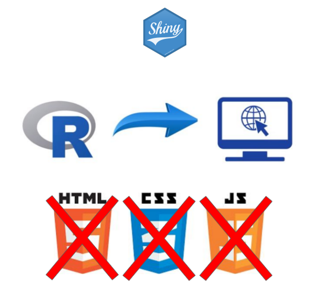
```
]

---
class: middle

### Primeiros passos

Por ser um pacote em R, precisamos, antes de qualquer coisa, instalar o Shiny em nossos computadores. Para isso, basta que executemos em nosso console do R o comando .codigo[install.packages("shiny")].

Para a criação de um novo aplicativo em Shiny, existem algumas maneiras possíveis de prosseguirmos. Uma delas é através da criação de um novo script em R e da utilização do *snippet* .codigo[shinyapp], disponível por padrão no RStudio. O script será automaticamente preenchido com um bloco de código contendo os componentes básicos de um aplicativo Shiny. 

.center[
```{r echo=FALSE, fig.align='center'}
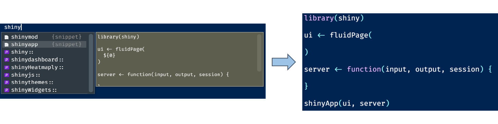
```
]

---
class: middle

### A estrutura básica de um aplicativo Shiny

Assim que criamos um aplicativo em Shiny, podemos perceber que existem três componentes básicos: 

- Um objeto chamado .codigo[ui] (interface do usuário); 
- Uma função chamada .codigo[server] (servidor);
- Uma chamada da função .codigo[shinyApp()], responsável por juntar a UI e o servidor e criar o aplicativo Shiny. 
 
Exceto algumas poucas exceções, a grande maioria dos aplicativos em Shiny seguirá essa mesma estrutura.

```{r}
library(shiny)

ui <- fluidPage(
  
)

server <- function(input, output, session) {
  
}

shinyApp(ui, server)
```

---
class: middle

### UI: a cara do seu aplicativo

É dentro da UI que decidiremos quais elementos serão mostrados ao usuário e onde eles estarão dispostos. Ela é a “cara” do nosso aplicativo. Nesse objeto, não vamos fazer nenhuma manipulação de dados, análises, criação de gráficos ou qualquer outra coisa do tipo. Iremos apenas organizar a interface para que ela possa ser apresentada ao usuário final. 

Como considerações iniciais sobre a UI, podemos dizer que:

- Tudo que colocaremos dentro da UI deve estar dentro da função .codigo[fluidPage()]. Essa função cria uma página fluida, que nada mais é do que uma página em branco que pode ser customizada de acordo com a nossa vontade;

- Uma fluid page pode ser dividida em linhas, por meio da função .codigo[fluidRow()];

- Uma fluid row pode ser dividida em colunas, por meio da função .codigo[column()].  

Além disso, tudo o que criarmos dentro da UI retornará um código HTML. Dessa forma, estamos, mesmo que sem saber, utilizando funções em R para "programar" em HTML.

```{r}
ui <- fluidPage("O meu primeiro aplicativo")
#> <div class="container-fluid">O meu primeiro aplicativo</div>
```

---
class: middle

### Um exemplo de UI

Um exemplo da UI de um aplicativo básico pode ser visto abaixo. O app permite a seleção de duas variáveis e apresenta o gráfico de dispersão delas.

.center[
```{r echo=FALSE, fig.align='center'}
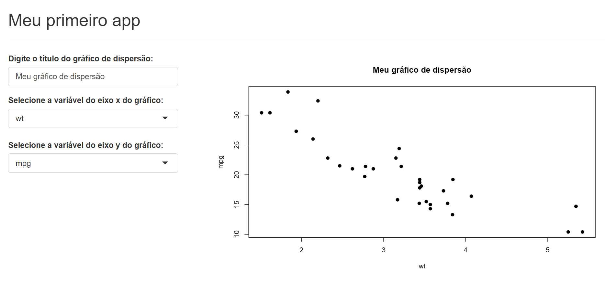
```
]

---
class: middle

### Server: o que está por trás dos panos

O .codigo[server()] é uma função responsável por realizar todo o processamento dos dados que o seu aplicativo precisa. Sempre que queremos manipular bases de dados, gerar tabelas, gráficos, mapas e qualquer outro tipo de visualização, é o servidor que utilizaremos. E tudo o que criarmos aqui e que queiramos que seja mostrado ao usuário será referenciado na UI. 

Essa função recebe três argumentos: 

- .codigo[input]: uma lista com todos os parâmetros que o usuário pode mexer;
-	.codigo[output]: uma lista com todas as visualizações que vamos mostrar para o usuário;
-	.codigo[session]: uma lista com informações da sessão que está rodando o aplicativo.

É importante ressaltar que todas as três listas serão criadas automaticamente quando rodarmos o aplicativo. Mas somos nós quem definiremos os elementos que estarão dentro das listas .codigo[input] e .codigo[output].

---
class: middle

### Rodando o aplicativo

Para rodar um app, podemos usar três métodos diferentes:

-	Podemos clicar no botão Run App, que aparece no canto superior direito do RStudio quando salvamos arquivo que contém o app;

.center[
```{r echo=FALSE, fig.align='center', out.width="80%"}
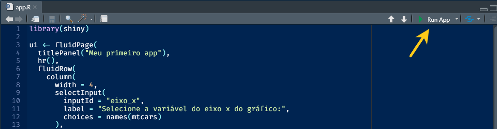
```
]

-	Podemos rodar o script que contém o app através do atalho .codigo[CTRL + SHIFT + ENTER];

-	Podemos utilizar a função .codigo[runApp()], passando como argumento o caminho até o arquivo que contém o app.

---
class: middle

### Sessão ocupada

É importante lembrar que, enquanto o seu aplicativo está aberto, a sessão do R estará ocupada. Com isso, não conseguiremos rodar qualquer tipo de código nesse meio tempo. Isso acontece porque todo aplicativo Shiny precisa de uma sessão de R rodando por trás. Essa sessão fornece a comunicação da UI com o servidor e é responsável por atualizar as visualizações apresentadas na UI sempre que alguém interagir com o app.


Para desocupar a sessão, basta que fechemos o aplicativo, seja diretamente, seja pelo botão .codigo[STOP], no console do RStudio, ou apertando a tecla .codigo[ESC] com o RStudio aberto.


.center[
```{r echo=FALSE, fig.align='center', out.width="80%"}
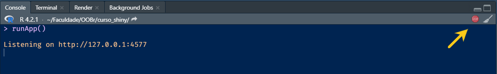
```
]

---
class: inverse, middle, center

## Interatividade: inputs e outputs

---
class: middle

### Inputs e Outputs

Um dos principais motivos de se criar um aplicativo Shiny é permitir a interação entre o usuário e o painel de visualização. Essa interatividade é proporcionada através da criação de **inputs** e **outputs**.

.center[
```{r echo=FALSE, fig.align='center'}

```
]

---
class: middle

### Inputs: as entradas do aplicativo


Os inputs representam as entradas do nosso aplicativo, isto é, a maneira como o usuário pode fornecer informações. Essas informações podem ser números, textos, datas, arquivos ou até mesmo cliques em um botão, e serão utilizadas pelo servidor para realizar manipulações de dados e construção de visualizações.

Os inputs de um aplicativo são criados dentro da UI, e as funções que utilizamos para criá-los seguem um padrão: em geral, elas são da forma <code style = "color: #0A1E3C">&ast;</code>.codigo[Input()], onde o asterisco representa o tipo de input em questão. Para inputs que são botões, o padrão dos nomes das funções costuma ser <code style = "color: #0A1E3C">&ast;</code>.codigo[Button()].

Todas as funções que criam inputs têm o mesmo primeiro argumento: .codigo[inputId]. Esse é um identificador, **que deve ser único** e que será utilizado para acessar cada input dentro do servidor.

Se dentro da nossa UI existe um input cujo .codigo[inputId] seja *"texto"*, podemos acessar esse input dentro da função .codigo[server()] através do código .codigo[input$texto]. Todos os inputs ficarão dentro da lista .codigo[input].

.center[
#### `r fontawesome::fa("link", fill = "#0A1E3C")` [https://shiny.rstudio.com/gallery/widget-gallery.html](https://shiny.rstudio.com/gallery/widget-gallery.html)
]

---
class: middle

### No `r fontawesome::fa("r-project", fill = "#0A1E3C")`

Vamos construir parte da UI do aplicativo abaixo. Podemos visualizar esse aplicativo através [deste link](https://rafasantanah.shinyapps.io/meu-primeiro-app/).

.center[
```{r echo=FALSE, fig.align='center'}

```
]

---
class: middle

### Outputs: as saídas do aplicativo

Os outputs representam as saídas do nosso aplicativo, isto é, tudo que queremos que seja mostrado para o usuário. Essas saídas podem ser tabelas, gráficos, mapas, texto, imagens e vários outros elementos.

Os outputs são **definidos na UI** e **criados no servidor**. Dentro da UI, cada tipo de output é definido por uma função do que segue o padrão .codigo[\*Output()], onde o asterisco representa o tipo de visualização que queremos definir. As principais funções dessa família, bem como as visualizações que definimos com elas, podem ser vistas abaixo:

```{r echo = FALSE}
data.frame("funcao" = c("plotOutput()", "tableOutput()", "textOutput"),
           "visualizacoes" = c("Gráficos", "Tabelas", "Textos")) |>
  reactable::reactable(columns = list(funcao = reactable::colDef(name = "Função"),
                                      visualizacoes = reactable::colDef(name = "Visualizações definidas")),
                       sortable = FALSE)
```

Todas as funções utilizadas para definirmos outputs na UI recebem como primeiro argumento o .codigo[outputId]. Esse é um identificador **que deve ser único para cada output** e que será utilizado dentro do servidor para se acessar o output correspondente, através do código .codigo[output$id_do_output]. Todos os outputs ficarão dentro da lista .codigo[output].

---

### Outputs: as funções render

Para criarmos, de fato, um output, precisamos das funções do tipo .codigo[render\*()], onde o asterisco representa o tipo de output que estamos criando. É dentro dessas funções que escrevemos o código necessário para a criação dos outputs. 

As funções do tipo .codigo[render\*()] são responsáveis por conectar as visualizações definidas na UI com seus códigos construídos dentro do servidor. Na grande maioria dos casos, para mostrarmos um output ao usuário, teremos um par de funções formado por:

- uma função do tipo .codigo[visualizacaoOutput()], na UI;
- uma função do tipo .codigo[renderVisualizacao()], no servidor. 

Veja abaixo as principais funções .codigo[render\*()] e como elas se comunicam com as funções <code style = "color: #0A1E3C">&ast;</code>.codigo[Output()].

```{r echo = FALSE}
data.frame("ui" = c("plotOutput()", "tableOutput()", "textOutput"),
           "servidor" = c("renderPlot()", "renderTable()", "renderText()")) |>
  reactable::reactable(columns = list(ui = reactable::colDef(name = "Na UI"),
                                      servidor = reactable::colDef(name = "No servidor")),
                       sortable = FALSE)
```

---
class: top

### Acessando outputs no servidor

Abaixo, temos um exemplo de como acessar um output definido na UI dentro do servidor. 

.panelset[

.panel[
.panel-name[Aplicativo]

```{r echo=FALSE, fig.align='center', out.width='90%'}
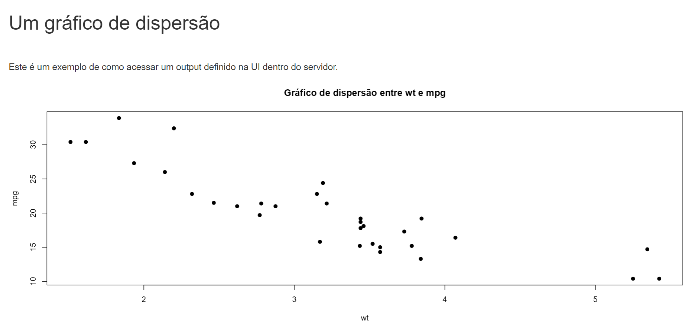
```

]

.panel[
.panel-name[Código]

```{r eval=FALSE}
library(shiny)

ui <- fluidPage(
  titlePanel("Um gráfico de dispersão"),
  hr(),
  "Este é um exemplo de como acessar um output definido na UI dentro do servidor.",
  plotOutput(outputId = "grafico")
)

server <- function(input, output, session) {
  output$grafico <- renderPlot({
    plot(x = mtcars$wt,
         y = mtcars$mpg,
         main = "Gráfico de dispersão entre wt e mpg",
         xlab = "wt",
         ylab = "mpg",
         pch = 19)
  })
}

shinyApp(ui, server)
```

]

]

---
class: middle

### No `r fontawesome::fa("r-project", fill = "#0A1E3C")`

Vamos, agora, completar a construção do aplicativo que iniciamos anteriormente, definindo o gráfico de dispersão dentro da UI e escrevendo o código necessário para a sua criação dentro do servidor. Novamente, podemos visualizar esse aplicativo através [deste link](https://rafasantanah.shinyapps.io/meu-primeiro-app/).

.center[
```{r echo=FALSE, fig.align='center'}

```
]

---
class: inverse, middle, center

## Reatividade

---
class:top

### Dois diferentes paradigmas de programação

Para entendermos o funcionamento de um aplicativo Shiny, é necessário que conheçamos a diferença entre dois importantes paradigmas de programação: a **programação imperativa** e a **programação declarativa**.

--

- Na **programação imperativa**, nós precisamos descrever detalhadamente o passo a passo de um processo que a máquina deve executar, ou seja, as instruções são passadas por meio de códigos que devem ser executados **sequencialmente**. Em outras palavras, o foco está no **que** um programa deve realizar, e **como** esse processo deve ser executado.

--

- Por outro lado, na **programação declarativa**, o foco está apenas no **que** deve ser executado: nós apenas demonstramos o resultado esperado do código, sem nos preocuparmos com forma com a qual o processo será executado. Ou seja, a decisão de **quando** ou **como** executar o processo dependerá de algum outro mecanismo. E esse é o estilo de programação que nós utilizamos dentro do Shiny.   

--

A programação declarativa funciona como uma receita: nossos códigos descrevem aquilo queremos que seja realizado, e o Shiny decide a ordem e o momento em que esses códigos serão avaliados. O elemento responsável pela realização desse processo é o chamado **diagrama de reatividade**.

---
class: middle

### Diagrama de reatividade

O diagrama de reatividade é um conjunto de dependências que descreve como inputs e outputs estão conectados, sendo responsável por definir a ordem de execução dos códigos que escrevemos dentro do servidor. 

No aplicativo criado anteriormente, toda alteração que fazíamos em qualquer um dos inputs resultava automaticamente em uma atualização do gráfico que estávamos criando. Isso acontecia porque o Shiny, por meio do diagrama de reatividade, era capaz de reconhecer que o output do gráfico era **dependente** de todos os três inputs existentes no aplicativo. Um esquema do diagrama de reatividade do aplicativo pode ser visto abaixo.

.center[
```{r echo=FALSE, fig.align='center', out.width="80%"}
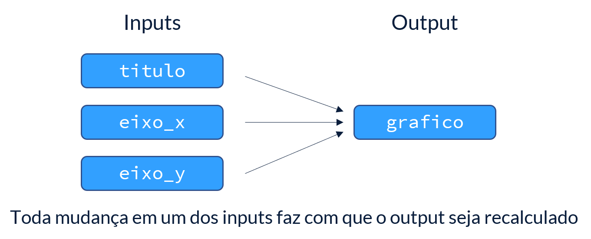
```
]

---
class: top

### A estrutura de um diagrama de reatividade

O diagrama de reatividade de um aplicativo Shiny possui três estruturas principais: os **valores reativos**, os **observers** e as **expressões reativas**.

--

- Os **valores reativos** são as chamadas **fontes de reatividade**, e são o ponto inicial do diagrama de reatividade. Eles guardam as informações que vêm da UI e disparam sinais de alerta sempre que essas informações mudam. Os valores reativos podem ser lidos por outros objetos reativos, e os exemplos mais comuns deles são aqueles dentro da lista .codigo[input].

--

- Os **observers** são o ponto final do diagrama de reatividade. Eles guardam o código de cada output, e recebem os sinais de alerta enviados pelos inputs para avaliar a necessidade de se recalcular um output. Os observers podem ler valores reativos e expressões reativas, sendo os exemplos mais comuns deles as funções .codigo[render\*()].

--

- Por fim, as **expressões reativas** são os chamados **condutores de reatividade**. Ela são capazes de ler valores reativos, realizar alguma manipulação e devolver um resultado que é, também, um valor reativo, e que por isso pode ser utilizado em um observer. Para criar expressões reativas, podemos utilizar as funções .codigo[reactive()] e .codigo[eventReactive()].

--

.center[
```{r echo=FALSE, fig.align='center', out.width="90%"}
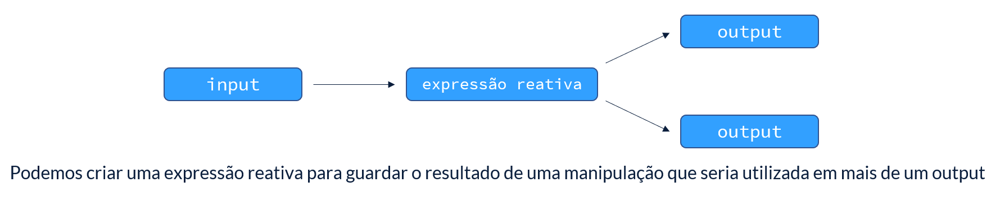
```
]

---
class: top

### A função reactive()

Vamos utilizar a função .codigo[reactive()] para tornar o aplicativo abaixo mais eficiente. Tudo o que precisamos fornecer a essa função é o código da expressão que queremos tornar reativa. É importante dizer que para acessar o valor de uma expressão reativa, precisamos usar parênteses após seu nome. O app pode ser visualizado através [deste link](https://rafaelsherzog.shinyapps.io/02-reactive/).

.panelset[

.panel[
.panel-name[UI]

```{r eval=FALSE}
ui <- fluidPage(
  titlePanel("Entendendo a necessidade de uma expressão reativa"),
  hr(),
  fluidRow(
    column(
      width = 4,
      selectInput(
        inputId = "cilindros",
        label = "Selecione o número de cilindros do motor:",
        choices = sort(unique(mtcars$cyl))
      )
    ),
    column(
      width = 4,
      selectInput(
        inputId = "eixo_x",
        label = "Selecione a variável do eixo x do gráfico:",
        choices = names(mtcars)
      )
    ),
    column(
      width = 4,
      selectInput(
        inputId = "eixo_y",
        label = "Selecione a variável do eixo y do gráfico:",
        choices = names(mtcars)
      )
    )
  ), 
  br(),
  fluidRow(
    column(
      width = 6,
      tableOutput(outputId = "tabela")
    ),
    column(
      width = 6,
      plotOutput(outputId = "grafico")
    )
  )
)
```

]

.panel[
.panel-name[Servidor]

```{r eval=FALSE}
server <- function(input, output, session) {
  mtcars_filtrada <- reactive({
    
  })
  
  output$tabela <- renderTable({
    mtcars |>
      filter(cyl == input$cilindros)},
    rownames = TRUE)
  
  output$grafico <- renderPlot({
    mtcars |>
      filter(cyl == input$cilindros) |>
      ggplot(mapping = aes_string(x = input$eixo_x, y = input$eixo_y)) +
      geom_point()
  })
}
shinyApp(ui, server)
```


]

]


---
class: middle

### A função eventReactive()

Caso seja de nosso interesse controlar o momento em que um observer ou uma expressão reativa seja atualizado, podemos utilizar a função .codigo[eventReactive()]. Essa função permite que um certo bloco de código só seja avaliado quando uma certa ação for realizada. Assim como no caso anterior, a função .codigo[eventReactive()] também retorna uma expressão reativa, e por isso precisamos utilizar parênteses para acessar o seu valor. 

Vamos, agora, utilizar essa função para forçar que a tabela e o gráfico construídos no exemplo anterior só sejam atualizados quando o usuário clicar no botão **"Atualizar a tabela e o gráfico"**, como está na imagem abaixo. O aplicativo completo pode ser acessado por meio [deste link](https://rafasantanah.shinyapps.io/event-reactive/).

.center[
```{r echo=FALSE, fig.align='center'}
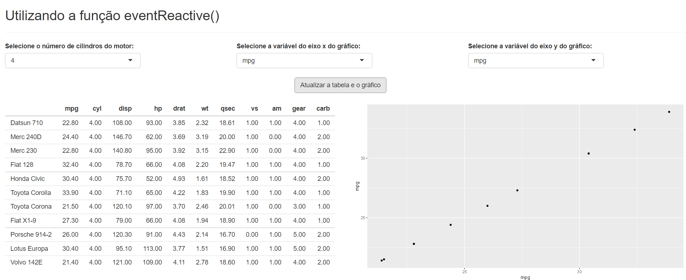
```
]


---
class: middle

### Contexto reativo

Valores reativos e expressões reativas só podem ser utilizados dentro de um contexto reativo. Esse tipo de ambiente é criado, por exemplo, pelas funções .codigo[render\*()] e pelas funções .codigo[reactive()] e .codigo[eventReactive()]. Dessa forma, precisamos levar em consideração que só podemos acessar os valores da lista .codigo[input] ou as expressões reativas que criamos quando estamos dentro de um contexto reativo.

<b style = "color: red"> Errado </b>

```{r eval=FALSE}
# server
output$tabela <- table(mtcars[mtcars$cyl == input$cilindros, ])
#> Error : Can't access reactive value 'cilindros' outside of reactive consumer.

```

<b style = "color: green"> Certo </b>

```{r eval=FALSE}
# server
output$tabela <- renderTable(mtcars[mtcars$cyl == input$cilindros, ])
```


---
class: inverse, middle, center

## Layouts

---
class: middle

### HTML e Tags HTML

De forma resumida, o HTML é uma **linguagem de marcação**, ou seja, é um tipo de documento que contém um texto simples e um conjunto de instruções para formatar partes específicas do texto. Dentro do HTML, essas instruções de formatação são chamadas de *tags*. Como foi dito anteriormente, a UI nada mais é do que um grande bloco de código HTML. Dessa forma, podemos utilizar as tags dentro de um aplicativo Shiny para formatar os elementos da página a nosso gosto.

O pacote .codigo[{shiny}] possui uma série de funções que simulam as tags HTML. Além disso, todas as tags existentes podem ser acessadas através da lista .codigo[tags], disponível dentro do pacote. As principais funções que utilizamos, bem como o que fazem, podem ser vistas abaixo:


```{r echo=FALSE, fig.cap="Fonte: Curso-R."}
data.frame("funcao" = c("a()", "hr()", "br()", "h1(), ..., h6()", "img()", "p()", "em()", "strong()"),
           "acao" = c("cria um hiperlink", "cria uma linha horizontal", "insere uma quebra de linha", "cria títulos",
                      "insere uma imagem", "cria um parágrafo", "formata o texto em itálico", "formata o texto em negrito")) |>
  reactable::reactable(columns = list(funcao = reactable::colDef(name = "Função"),
                                      acao = reactable::colDef(name = "Para que serve")),
                       sortable = FALSE,
                       height = 200)
```


---
class: middle

### O que está por trás do layout de um app

O layout de um aplicativo Shiny segue um framework chamado de Bootstrap. O Bootstrap é um conjunto de códigos HTML, CSS e JavaScript que definem como o layout de um app deve funcionar. Algumas definições do Bootstrap são:

1. Os elementos serão dispostos primeiramente em linhas;
2. Cada nova linha será colocada embaixo da anterior;
3. Cada linha pode ser dividida em colunas;
4. O comprimento da página será dividido em 12 unidades, independentemente do tamanho da tela.

.center[
```{r echo=FALSE, fig.align='center'}
knitr::include_graphics("img/bootstrap.png")
```
<b> Fonte </b>: <a href = https://dzone.com/articles/working-with-bootstrap-4-grid-system-for-creating> https://dzone.com/articles/working-with-bootstrap-4-grid-system-for-creating </a>
]

---
class: middle

### Linhas e colunas

Como dissemos no início da apresentação, podemos criar novas linhas dentro da UI através da função .codigo[fluidRow()]. Tudo aquilo que queremos que seja mostrado dentro de uma dada linha deve ser colocado dentro da fluid row correspondente.

Além disso, para criar colunas dentro de uma linha, utilizamos a função .codigo[column()]. Essa função tem dois argumentos importantes: .codigo[width] e .codigo[offset]. Como já vimos ao longo dos exemplos, temos que:

- o argumento .codigo[width] determina o comprimento da coluna, que varia de 1 a 12; 
- o argumento .codigo[offset] indica quantas unidades gostaríamos de "pular" antes de começar a coluna em questão. 

Um exemplo da utilização dessas funções pode ser visto abaixo.

.center[
```{r echo=FALSE, fig.align='center', out.width='90%'}
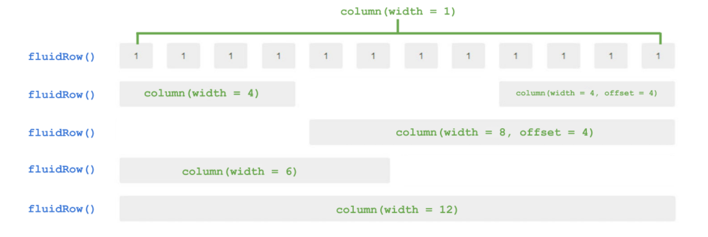
```
<b> Fonte </b>: Curso-R.
]

---
class: middle

### Layouts

Dentro do pacote .codigo[{shiny}], podemos encontrar algumas funções que nos permitem utilizar layouts um pouco mais complexos. Nessa apresentação, iremos falar sobre:

- o .codigo[sidebarLayout()], para criar um aplicativo que contenha uma barra lateral, na qual colocaremos inputs, e uma área principal, na qual colocaremos outputs;

- o .codigo[tabsetPanel()], para dividir a área principal de um sidebarLayout em várias abas;

- e a .codigo[navbarPage()], para criar um aplicativo com várias páginas. 

Além disso, existem alguns pacotes que permitem a construção de aplicativos com outros tipos de layouts. Falaremos sobre um deles, o .codigo[{shinydashboard}], mais adiante.

---
class: middle

### sidebarLayout: um exemplo 

Transformando o layout do aplicativo criado anteriormente em um sidebarLayout, teríamos o seguinte resultado, que pode ser acessado através [deste link](https://rafaelsherzog.shinyapps.io/04-sidebarLayout/):

.center[
```{r echo=FALSE, fig.align='center', out.width='90%'}
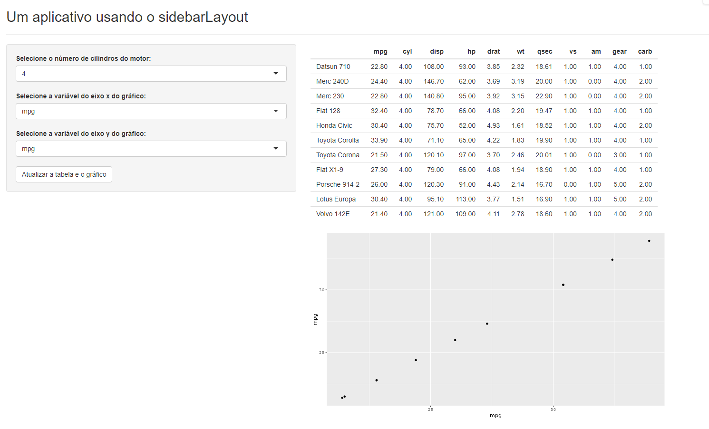
```
]

---
class: middle

### sidebarLayout: entendendo o código

A estrutura da UI de um aplicativo construído utilizando o sidebarLayout é a seguinte:

.panelset[

.panel[
.panel-name[1]

Toda a UI estará dentro da função .codigo[fluidPage()]:

```{r eval=FALSE}
*ui <- fluidPage(
  titlePanel(),
  sidebarLayout(
    sidebarPanel(),
    mainPanel()
  )
*)
```

]

.panel[
.panel-name[2]

O título do aplicativo é definido através da função .codigo[titlePanel()]:

```{r eval=FALSE}
ui <- fluidPage(
* titlePanel(),
  sidebarLayout(
    sidebarPanel(),
    mainPanel()
  )
)
```

]

.panel[
.panel-name[3]

Definimos que queremos utilizar esse tipo de layout através da função .codigo[sidebarLayout()]:

```{r eval=FALSE}
ui <- fluidPage(
  titlePanel(),
* sidebarLayout(
    sidebarPanel(),
    mainPanel()
* )
)
```

]

.panel[
.panel-name[4]

Dentro de .codigo[sidebarLayout()], criamos a barra lateral através da função .codigo[sidebarPanel()];

```{r eval=FALSE}
ui <- fluidPage(
  titlePanel(),
  sidebarLayout(
*   sidebarPanel(),
    mainPanel()
  )
)
```

]

.panel[
.panel-name[5]

Também dentro de .codigo[sidebarLayout()], criamos a área principal do painel através da função .codigo[mainPanel()].

```{r eval=FALSE}
ui <- fluidPage(
  titlePanel(),
  sidebarLayout(
    sidebarPanel(),
*   mainPanel()
  )
)
```

]
]

---
class: middle

### sidebarLayout: entendendo o código

Vamos, agora, passar para a montagem do aplicativo mostrado. Como vimos, todos os elementos do layout são colocados dentro da função .codigo[fluidPage()]:

```{r eval=FALSE}
*ui <- fluidPage(
  titlePanel(title = "Um aplicativo usando o sidebarLayout"),
  hr(),
  sidebarLayout(
    sidebarPanel(
      selectInput(inputId = "cilindros", label = "Selecione o número de cilindros do motor:", choices = sort(unique(mtcars$cyl))),
      selectInput(inputId = "eixo_x", label = "Selecione a variável do eixo x do gráfico:", choices = names(mtcars)),
      selectInput(inputId = "eixo_y", label = "Selecione a variável do eixo y do gráfico:", choices = names(mtcars)),
      actionButton(inputId = "atualizar", label = "Atualizar a tabela e o gráfico")
    ),
    mainPanel(
      tableOutput(outputId = "tabela"),
      plotOutput(outputId = "grafico")
    )
  )
*)
```


---
class: middle

### sidebarLayout: entendendo o código

Atribuímos ao aplicativo o título "Um aplicativo usando o sidebarLayout" através da função .codigo[titlePanel()]:

```{r eval=FALSE}
ui <- fluidPage(
* titlePanel(title = "Um aplicativo usando o sidebarLayout"),
  hr(),
  sidebarLayout(
    sidebarPanel(
      selectInput(inputId = "cilindros", label = "Selecione o número de cilindros do motor:", choices = sort(unique(mtcars$cyl))),
      selectInput(inputId = "eixo_x", label = "Selecione a variável do eixo x do gráfico:", choices = names(mtcars)),
      selectInput(inputId = "eixo_y", label = "Selecione a variável do eixo y do gráfico:", choices = names(mtcars)),
      actionButton(inputId = "atualizar", label = "Atualizar a tabela e o gráfico")
    ),
    mainPanel(
      tableOutput(outputId = "tabela"),
      plotOutput(outputId = "grafico")
    )
  )
)
```

---
class: middle

### sidebarLayout: entendendo o código

Definimos que queremos utilizar esse layout através da função .codigo[sidebarLayout()]: 

```{r eval=FALSE}
ui <- fluidPage(
  titlePanel(title = "Um aplicativo usando o sidebarLayout"),
  hr(),
* sidebarLayout(
    sidebarPanel(
      selectInput(inputId = "cilindros", label = "Selecione o número de cilindros do motor:", choices = sort(unique(mtcars$cyl))),
      selectInput(inputId = "eixo_x", label = "Selecione a variável do eixo x do gráfico:", choices = names(mtcars)),
      selectInput(inputId = "eixo_y", label = "Selecione a variável do eixo y do gráfico:", choices = names(mtcars)),
      actionButton(inputId = "atualizar", label = "Atualizar a tabela e o gráfico")
    ),
    mainPanel(
      tableOutput(outputId = "tabela"),
      plotOutput(outputId = "grafico")
    )
* )
)
```

---
class: middle

### sidebarLayout: entendendo o código

Criamos a barra lateral do painel através da função .codigo[sidebarPanel()]: 

```{r eval=FALSE}
ui <- fluidPage(
  titlePanel(title = "Um aplicativo usando o sidebarLayout"),
  hr(),
  sidebarLayout(
*   sidebarPanel(
      selectInput(inputId = "cilindros", label = "Selecione o número de cilindros do motor:", choices = sort(unique(mtcars$cyl))),
      selectInput(inputId = "eixo_x", label = "Selecione a variável do eixo x do gráfico:", choices = names(mtcars)),
      selectInput(inputId = "eixo_y", label = "Selecione a variável do eixo y do gráfico:", choices = names(mtcars)),
      actionButton(inputId = "atualizar", label = "Atualizar a tabela e o gráfico")
*   ),
    mainPanel(
      tableOutput(outputId = "tabela"),
      plotOutput(outputId = "grafico")
    )
  )
)
```

---
class: middle

### sidebarLayout: entendendo o código

Dentro da função .codigo[sidebarPanel()], definimos tudo aquilo que queremos que esteja na barra lateral do painel (nesse caso, temos três select inputs e um action button): 

```{r eval=FALSE}
ui <- fluidPage(
  titlePanel(title = "Um aplicativo usando o sidebarLayout"),
  hr(),
  sidebarLayout(
    sidebarPanel(
*     selectInput(inputId = "cilindros", label = "Selecione o número de cilindros do motor:", choices = sort(unique(mtcars$cyl))),
*     selectInput(inputId = "eixo_x", label = "Selecione a variável do eixo x do gráfico:", choices = names(mtcars)),
*     selectInput(inputId = "eixo_y", label = "Selecione a variável do eixo y do gráfico:", choices = names(mtcars)),
*     actionButton(inputId = "atualizar", label = "Atualizar a tabela e o gráfico")
    ),
    mainPanel(
      tableOutput(outputId = "tabela"),
      plotOutput(outputId = "grafico")
    )
  )
)
```


---
class: middle

### sidebarLayout: entendendo o código

Criamos a área principal do painel através da função .codigo[mainPanel()]: 

```{r eval=FALSE}
ui <- fluidPage(
  titlePanel("Um aplicativo usando o sidebarLayout"),
  hr(),
  sidebarLayout(
    sidebarPanel(
      selectInput(inputId = "cilindros", label = "Selecione o número de cilindros do motor:", choices = sort(unique(mtcars$cyl))),
      selectInput(inputId = "eixo_x", label = "Selecione a variável do eixo x do gráfico:", choices = names(mtcars)),
      selectInput(inputId = "eixo_y", label = "Selecione a variável do eixo y do gráfico:", choices = names(mtcars)),
      actionButton(inputId = "atualizar", label = "Atualizar a tabela e o gráfico")
    ),
*   mainPanel(
      tableOutput(outputId = "tabela"),
      plotOutput(outputId = "grafico")
*   )
  )
)
```

---
class: middle

### sidebarLayout: entendendo o código

Dentro da função .codigo[mainPanel()], definimos tudo aquilo que queremos que esteja na área principal do painel (nesse caso, temos uma tabela e um gráfico): 

```{r eval=FALSE}
ui <- fluidPage(
  titlePanel("Um aplicativo usando o sidebarLayout"),
  hr(),
  sidebarLayout(
    sidebarPanel(
      selectInput(inputId = "cilindros", label = "Selecione o número de cilindros do motor:", choices = sort(unique(mtcars$cyl))),
      selectInput(inputId = "eixo_x", label = "Selecione a variável do eixo x do gráfico:", choices = names(mtcars)),
      selectInput(inputId = "eixo_y", label = "Selecione a variável do eixo y do gráfico:", choices = names(mtcars)),
      actionButton(inputId = "atualizar", label = "Atualizar a tabela e o gráfico")
    ),
    mainPanel(
*     tableOutput(outputId = "tabela"),
*     plotOutput(outputId = "grafico")
    )
  )
)
```

---
class: middle

### sidebarLayout: entendendo o código

Não precisamos fazer nada de diferente dentro do servidor. 

```{r eval=FALSE}
server <- function(input, output, session) {
  mtcars_filtrada <- reactive({
    mtcars |>
      filter(cyl == input$cilindros)
  })
  
  tabela_atualizada <- eventReactive(input$atualizar, {
    mtcars_filtrada()
  })
  
  output$tabela <- renderTable(tabela_atualizada(), rownames = TRUE)
  
  grafico_atualizado <- eventReactive(input$atualizar, {
    mtcars_filtrada() |>
      ggplot(mapping = aes_string(x = input$eixo_x, y = input$eixo_y)) +
      geom_point()
  })
  
  output$grafico <- renderPlot(grafico_atualizado())
}
```


---
class: middle

### sidebarLayout: No `r fontawesome::fa("r-project", fill = "#0A1E3C")`

Vamos ao R para visualizar melhor a construção de um sidebarLayout.

---
class: middle

### tabsetPanel: um exemplo 

O tabsetPanel não é um layout completo: nós podemos implementá-lo dentro de algum tipo de layout para dividir a área principal do aplicativo em mais de uma aba. Implementando o tabsetPanel no sidebarLayout do aplicativo criado anteriormente, teríamos o seguinte resultado, que podemos acessar através [deste link](https://rafaelsherzog.shinyapps.io/05-tabsetPanel/):

.panelset[

.panel[
.panel-name[Primeira aba]

.center[
```{r echo=FALSE, fig.align='center', out.width='90%'}
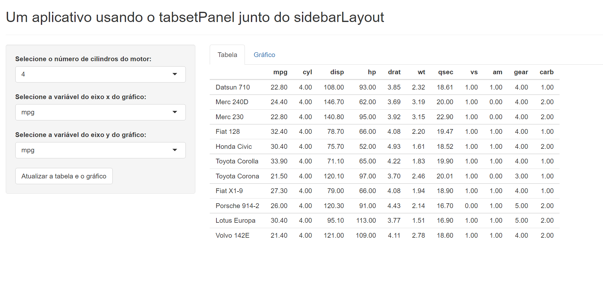
```
]
]

.panel[
.panel-name[Segunda aba]

.center[
```{r echo=FALSE, fig.align='center', out.width='95%'}
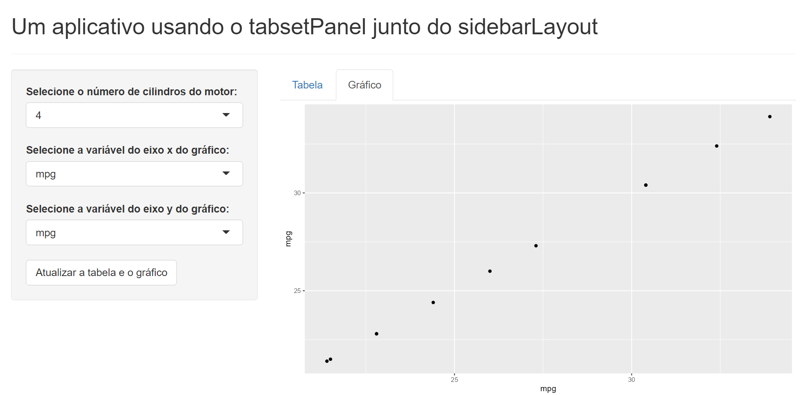
```
]

]


]


---
class: middle

### tabsetPanel: entendendo o código

Em comparação com o aplicativo criado utilizando apenas o sidebarLayout, a única diferença que temos no código da UI está dentro da função .codigo[mainPanel()]. Observe que agora estamos utilizando, dentro de .codigo[mainPanel()], a função .codigo[tabsetPanel()]. Essa é a função responsável por dividir as visualizações dos outputs em abas separadas.

```{r eval=FALSE}
ui <- fluidPage(
  titlePanel("Um aplicativo usando o tabsetPanel junto do sidebarLayout"),
  hr(),
  sidebarLayout(
    sidebarPanel(
      selectInput("cilindros", label = "Selecione o número de cilindros do motor:", choices = sort(unique(mtcars$cyl))),
      selectInput("eixo_x", label = "Selecione a variável do eixo x do gráfico:", choices = names(mtcars)),
      selectInput("eixo_y", label = "Selecione a variável do eixo y do gráfico:", choices = names(mtcars)),
      actionButton(inputId = "atualizar", label = "Atualizar a tabela e o gráfico")
    ),
    mainPanel(
*     tabsetPanel(
        tabPanel(title = "Tabela", tableOutput(outputId = "tabela")),
        tabPanel(title = "Gráfico", plotOutput(outputId = "grafico"))
*     )
    )
  )
)
```

---
class: middle

### tabsetPanel: entendendo o código

A função .codigo[tabsetPanel()] recebe elementos criados pela função .codigo[tabPanel()]. Cada .codigo[tabPanel()] que utilizamos cria uma nova aba na área principal do sidebarLayout. Nesse exemplo, estamos criando duas abas: uma para visualizarmos a tabela, que receberá o nome de "Tabela", e uma para visualizarmos o gráfico, que receberá o nome de "Gráfico".

```{r eval=FALSE}
ui <- fluidPage(
  titlePanel("Um aplicativo usando o tabsetPanel junto do sidebarLayout"),
  hr(),
  sidebarLayout(
    sidebarPanel(
      selectInput("cilindros", label = "Selecione o número de cilindros do motor:", choices = sort(unique(mtcars$cyl))),
      selectInput("eixo_x", label = "Selecione a variável do eixo x do gráfico:", choices = names(mtcars)),
      selectInput("eixo_y", label = "Selecione a variável do eixo y do gráfico:", choices = names(mtcars)),
      actionButton(inputId = "atualizar", label = "Atualizar a tabela e o gráfico")
    ),
    mainPanel(
      tabsetPanel(
*       tabPanel(title = "Tabela", tableOutput(outputId = "tabela")),
*       tabPanel(title = "Gráfico", plotOutput(outputId = "grafico"))
      )
    )
  )
)
```

---
class: middle

### tabsetPanel: entendendo o código

O servidor, novamente, não sofre alterações.

```{r eval = FALSE}
server <- function(input, output, session) {
  mtcars_filtrada <- reactive({
    mtcars |>
      filter(cyl == input$cilindros)
  })
  
  tabela_atualizada <- eventReactive(input$atualizar, {
    mtcars_filtrada()
  })
  
  output$tabela <- renderTable(tabela_atualizada(), rownames = TRUE)
  
  grafico_atualizado <- eventReactive(input$atualizar, {
    mtcars_filtrada() |>
      ggplot(mapping = aes_string(x = input$eixo_x, y = input$eixo_y)) +
      geom_point()
  })
  
  output$grafico <- renderPlot(grafico_atualizado())
}
```


---
class: middle

### navbarPage: um exemplo 

Quando queremos criar um layout com um com menu de navegação superior, utilizamos a função .codigo[navbarPage()]. Adaptando o aplicativo criado anteriormente para esse novo tipo de layout, teríamos o seguinte resultado, que pode ser acessado através [deste link](https://rafaelsherzog.shinyapps.io/06-navbarPage/):

.panelset[

.panel[
.panel-name[Sobre]

.center[
```{r echo=FALSE, fig.align='center', out.width='95%'}
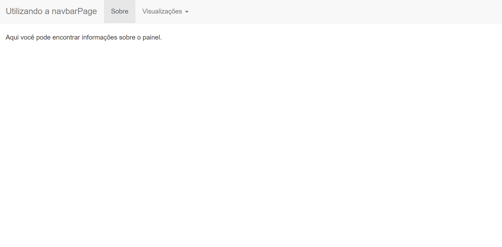
```
]
]

.panel[
.panel-name[Visualizações]

.center[
```{r echo=FALSE, fig.align='center', out.width='95%'}
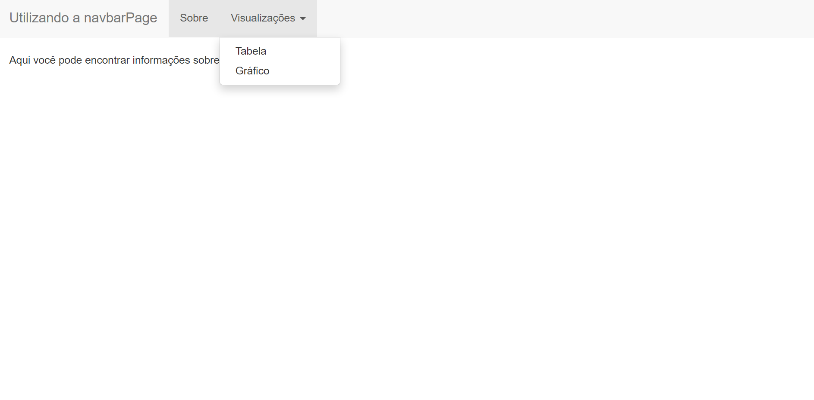
```
]

]

.panel[
.panel-name[Tabela]

.center[
```{r echo=FALSE, fig.align='center', out.width='95%'}
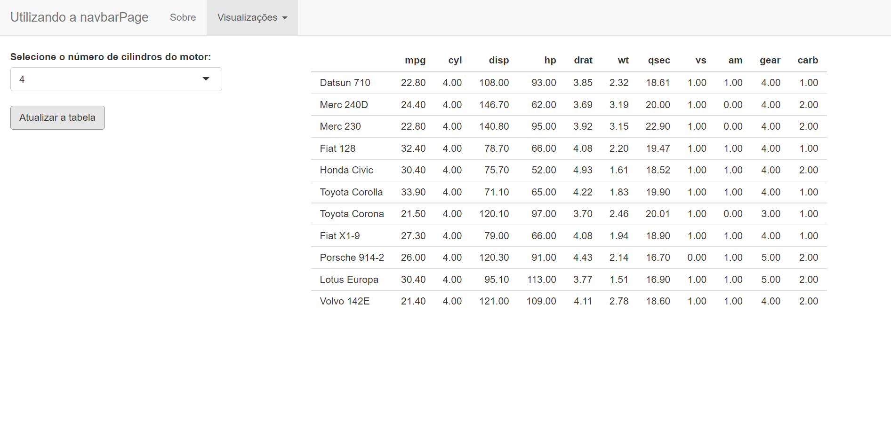
```
]

]
.panel[
.panel-name[Gráfico]

.center[
```{r echo=FALSE, fig.align='center', out.width='95%'}
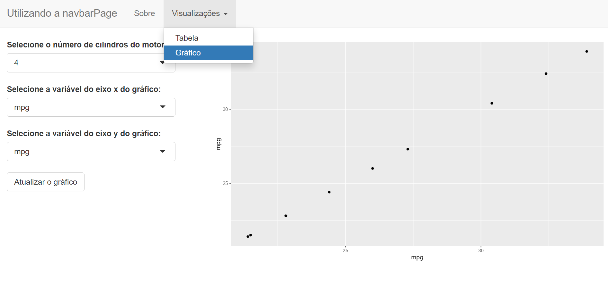
```
]

]
]

---
class: top

### navbarPage: entendendo o código

Tudo aquilo que queremos que esteja na UI deve estar dentro da função .codigo[navbarPage()], diferente do que acontecia com os outros tipos de layout: 

```{r eval=FALSE}
*ui <- navbarPage(
  title = "Utilizando a navbarPage",  
  tabPanel(title = "Sobre"),
  navbarMenu(
    title = "Visualizações",
    tabPanel(title = "Tabela"),
    tabPanel(title = "Gráfico")
  )
*)
```

---
class: top

### navbarPage: entendendo o código

O título do aplicativo é definido através do argumento .codigo[title]:

```{r eval=FALSE}
ui <- navbarPage(
* title = "Utilizando a navbarPage",  
  tabPanel(title = "Sobre"),
  navbarMenu(
    title = "Visualizações",
    tabPanel(title = "Tabela"),
    tabPanel(title = "Gráfico")
  )
)
```

- Resultado:

.center[
```{r echo=FALSE, fig.align='center', out.width='100%'}
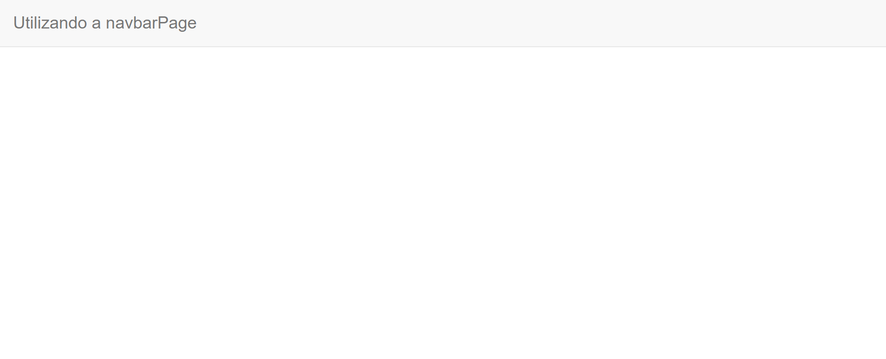
```
]


---
class: top

### navbarPage: entendendo o código

Criamos cada aba do menu de navegação superior através da função .codigo[tabPanel()]:

```{r eval=FALSE}
ui <- navbarPage(
  title = "Utilizando a navbarPage",  
* tabPanel(title = "Sobre"),
  navbarMenu(
    title = "Visualizações",
    tabPanel(title = "Tabela"),
    tabPanel(title = "Gráfico")
  )
)
```

- Resultado:

.center[
```{r echo=FALSE, fig.align='center', out.width='100%'}
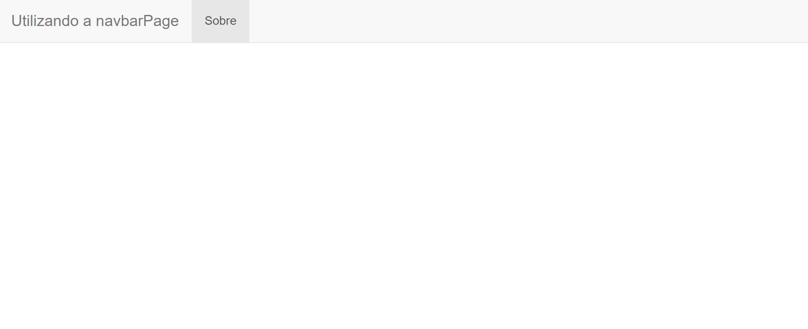
```
]


---
class: top

### navbarPage: entendendo o código

Criamos uma aba que agrupará outras páginas por meio da função .codigo[navbarMenu()]:

```{r eval=FALSE}
ui <- navbarPage(
  title = "Utilizando a navbarPage",  
  tabPanel(title = "Sobre"),
* navbarMenu(
    title = "Visualizações",
    tabPanel(title = "Tabela"),
    tabPanel(title = "Gráfico")
* )
)
```

- Resultado:

.center[
```{r echo=FALSE, fig.align='center', out.width='100%'}
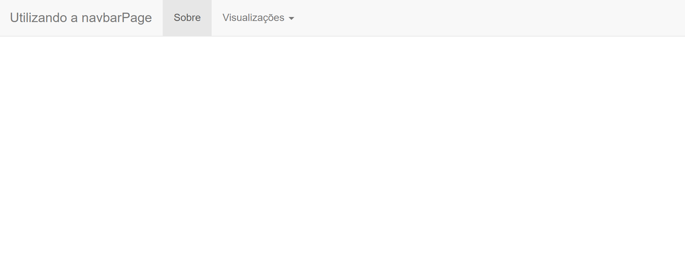
```
]


---
class: top

### navbarPage: entendendo o código

Criamos cada página que estará agrupada na aba "Visualizações" por meio da função .codigo[tabPanel()]:

```{r eval=FALSE}
ui <- navbarPage(
  title = "Utilizando a navbarPage",  
  tabPanel(title = "Sobre"),
  navbarMenu(
    title = "Visualizações",
*   tabPanel(title = "Tabela"),
*   tabPanel(title = "Gráfico")
  )
)
```

- Resultado:

.center[
```{r echo=FALSE, fig.align='center', out.width='100%'}
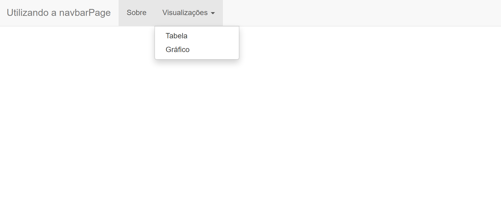
```
]


---
class: top

### navbarPage: entendendo o código

Os inputs, outputs e qualquer outro elemento da página são colocados dentro do .codigo[tabPanel()] correspondente.

```{r eval=FALSE}
ui <- navbarPage(
  title = "Utilizando a navbarPage",  
* tabPanel(
*   title = "Sobre",
*   "Aqui você pode encontrar informações sobre o painel."
* ),
  navbarMenu(
    title = "Visualizações",
    tabPanel(title = "Tabela"),
    tabPanel(title = "Gráfico")
  )
)
```

- Resultado: 

.center[
```{r echo=FALSE, fig.align='center', out.width='100%'}
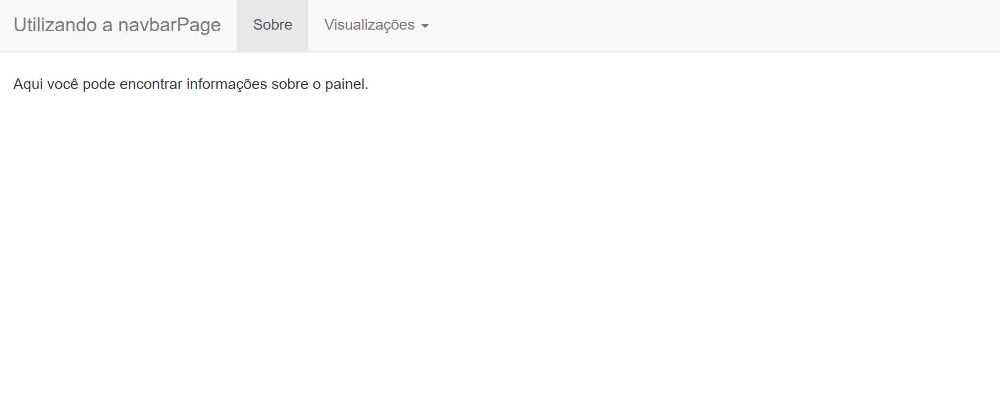
```
]


---
class: middle

### navbarPage: No `r fontawesome::fa("r-project", fill = "#0A1E3C")`

Vamos terminar de escrever o código da UI e do servidor desse aplicativo dentro do R.


---
class: inverse, middle, center

## O pacote {shinydashboard} 


---
class: top

### Visão incial e estrutura básica

O .codigo[{shinydasboard}] é um pacote de R que introduz diversas ferramentas para o Shiny. A principal delas é o layout de dashboard. Com um formato simples de código, conseguimos gerar uma UI naturalmente bonita e organizada.

A estrutura básica da UI de um aplicativo Shiny criado por meio do .codigo[{shinydashboard}] é a seguinte:

.panelset[

.panel[
.panel-name[1]

- Por meio da função .codigo[dashboardPage()], definimos que queremos utilizar o layout de dashboard. Ela recebe três funções como argumentos: .codigo[dashboardHeader()], .codigo[dashboardSidebar()] e .codigo[dashboardBody()];

.pull-left[
```{r eval=FALSE}
*ui <- dashboardPage(
  dashboardHeader(),
  dashboardSidebar(),
  dashboardBody()
*)
```
]

.pull-right[
```{r echo=FALSE, fig.align='center', out.width='100%'}
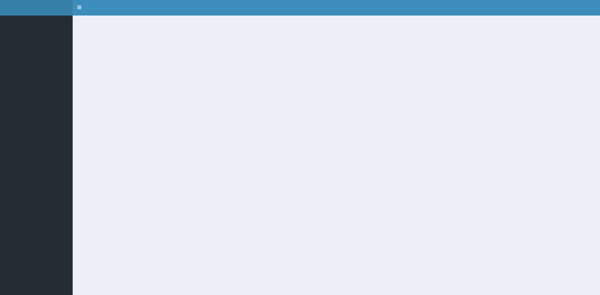
```
]
]

.panel[
.panel-name[2]

- Por meio da função .codigo[dashboardHeader()], criamos e controlamos a barra superior (em azul);

.pull-left[
```{r eval=FALSE}
ui <- dashboardPage(
* dashboardHeader(),
  dashboardSidebar(),
  dashboardBody()
)
```
]

.pull-right[
```{r echo=FALSE, fig.align='center', out.width='100%'}

```
]
]

.panel[
.panel-name[3]

- Por meio da função .codigo[dashboardSidebar()], criamos e controlamos a barra lateral (em preto). Utlizaremos essa parte do aplicativo para criar um menu contendo as páginas do nosso dashboard;

.pull-left[
```{r eval=FALSE}
ui <- dashboardPage(
  dashboardHeader(),
* dashboardSidebar(),
  dashboardBody()
)
```
]

.pull-right[
```{r echo=FALSE, fig.align='center', out.width='100%'}

```
]
]

.panel[
.panel-name[4]

- Por fim, por meio da função .codigo[dashboardBody()], criamos e controlamos a área principal do dashboard (em cinza). É nela que colocaremos os nossos inputs e as nossas visualizações.

.pull-left[
```{r eval=FALSE}
ui <- dashboardPage(
  dashboardHeader(),
  dashboardSidebar(),
* dashboardBody()
)
```
]

.pull-right[
```{r echo=FALSE, fig.align='center', out.width='100%'}

```
]
]

]

---
class: top

### A barra superior

Como vimos no slide anterior, é por meio da função .codigo[dashboardHeader()] que criamos e controlamos a barra superior do dashboard. O único argumento que utilizaremos dessa função é o argumento .codigo[title], por meio do qual definimos o título do aplicativo.

.panelset[

.panel[
.panel-name[Código]

```{r eval=FALSE}
ui <- dashboardPage(
* dashboardHeader(title = "Meu título"),
  dashboardSidebar(),
  dashboardBody()
)
```

]

.panel[
.panel-name[Resultado]

```{r echo=FALSE, fig.align='center', out.width='95%'}
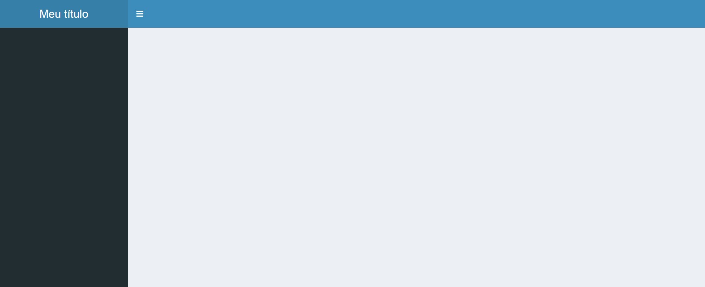
```
]

]

---
class: top

### O menu lateral

Para construirmos um menu na barra lateral, utilizamos a função .codigo[sidebarMenu()] dentro da função .codigo[dashboardSidebar()]. Cada item do menu é criado pela função .codigo[menuItem()]. Além de utilizarmos o argumento .codigo[text] para dar nomes a cada item, 
a função .codigo[menuItem()] recebe, também, um argumento chamado .codigo[tabName], que será utilizado para nos referirmos ao item correspondente dentro da função .codigo[dashboardBody].

.panelset[

.panel[
.panel-name[Código]
```{r eval=FALSE}
ui <- dashboardPage(
  dashboardHeader(title = "Meu título"),
* dashboardSidebar(
*   sidebarMenu(
*     menuItem(text = "Página 1", tabName = "pagina1"),
*     menuItem(text = "Página 2", tabName = "pagina2")
*   )
* ),
  dashboardBody()
)
```
]

.panel[
.panel-name[Resultado]
```{r echo=FALSE, fig.align='center', out.width='100%'}

```
]
]

---
class: top

### A área principal do aplicativo

Dentro do .codigo[dashboardBody()], utilizamos a função .codigo[tabItems()] para listar os itens do menu. Utilizamos como argumentos para essa função as funções .codigo[tabItem()], nas quais criaremos cada uma das páginas. Dentro de cada .codigo[tabItem()], utilizaremos o argumento .codigo[tabName] para especificarmos qual das páginas definidas no .codigo[sidebarMenu()] estaremos criando. Todo o código necessário para a construção de cada página deve estar dentro do respectivo .codigo[tabItem()].


.panelset[

.panel[
.panel-name[Código]
```{r eval=FALSE}
ui <- dashboardPage(
  dashboardHeader(title = "Meu título"),
  dashboardSidebar(
    sidebarMenu(
      menuItem(text = "Página 1", tabName = "pagina1"),
      menuItem(text = "Página 2", tabName = "pagina2")
    )
  ),
* dashboardBody(
*   tabItems(
*     tabItem(
*       tabName = "pagina1",
*       "Aqui vem todo o conteúdo da primeira página."),
*     tabItem(
*       tabName = "pagina2",
*       "Aqui vem todo o conteúdo da segunda página.")
*   )
* )
)

```
]

.panel[
.panel-name[Resultado]
```{r echo=FALSE, fig.align='center', out.width='100%'}
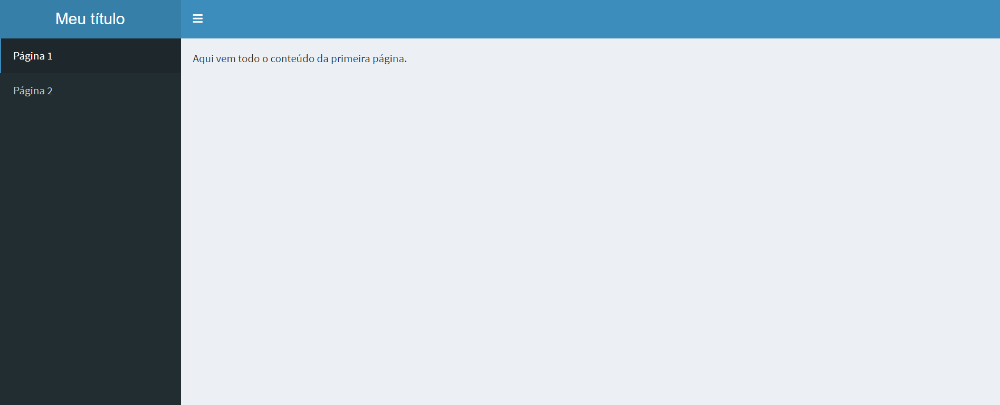
```
]
]

---
class: middle

### No `r fontawesome::fa("r-project", fill = "#0A1E3C")`

Para finalizarmos o minicurso, vamos construir o aplicativo abaixo utilizando o pacote .codigo[{shinydashboard}]. O aplicativo pode ser encontrado [neste link](https://rafasantanah.shinyapps.io/shinydashboard/).

.panelset[

.panel[
.panel-name[Tabela]
```{r echo=FALSE, fig.align='center', out.width='100%'}
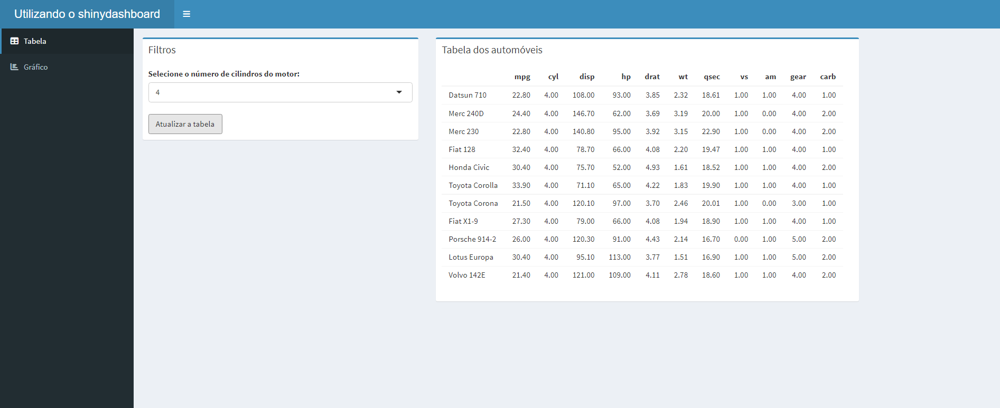
```

]

.panel[
.panel-name[Gráfico]
```{r echo=FALSE, fig.align='center', out.width='100%'}
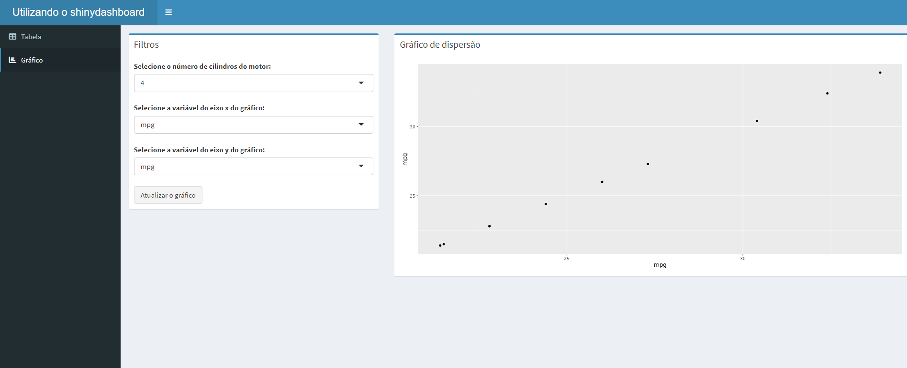
```
]
]

---
class: inverse, middle

.center[
## <br>Obrigado!
]

.pull-left[
```{r echo=FALSE, fig.align='center', fig.cap='Foto: OOBr no Instituto Butantan.'}
knitr::include_graphics("img/butantan.png")
```
]

.pull-right[
<br><br>OOBr na web:

`r fontawesome::fa("globe", fill = "white")` [https://observatorioobstetricobr.org](https://observatorioobstetricobr.org)

`r fontawesome::fa("twitter", fill = "white")` [@observatorioobr](https://twitter.com/observatorioobr)

`r fontawesome::fa("instagram", fill = "white")` [@observatorioobr](https://instagram/observatorioobr) 

`r fontawesome::fa("envelope", fill = "white")` <a href="mailto:observatorioobstetricobr@gmail.com">observatorioobstetricobr@gmail.com</a>
]
