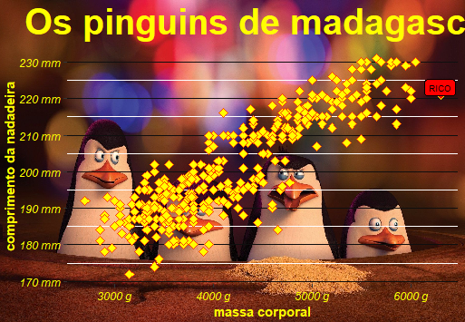

class: middle, center, inverse

```{r setup, include=FALSE}
library(ggplot2)
library(dados)
options(htmltools.dir.version = FALSE)
link <- function(href, ...) {
  htmltools::a(
    href = href,
    target = "_blank",
    ...
  )
}
knitr::opts_chunk$set(
  echo = FALSE, 
  fig.align='center'
)
xaringanExtra::use_panelset()
```


# Sobre o curso


---
class: middle, center

# Introdução


---

.pull-left[

## Discussões iniciais

- Compreender o papel da visualização em um projeto de ciência de dados.

- Discutir alguns recursos que devem ser considerados em um gráfico.

- Entender o funcionamento básico do pacote `{ggplot2}`.

]

--

.pull-right[


## Prática no R 

- Utilizar os principais gráficos do `{ggplot2}`.

- Otimização visual.

- Utilizar alguns recursos avançados do `{ggplot2}`

- Extensões e gráficos interativos.

]
---

.pull-left[

# O que é visualização de dados?

- É a representação de dados em gráficos, tabelas e diagramas que podem ser interpretados por pessoas.

- É uma área interdisciplinar, misturando estatística, arte e comunicação.

- É uma parte da área de *data storytelling*, que envolve organizar todos os resultados de uma análise de dados em uma ordem lógica para comunicar de forma efetiva com a audiência.

]

.pull-right[

# Por quê fazer visualizações de dados?

- Visualizações estão presentes na grande maioria dos projetos de ciência de dados.

- É a parte mais acessível da ciência de dados do ponto de vista de quem lê. Mostrar uma visualização costuma ser mais efetivo do que a saída de um modelo.

- É uma das partes mais difíceis de automatizar da ciência de dados. Uma carreira em *dataviz* dificilmente ficará obsoleta.

]

---

# Para quê servem as visualizações?

.pull-left[

- Uma base de dados contém toda a informação que precisamos.

- No entanto, não somos capazes de tirar conclusões apenas olhando essas bases.

- Por isso, é necessário resumir esses dados em estatísticas.

- Nem sempre as estatísticas (os números) são úteis para uma comunicação efetiva... Por isso, faz sentido mostrá-las usando formas, cores e outros elementos que facilitam a absorção da informação pelas pessoas.

]

.pull-right[

```{r}
knitr::include_graphics("https://raw.githubusercontent.com/allisonhorst/stats-illustrations/master/rstats-artwork/presenting_monster.png")
```

Ilustração de [Allison Horst](https://www.allisonhorst.com)

]

---

# Storytelling com dados

.pull-left[


- A importância do contexto. 


- A escolha da visualização eficaz.

]

.pull-right[

]

---
.pull-left[

## Análise exploratória

- É um trabalho de __investigação__ de dados
- A ferramenta: precisa ser __rápida__ de programar
- O objetivo é **aprender**

```{r, fig.width=6, fig.height=4}
ggplot2::ggplot(cars) +
  ggplot2::aes(speed, dist) +
  ggplot2::geom_point()
```

]

--

.pull-right[

## Análise descritiva

- É um trabalho de __otimização visual__
- A ferramenta: precisa ser __customizável__
- O objetivo é **comunicar**

```{r, fig.width=6, fig.height=4}
ggplot2::ggplot(cars) +
  ggplot2::aes(speed, dist) +
  ggplot2::geom_point(colour = "darkblue") +
  ggplot2::stat_smooth(
    se = FALSE, colour = "lightgray", method="loess",
    formula = "y~x"
  ) +
  ggplot2::theme_minimal(14) +
  ggplot2::labs(
    title = "A velocidade influencia na distância de parada?",
    subtitle = "Distância necessária para parar o carro",
    caption = "Fonte: Ezekiel, M. (1930) Methods of Correlation Analysis. Wiley",
    x = "Velocidade",
    y = "Distância para parar"
  )
```


]

--

.center[
### O `{ggplot2}` permite fazer as duas coisas!
]

---
# Gráficos bons e ruins

.pull-left[

### Gráficos para evitar

- Barras que não começam no zero
- [Gráficos de pizza](https://www.ime.usp.br/inscricoes-abertas-cea-da-usp-recebe-projetos-para-analise-estatistica-de-dados-2/#:~:text=Inscri%C3%A7%C3%B5es%20Abertas%3A%20CEA%20da%20USP%20recebe%20projetos%20para%20an%C3%A1lise%20estat%C3%ADstica%20de%20dados,-NOT%C3%8DCIAS&text=O%20Centro%20de%20Estat%C3%ADstica%20Aplicada,a%2015%2F07%2F2022.) (discutível!)
- ...

]

--

.pull-right[

### Gráficos para tomar cuidado

- Gráficos com dois eixos
- [Gráficos pouco conhecidos](https://confe.org.br/)
- ...

]

---

# [Qual gráfico escolher?](https://www.data-to-viz.com)

```{r, out.width="90%"}
knitr::include_graphics("img/data-to-viz.png")
```

---
class: middle,inverse,center

# Ferramental

---


# Gramática de gráficos *em camadas*

O pacote `{ggplot2}` segue duas filosofias que nos ajudam a entender o processo de construção dos gráficos:

1. Um gráfico estatístico é uma representação visual dos dados por meio de atributos estéticos (posição, cor, forma, tamanho, ...) de formas geométricas (pontos, linhas, barras, ...). [The Grammar of Graphics](https://www.springer.com/gp/book/9780387245447).

2. Um gráfico pode ser construído em camadas (um gráfico é a sobreposição de elementos visuais). [A layered grammar of graphics](https://vita.had.co.nz/papers/layered-grammar.html).


---

# Camadas

.panelset[

.panel[
.panel-name[Canvas]

```{r canvas, dpi=300, out.width="40%"}
cars |> 
  ggplot()
```

]

.panel[
.panel-name[Canvas (R)]

```{r, canvas, echo=TRUE, dpi=300, out.width="40%"}
```

]

.panel[
.panel-name[Eixos]

```{r aes-mapping, dpi=300, out.width="40%"}
cars |> 
  ggplot() +
  aes(x = speed, y = dist)
```

]


.panel[
.panel-name[Eixos (R)]

```{r, aes-mapping, echo=TRUE, dpi=300, out.width="40%"}
```

]

.panel[
.panel-name[Geometria]

```{r dispersao, dpi=300, out.width="40%"}
cars |> 
  ggplot() +
  aes(x = speed, y = dist) +
  geom_point()
```

]

.panel[
.panel-name[Geometria (R)]

```{r, dispersao, echo=TRUE, dpi=300, out.width="40%"}
```

]
]

---

# Camadas

Depois, podemos trabalhar a estética com temas e detalhamentos.

.panelset[
.panel[
.panel-name[Completo]

```{r cars-completo, fig.width=9, fig.height=6, dpi=300}
ggplot(cars) +
  aes(speed, dist) +
  geom_point(colour = "darkblue") +
  stat_smooth(
    se = FALSE, colour = "lightgray", 
    method = "loess", formula = "y ~ x"
  ) +
  theme_minimal(14) +
  labs(
    title = "A velocidade influencia na distância de parada?",
    subtitle = "Distância necessária para parar o carro",
    caption = paste(
      "Fonte: Ezekiel, M. (1930) Methods of",
      "Correlation Analysis. Wiley"),
    x = "Velocidade", y = "Distância para parar"
  )
```

]
.panel[
.panel-name[Completo (R)]

```{r, cars-completo, fig.width=9, fig.height=6, echo=TRUE}
```

]
]


---

# [Dúvidas? cheat sheet](https://www.rstudio.com/resources/cheatsheets/)

```{r, out.width="75%"}
knitr::include_graphics("https://raw.githubusercontent.com/rstudio/cheatsheets/main/pngs/data-visualization.png")
```


---
class: middle, center, inverse

# Otimização Visual

---

# O que é otimização visual?

- É o ato de trabalhar em uma visualização aprimorar a comunicação.

- Pode envolver alterações nas cores, fontes, elementos geométricos, entre outros, a partir de um gráfico exploratório.

- Não é uma ciência exata, mas recolhe elementos da ciência para aumentar a probabilidade de sucesso da visualização.

---

# Recursos pré-atentativos

- Uma propriedade visual pré-atentativa é processada pelo nosso [cérebro antes de uma ação consciente](https://www.interaction-design.org/literature/article/preattentive-visual-properties-and-how-to-use-them-in-information-visualization).

- Como isso esse processamento é muito rápido, trata-se de uma oportunidade para tornar visualizações mais amigáveis e diretamente interpretadas.

- Segundo [Colin Ware](https://en.wikipedia.org/wiki/Colin_Ware), existem 4 propriedades pré-atentativas que podemos explorar:
    - Cor
    - Forma
    - Movimento
    - Posicionamento
    
- O objetivo dos recursos pré-atentativos é __<span style="color:blue;">chamar a atenção</span>__.

---

# Recursos pré-atentativos

- Uma propriedade visual pré-atentativa é processada pelo nosso [cérebro antes de uma ação consciente](https://www.interaction-design.org/literature/article/preattentive-visual-properties-and-how-to-use-them-in-information-visualization).

- Como isso esse processamento é muito rápido, trata-se de uma oportunidade para tornar visualizações mais amigáveis e diretamente interpretadas.

- Segundo [Colin Ware](https://en.wikipedia.org/wiki/Colin_Ware), existem 4 propriedades pré-atentativas que podemos explorar:
    - __Cor__
    - __Forma__
    - Movimento
    - Posicionamento
    
- O objetivo dos recursos pré-atentativos é __<span style="color:blue;">chamar a atenção</span>__.

---
class: middle, center

# Cor

---

# Cores do zero: HCL vs RGB

- HCL (hue, chroma, luminance) é vantajoso pois é mais intuitivo de criar do que RGB, já que o HCL tem apenas um eixo de cores (*hue*), enquanto RGB é uma composição de três (*red*, *green*, *blue*)

- O pacote {colorspace} permite usar HCL para definir uma cor/paleta. No R: colorspace::hcl_color_picker()

- [color picker](https://www.google.com/search?q=color+picker&rlz=1C1CHZN_pt-BRBR985BR985&oq=color+pick&aqs=chrome.1.69i57j0i131i433i512l5j0i512l4.5991j0j7&sourceid=chrome&ie=UTF-8), também é possível criar algumas paletas

---

# Paletas de cores prontas

- __Escalas qualitativas__: utilizado para variáveis nominais (sexo, cor/raça)

- __Escalas divergentes__: utilizado para variáveis que têm um centro neutro (favorável/neutro/desfavorável, correlação)

- __Escalas sequenciais__: utilizado para variáveis ordinais (faixa etária, renda)

- [__Viridis__](https://cran.r-project.org/web/packages/viridis/vignettes/intro-to-viridis.html): útil para comunicar com pessoas com daltonismo

---

# Paletas de cores no {ggplot2}

- `scale_*_brewer()`: utilizada para variáveis discretas. Possui três tipos: divergente, qualitativa e sequencial.

- `scale_*_distiller()`: utilizada para variáveis contínuas. Interpola as cores do *brewer* para lidar com todos os valores.

- `scale_*_fermenter()`: utilizada para variáveis contínuas, que são transformadas em discretas (binned).

- `scale_*_viridis_[cdb]`: Escala viridis para variáveis `c`ontínuas, `d`iscretas ou `b`inned.

- `scale_*_manual()`: inclui um conjunto de cores manualmente.

---

# Paletas de outros pacotes

- [`{ggthemr}`](https://github.com/Mikata-Project/ggthemr) tem um monte de paletas, mas está um pouco desatualizado.

- [`{hrbrthemes}`](https://github.com/hrbrmstr/hrbrthemes) contém uma lista de temas escolhidos pelo Bob Rudis.

- [`{ghibli}`](https://ewenme.github.io/ghibli/) tem paletas de cores relacionadas ao Studio Ghibli

- [`{paletteer}`](https://github.com/EmilHvitfeldt/paletteer) tem uma coleção de cores de vários outros pacotes de paletas.

---

# Qual visualização é melhor?

.pull-left[

```{r, fig.width=5, fig.height=4, dpi = 300}
notas_pixar <- dados::pixar_avalicao_publico |> 
  dplyr::count(nota_cinema_score) |> 
  dplyr::mutate(
    nota = forcats::fct_explicit_na(nota_cinema_score, "(vazio)"),
    nota = forcats::fct_relevel(nota, c("A-", "A", "A+", "(vazio)"))
  )
notas_pixar |> 
  ggplot2::ggplot() +
  ggplot2::aes(nota, n) +
  ggplot2::geom_col(width = .5) +
  ggplot2::scale_y_continuous(limits = c(0, 15)) +
  ggplot2::labs(title = "A maioria dos filmes da pixar tem nota 'A'") +
  ggplot2::theme_minimal(12)
```

]


.pull-right[

```{r, fig.width=5, fig.height=4, dpi = 300}
notas_pixar |> 
  dplyr::mutate(cor = dplyr::case_when(
    nota == "A" ~ "b",
    TRUE ~ "a"
  )) |> 
  ggplot2::ggplot() +
  ggplot2::aes(nota, n, fill = cor) +
  ggplot2::geom_col(width = .5, show.legend = FALSE) +
  ggplot2::scale_y_continuous(limits = c(0, 15)) +
  ggplot2::scale_fill_manual(values = c("gray30", "tomato")) +
  ggplot2::labs(title = "A maioria dos filmes da pixar tem nota 'A'") +
  ggplot2::theme_minimal(12)
```

]


---
class: middle, center

# Forma

---

# Formas

- Geralmente queremos contrastar formas para chamar a atenção...

--

- Sem com isso fazer uma bagunça visual.

--

- A ideia é utilizar apenas um elemento, como tamanho, forma, largura, marcações, angulações, etc. para mostrar o contraste.


---

# Reflita

```{r, out.width="90%"}

```


---
class: inverse, middle, center

# Extensões do ggplot2

---

# O que é uma extensão?

- O `{ggplot2}` é maravilhoso, mas não possui todos os gráficos possíveis.

- Por isso, pessoas do mundo todo desenvolvem extensões para a comunidade usar, que vão desde pacotes com novos temas/cores, geometrias eixos até a [possibilidade de desenhar gatinhos em barras](https://coolbutuseless.github.io/package/ggpattern/index.html)

- A equipe do tidyverse mantém uma [lista curada de extensões do `{ggplot2}`](https://exts.ggplot2.tidyverse.org/gallery/)

---


# Interatividade


---

## Gráficos interativos e estáticos

- Gráficos interativos têm o poder de engajar mais. Todo ser humano gosta de interagir com aquilo que está analisando.

- No entanto, isso vem com um custo: não são todos os documentos capazes de processar visualizações dinâmicas. Em particular, PDF, Word e PPT não rodam esses conteúdos.

- Difculdade da sintaxe. 


---
## Gráficos com plotly

O pacote `plotly` nos permite criar gráficos interativos baseados na biblioteca [Plotly](https://plotly.com/) (construída em [D3](https://d3js.org/)). 

Embora seja possível criar um plotly do zero usando a função `plot_ly()`, um jeito muito eficiente de utilizar essa biblioteca é criar um ggplot e então utilizar a função `ggplotly()`. Veja o exemplo a seguir.

#### Tutoriais

- [Tutorial plotly](https://plotly.com/r/)

- [Interactive web-based data visualization with R, plotly, and shiny](https://plotly-r.com/)

---
<br><br>

.pull-left[

```{r echo=TRUE, eval=FALSE}
gg <- ggplot(mtcars) +
  aes(wt, mpg) +
  geom_point()
plotly::ggplotly(
  p = gg, 
  height = 400
)
```

]

.pull-right[

```{r}
gg <- ggplot(mtcars) +
  aes(wt, mpg) +
  geom_point()
plotly::ggplotly(
  p = gg, 
  height = 400
)
```


]


---
## Pacotes alternativos

A seguir, uma lista de pacotes/funções alternativos que trazem soluções para visualização de gráficos.

- `highcharter::highcharter()`: pacote gráfico baseado na biblioteca JavaScript [Highcharts](https://www.highcharts.com/). A biblioteca Highcharts é gratuita apenas para fins educacionais e não lucrativos (exceto órgãos governamentais). Para outros usos, você pode precisar de uma licença. **[avançado]**

- Procure por pacotes para tipos específicos de gráficos na [galeria de htmlwidgets](http://gallery.htmlwidgets.org/).

#### Tutoriais

- [Tutorial highcharter](http://jkunst.com/highcharter/)

- [Documentação Highcharts](https://api.highcharts.com/highcharts/)

---
## Mapas com leaflet

O pacote `{leaflet}` nos permite criar mapas interativos baseados na biblioteca  JavaScript open-source [Leaflet](https://leafletjs.com/).

Para criar um mapa leaflet, utilizamos a função `leaflet::leaflet()` e diversas funções auxiliares para caracterizar nosso mapa. Um tutorial de como utilizar o `leaflet` se encontra [aqui](http://rstudio.github.io/leaflet/).

A seguir, mostramos um exemplo simples de como criar um mapa leaflet.

---
<br><br>


```{r echo=TRUE}
library(leaflet)
leaflet(height = 300) %>%
  addTiles() %>%  # Adiciona a camada gráfica do OpenStreetMap (padrão)
  addMarkers(
    lng = -40.3046969, lat = -20.2760684, 
    popup = "Estamos aqui!!!"
  )

```

--- 
<br><br>


```{r echo=TRUE}
library(leaflet)
leaflet(height = 300) %>%
addProviderTiles(providers$Stamen.Toner) %>%  # Adiciona a camada gráfica do OpenStreetMap (padrão)
  addMarkers(
    lng = -40.3046969, lat = -20.2760684, 
    popup = "Estamos aqui!!!"
  )

```

---
## Pacotes alternativos

- `highcharter::hcmap()`: variação do `highcharter` para mapas, baseada na biblioteca JavaScript [Highcharts](https://www.highcharts.com/maps/demo). **[avançado]**

- [`{tmap}`](https://github.com/mtennekes/tmap): Pacote focado em mapas temáticos.

#### Tutoriais

- [Construindo mapas com o highcharter](http://jkunst.com/highcharter/highmaps.html)

- [Documentação Highmaps](https://api.highcharts.com/highmaps/)

- [Documentação do tmap](https://github.com/mtennekes/tmap)

---
class: middle, center, inverse

.center[
## <br>Obrigado!
]

.pull-left[
```{r echo=FALSE, fig.align='center', fig.cap='Foto: OOBr no Instituto Butantan.'}
knitr::include_graphics("img/butantan.png")
```
]

.pull-right[
<br><br>OOBr na web:

`r fontawesome::fa("envelope", fill = "white")` <a href="mailto:observatorioobstetricobr@gmail.com">observatorioobstetricobr@gmail.com</a>

`r fontawesome::fa("twitter", fill = "white")` [@observatorioobr](https://twitter.com/observatorioobr)

`r fontawesome::fa("instagram", fill = "white")` [@observatorioobr](https://instagram/observatorioobr) 
]