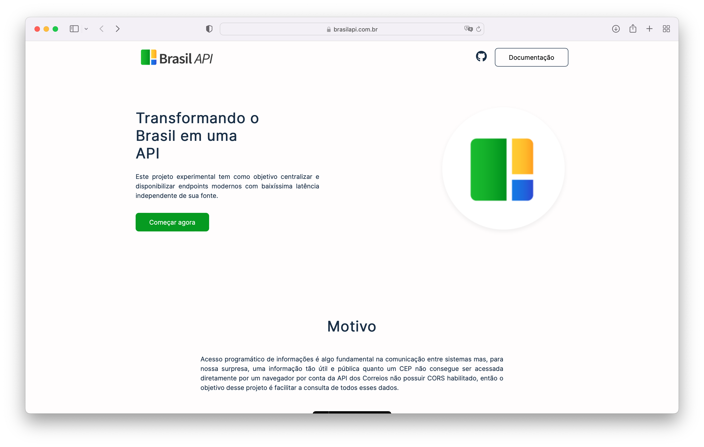
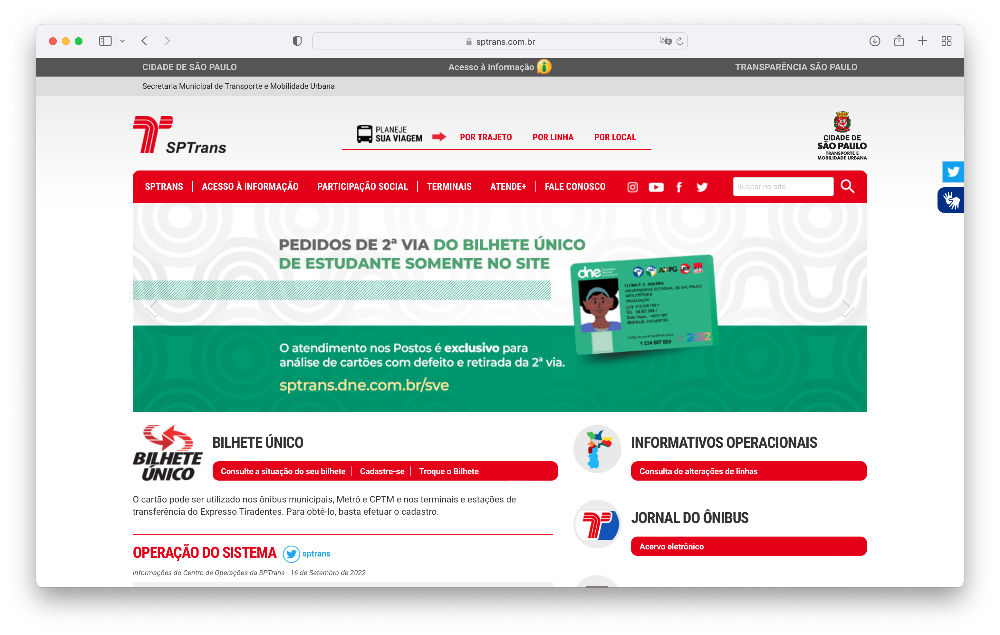
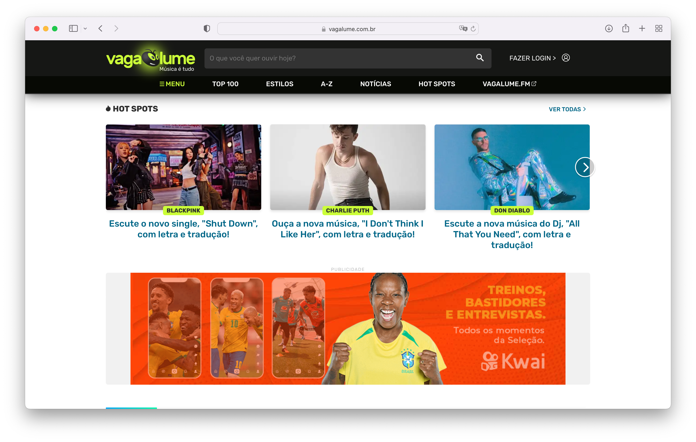
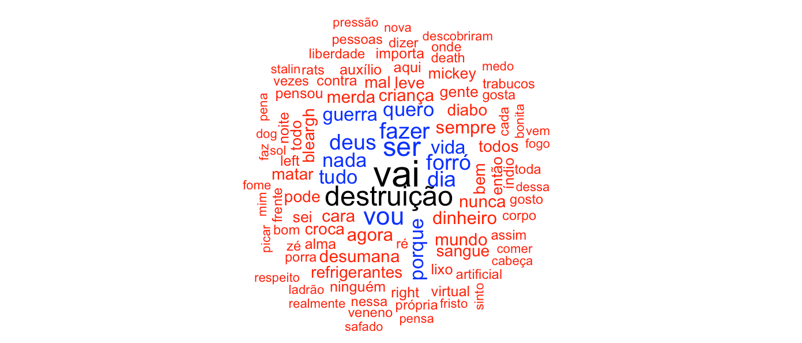
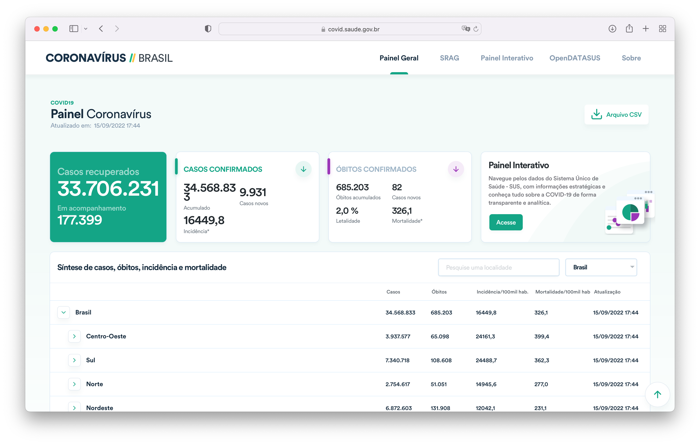
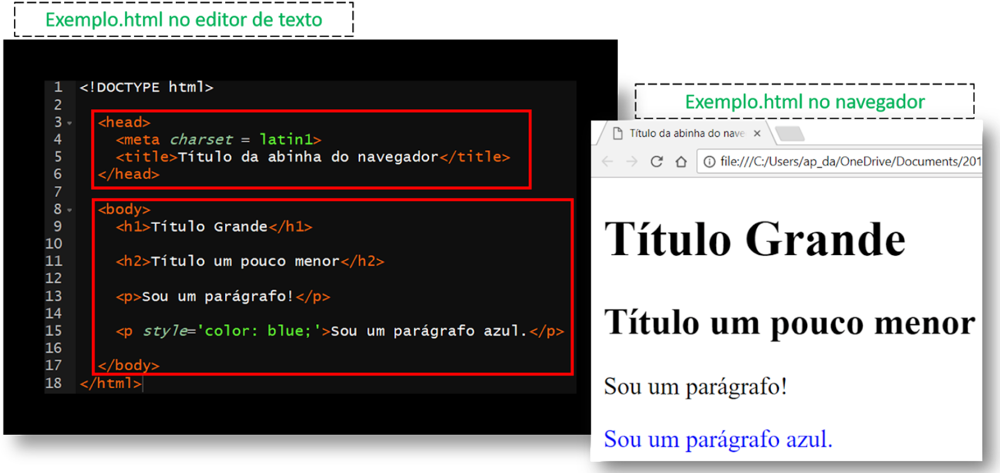
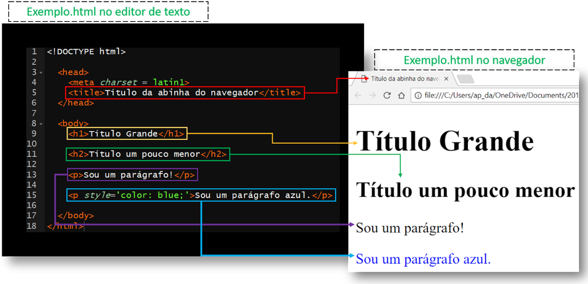
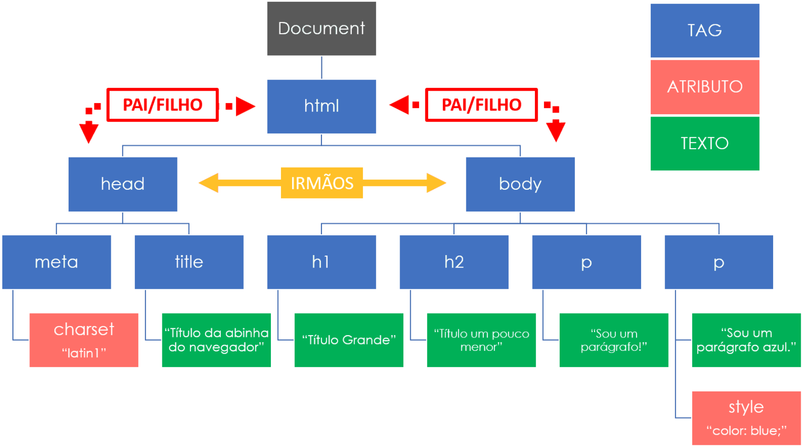
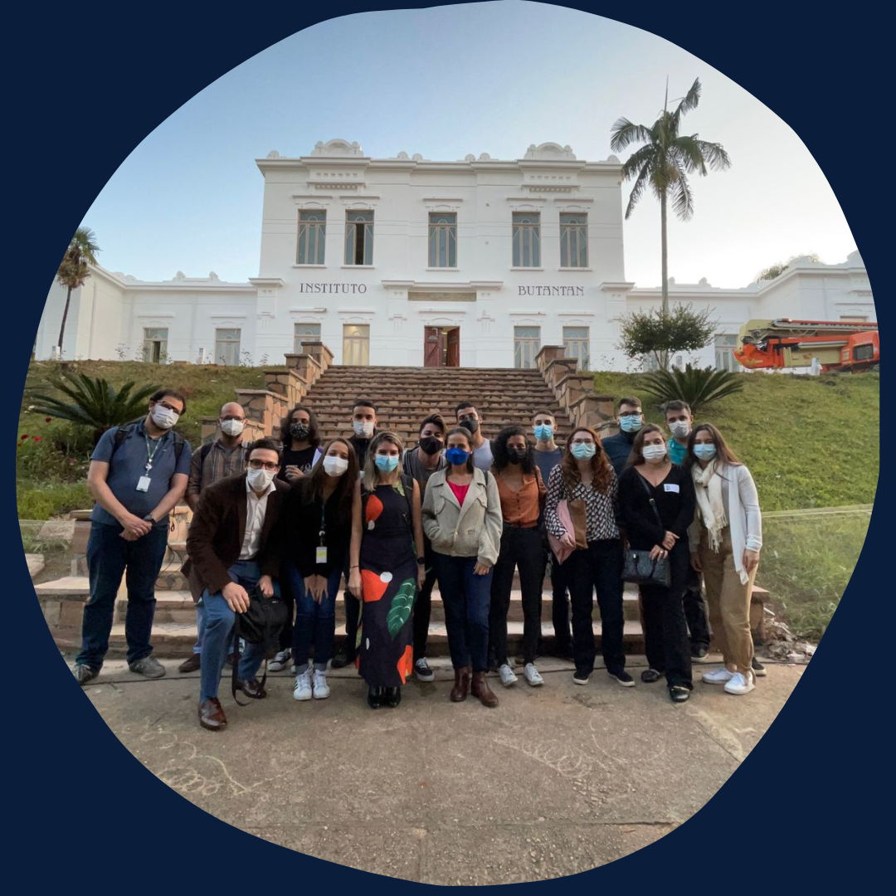

class: inverse, center, middle

background-image: url(img/logo.png)
background-position: 50% 15%
background-size: 30%

# <br><br>Web Scraping

### Workshop Ciência de Dados 
### OOBr + Constat

---

```{r setup, include=FALSE}
options(htmltools.dir.version = FALSE)

knitr::opts_chunk$set(
  fig.width=9, fig.height=3.5, fig.retina=3,
  out.width = "100%",
  cache = FALSE,
  echo = TRUE,
  message = FALSE, 
  warning = FALSE,
  hiline = TRUE
)
```

```{r xaringan-themer, include=FALSE, warning=FALSE}
library(xaringanthemer)
style_mono_accent(
  base_color = "#0A1E3C",
  code_inline_color = "#41BE3C",
  text_bold_color = "#32A0FF",
  link_color = "#FAC80F",
  text_font_google = google_font("Lato", "300", "300i"),
  header_font_google = google_font("Ubuntu")
)
```

```{css, echo=FALSE}
pre {
  max-height: 300px;
  overflow-y: auto;
  background-color: inherit;
}
```

```{r echo=FALSE, message=FALSE, warning=FALSE, error=FALSE}
#web scraping
library(httr)
library(xml2)
library(rvest)
library(progressr)
library(beepr)
#data
library(dplyr)
library(purrr)
library(janitor)
library(tidyr)
library(stringr)
#graph
library(ggplot2)
library(ghibli)
library(ggimage)
```

### Sobre mim

.pull-left[

]

.pull-right[
- Graduanda em Estatística na Universidade Federal do Espírito Santo (UFES).

- Botafoguense e bávara (Bayern de Munique) doente.

- Apaixonada por gráficos, cavalos, cinema, música ruim e geopolítica.

- Antes de partir, gostaria de ver a Palestina livre.

<br><br><br>Contato:

`r fontawesome::fa("envelope", fill = "#0A1E3C")` <a href="mailto:ornscar@gmail.com">ornscar@gmail.com</a>

`r fontawesome::fa("github", fill = "#0A1E3C")` <a href="http://github.com/ornscar">@ornscar</a>
]

---

### Sobre o OOBr

.pull-left[
- Plataforma interativa de monitoramento, análises de dados públicos (da saúde, socioeconômicos e ambientais) cientificamente embasadas e disseminação de informações relevantes na área da saúde materno-infantil. 

- Ser referência de informações acessíveis e confiáveis sobre saúde materno-infantil e ser um suporte importante para a tomada de decisões na área.

- Equipe multidisciplinar da UFES, USP e FACENS.

- Financiado pela Fundação Bill & Melinda Gates, CNPq e FAPES.
]

.pull-right[
```{r echo=FALSE, fig.align='center'}
knitr::include_graphics("img/logo2.png")
```
]

---

.pull-left[
### Painéis
```{r echo=FALSE, fig.align='center'}
knitr::include_graphics("img/paineis.png")
```
]

.pull-right[
### Livro e tutoriais
```{r echo=FALSE, fig.align='center'}
knitr::include_graphics("img/tutoriais.png")
```
]

.center[
#### `r fontawesome::fa("link", fill = "#0A1E3C")` [https://observatorioobstetricobr.org](https://observatorioobstetricobr.org)
]

---

### Cronograma

1. Introdução ao Web Scraping: o que é, quando usar e quais cenários?

2. Acessar APIs: disponíveis, ocultas e com autenticação simples.

3. Sites estáticos em HTML.

4. Iteração de algoritmos com tratamento de erros e barras de progresso.

- Serão utilizados os pacotes `r fontawesome::fa("r-project", fill = "#0A1E3C")`:

> `{httr}`: acessar a web;

> `{xlm2}` e `{rvest}`: extrair dados de arquivos HTML;

> `{jsonlite}`: extrair dados de arquivos JSON;

> `{purrr}`: iterar e identificar erros;

> `{progressr}`: incluir barras de progresso;

> `{tidyverse}`: manipulação e visualização dos dados extraídos.

- Minicurso baseado no material do [curso de Web Scraping da Curso-R](https://loja.curso-r.com/web-scraping.html).

---
class: inverse, middle, center

## Introdução

---

### O que é _web scraping_?

- Em português, conhecido como raspagem de dados.

- Técnica que consite em acessar, baixar e organizar (ou "parsear") dados da internet.

```{r echo=FALSE, fig.align='center', fig.cap='Figura 1: Fluxo de web scraping. Fonte: Curso-R.', out.width="70%"}
knitr::include_graphics("img/fluxo.png")
```

- Utilizado por empresas imobiliárias, de negócios e de marketing e mídias sociais, escritórios de advocacia e acadêmicos.

- Grande habilidade de um estatístico e cientista de dados.

---

.pull-left[
### Quando usar _web scraping_? 

- Quando é preciso coletar um grande volume de dados que está disponível somente na internet.

- As informações do site são públicas.

> dados abertos _vs._ dados públicos.

]

.pull-right[
### E quando não usar?

- Quando existem formas mais simples de obter os dados.

- Os termos de uso do site não permitem fazer _web scraping_.

```{r echo=FALSE, fig.align='center', fig.cap='Figura 2: Robots do site Who Scored.', out.width="80%"}
knitr::include_graphics("img/robots.png")
```
]

--

.center[
####<br><br><br><br><br><br><font color="red">Cuidado! Risco de derrubar ou comprometer a estabilidade do site.</font>
]

---

### Tipos de cenários para "scrapear"

- API disponível: o site fornece uma forma estruturada e documentada para acessar suas páginas. _Ex.: ACNUR._

- API oculta: o site não fornece uma forma estruturada e documentada para acessar suas páginas, mas internamente é alimentado por uma API não documentada. _Ex.: Sabesp._

- API com autenticação: a fim de identificar o projeto ou o sistema que está fazendo a requisição, o site exige um _token_ para liberar o acesso às suas páginas. _Ex.: Twitter._

- Site estático: o site não fornece uma forma estruturada de acessar suas páginas, e as páginas são geradas de forma estática. _Ex.: páginas da Wikipédia._

- Site dinâmico: o site não fornece uma forma estruturada de acessar as páginas, e as páginas são geradas de forma dinâmica. _Ex.: painéis de visualização do OOBr._

---

### Códigos de status de uma requisição

- `200` OK

- `302` Redirecionado

- `400` Requisição mal formatada

- `401` Não autorizado

- `403` Proibido

- `404` Não encontrado

- `503` Erro no servidor

<br><br>

Veja mais códigos de status em: [https://en.wikipedia.org/wiki/List_of_HTTP_status_codes](https://en.wikipedia.org/wiki/List_of_HTTP_status_codes).

---
class: inverse, middle, center

## APIs

---

.pull-left[
### O que é API?

- Significa _Application Programming Interface_.

- Forma unificada para acessar dados de uma plataforma a partir de qualquer linguagem de programação.

- Pode vir ou não acompanhada de documentação.

- Reduz o volume na transferência de dados.

### Pacotes 

- `{httr}`, `{jsonlite}` e `{tidyverse}`.
]

.pull-right[
### Como funciona? 

- Acessar

    - Instruções de acesso na documentação da API;
    - Pode ser necessária a utilização de um _token_ de acesso.

- Coletar
    
    - Geralmente, são requisições do tipo GET;
    - Pode ou não possuir parâmetros para acessar as informações; 
    - Normalmente, os dados estão em formato .json.
    
- Inserir

    - Geralmente, são requisições do tipo POST;
    - Possui parâmetros para enviar informações ao servidor.
]

---

### Aplicação 1 - API disponível sem autenticação

- Brasil API: [https://brasilapi.com.br](https://brasilapi.com.br).

```{r echo=FALSE, fig.align='center', fig.cap='Figura 3: Site Brasil API.', out.width="80%"}

```

---

### No `r fontawesome::fa("r-project", fill = "#0A1E3C")`

- Exemplo 1: pesquisar a localidade a partir de um CEP de interesse.

```{r c1}
u_base <- "https://brasilapi.com.br/api"
endpoint_cep <- "/cep/v2/"
cep <- "66085370"

# url valida

u_cep <- paste0(u_base, endpoint_cep, cep)

# requisicao

r_cep <- httr::GET(u_cep); r_cep #<<
```

---

```{r}
# extrair conteudo da requisicao em formato de texto

httr::content(r_cep, as = "text") #<<
```

--

```{r}
# ler dados .json e transformar em um data frame

httr::content(r_cep, "text") %>% 
  jsonlite::fromJSON(simplifyDataFrame = TRUE) #<<
```

---

```{r}
# transformar em um data frame

content(r_cep, as = "text") %>% 
  jsonlite::fromJSON(simplifyDataFrame = TRUE) %>% 
  tibble::as_tibble() #<<
```

--

```{r}
# acessar conteudo das listas da variavel 'location'

content(r_cep, as = "text") %>% 
  jsonlite::fromJSON(simplifyDataFrame = TRUE) %>% 
  tibble::as_tibble() %>% 
  purrr::pluck("location", "coordinates") #<<
```

---

- Exemplo 2: pesquisar o preço atual de um carro de interesse e compará-lo com o preço na tabela de dez/2019.

    - Pode pesquisar o código FIPE em: [https://www.tabelafipebrasil.com](https://www.tabelafipebrasil.com).

```{r}
u_base <- "https://brasilapi.com.br/api"
endpoint_carro_fipe <- "/fipe/preco/v1/"
cod_carro_fipe <- "0560111" # Troller

# url valida

u_carro <- paste0(u_base, endpoint_carro_fipe, cod_carro_fipe)

# requisicao

r_carro <- httr::GET(u_carro); r_carro #<<
```

---

```{r}
# ler dados .json e transformar em um data frame

d_carro_22 <- httr::content(r_carro, simplifyDataFrame = TRUE) %>% 
  tibble::as_tibble()
``` 

--

```{r}
u_base <- "https://brasilapi.com.br/api"
endpoint_tabelas <- "/fipe/tabelas/v1"

# url valida

u_tabelas <- paste0(u_base, endpoint_tabelas)

# requisicao

r_tabelas <- httr::GET(u_tabelas); r_tabelas #<<
```

---

```{r}
# localizar codigo referente a dez/2019

httr::content(r_tabelas, simplifyDataFrame = TRUE) %>% 
  tibble::as_tibble() %>% 
  print(n = 50) #<<
```

--

```{r}
# parametro

q_fipe <- list(tabela_referencia = 249)
```

---

```{r}
# requisicao com parametro

r_carro_19 <- httr::GET(u_carro, query = q_fipe)

# ler dados .json e transformar em um data frame

d_carro_19 <- httr::content(r_carro_19, simplifyDataFrame = TRUE) %>% 
  tibble::as_tibble()
```

--

```{r}
d_carro_19 %>% #<<
  dplyr::select(valor, anoModelo) # valor do carro em 2019 #<< 

d_carro_22 %>% #<<
  dplyr::select(valor, anoModelo) # valor do carro em 2022 #<< 
```

---

### Aplicação 2 - API oculta sem autenticação

- Mananciais Sabesp: [https://mananciais.sabesp.com.br](https://mananciais.sabesp.com.br).

```{r echo=FALSE, fig.align='center', fig.cap='Figura 4: Portal dos Mananciais Sabesp.', out.width="80%"}
knitr::include_graphics("img/sabesp.png")
```

---

### No `r fontawesome::fa("r-project", fill = "#0A1E3C")`

- Exemplo: pesquisar sobre os níveis dos reservatórios que abastecem a região metropolitana de São Paulo.

```{r}
u_base <- "https://mananciais.sabesp.com.br/api/Mananciais/ResumoSistemas/"
endpoint_data_consulta <- "2022-05-09"

# url valida

u_sabesp <- paste0(u_base, endpoint_data_consulta)

# requisicao

r_sabesp <- httr::GET(u_sabesp); r_sabesp #<<
```

---

```{r}
# ler dados .json e transformar em um data frame

httr::content(r_sabesp, simplifyDataFrame = TRUE) #<<
```

---

```{r}
# selecionar a lista 'sistemas' dentro da lista 'ReturnObj'

httr::content(r_sabesp, simplifyDataFrame = TRUE) %>% 
  purrr::pluck("ReturnObj", "sistemas") #<<
```

---

```{r}
# transformar a lista 'sistemas' em um data frame

d_sabesp <- httr::content(r_sabesp, simplifyDataFrame = TRUE) %>%
  purrr::pluck("ReturnObj", "sistemas") %>% 
  janitor::clean_names() %>% 
  tibble::as_tibble()

d_sabesp #<<
```

---

### Aplicação 3.1 - API disponível com autenticação

- SPTrans: [https://www.sptrans.com.br](https://www.sptrans.com.br).

```{r echo=FALSE, fig.align='center', fig.cap='Figura 5: Site SPTrans.', out.width="80%"}

```

---

### No `r fontawesome::fa("r-project", fill = "#0A1E3C")`

- Exemplo: pesquisar sobre a localização dos ônibus.

```{r}
u_base <- "http://api.olhovivo.sptrans.com.br/v2.1"
endpoint_sptrans <- "/Posicao"

# url valida

u_sptrans <- paste0(u_base, endpoint_sptrans)

# requisicao

r_sptrans <- httr::GET(u_sptrans); r_sptrans #<<
```

--

```{r}
httr::content(r_sptrans) #<<
```

---

```{r}
# token de acesso a api

api_key <- "4af5e3112da870ac5708c48b7a237b30206806f296e1d302e4cb611660e2e03f"
```

```{r}
u_sptrans_login <- paste0(u_base, "/Login/Autenticar")

# parametro

q_sptrans <- list(token = api_key)

# requisicao com parametro

r_sptrans_login <- httr::POST(u_sptrans_login, query = q_sptrans)

r_sptrans_login #<<
```

--

```{r}
# verificar se a autenticacao foi realizada com sucesso

httr::content(r_sptrans_login) #<<
```

---

```{r}
u_base <- "http://api.olhovivo.sptrans.com.br/v2.1"
endpoint_sptrans <- "/Posicao"

# url valida

u_sptrans <- paste0(u_base, endpoint_sptrans)

# requisicao

r_sptrans <- httr::GET(u_sptrans); r_sptrans #<<
```

---

```{r}
# ler dados .json e transformar em um data frame

httr::content(r_sptrans, simplifyDataFrame = TRUE) #<<
```

---

```{r}
# selecionar a lista 'l'

httr::content(r_sptrans, simplifyDataFrame = TRUE) %>%
  purrr::pluck("l") #<<
```

---

```{r}
# transformar a lista 'l' em um data frame

httr::content(r_sptrans, simplifyDataFrame = TRUE) %>%
  purrr::pluck("l") %>%
  tibble::as_tibble() #<<
```

---

#### Manipulando os dados...

--

```{r}
# transformar variavel 'vs' em colunas regulares

httr::content(r_sptrans, simplifyDataFrame = TRUE) %>%
  purrr::pluck("l") %>%
  tibble::as_tibble() %>%
  tidyr::unnest(vs) #<<
```

---

#### Aqui, temos um gráfico para a localização dos ônibus:


```{r echo=FALSE}
xaringanExtra::use_panelset()
```

.panelset[

.panel[
.panel-name[código]
```{r echo=TRUE, eval=FALSE}
httr::content(r_sptrans, simplifyDataFrame = TRUE) %>%
  purrr::pluck("l") %>%
  tibble::as_tibble() %>%
  tidyr::unnest(vs) %>%
  ggplot(aes(x = px, y = py)) + #<<
  geom_point() + #<<
  coord_fixed() # nao desconfigurar #<<
```
]

.panel[
.panel-name[gráfico]
```{r echo=FALSE, eval=TRUE, out.width="70%", fig.height=6.5, fig.align='center'}
httr::content(r_sptrans, simplifyDataFrame = TRUE) %>%
  purrr::pluck("l") %>%
  tibble::as_tibble() %>%
  tidyr::unnest(vs) %>%
  ggplot(aes(x = px, y = py)) + #<<
  geom_point() + #<<
  coord_fixed() # nao desconfigurar #<<
```
]

]
---

### Aplicação 3.2 - API disponível com autenticação

- Vagalume: [https://www.vagalume.com.br](https://www.vagalume.com.br).

```{r echo=FALSE, fig.align='center', fig.cap='Figura 6: Site Vagalume.', out.width="80%"}

```

---

### Observações

- Utiliza OAuth.

- Pacote `{vagalumeR}`.

### No `r fontawesome::fa("r-project", fill = "#0A1E3C")`

- Exemplo: pesquisar as letras das músicas de um artista de interesse.

    1. Logar em [https://auth.vagalume.com.br/](https://auth.vagalume.com.br/).
    2. Criar credencial em [https://auth.vagalume.com.br/settings/api/](https://auth.vagalume.com.br/settings/api/) e copiá-la.

```{r}
# token de acesso

api_key <- Sys.getenv("API_VAGALUME")
```

--

```{r}
# definir artista

artista <- "mukeka-di-rato" 
```

---

```{r}
# buscar nomes e ids das musicas do artista

musicas <- artista %>% 
  vagalumeR::songNames()

musicas #<<
```

---

```{r}
musicas_aleatorias <- musicas %>% 
  dplyr::sample_n(60) %>%      # selecionar 60 musicas aleatoriamente
  pull(song.id) %>%            # acessar coluna 'song.id'
  map_dfr(vagalumeR::lyrics,   # obter data frame que tem a letra das musicas
          artist = "Mukeka di Rato", 
          type = "id", 
          key = api_key,
          message = FALSE)

musicas_aleatorias #<<
```

---

#### Após minerar as letras das músicas...

```{r echo=FALSE, fig.align='center', fig.cap='Figura 7: Nuvem de palavras das músicas da Mukeka di Rato.', out.width="100%"}

```

---

### Aplicação 4 - API oculta com autenticação

- Coronavírus Brasil: [https://covid.saude.gov.br](https://covid.saude.gov.br).

```{r echo=FALSE, fig.align='center', fig.cap='Figura 8: Site Coronavírus Brasil.', out.width="80%"}

```

---

### No `r fontawesome::fa("r-project", fill = "#0A1E3C")`

- Exemplo: pesquisar dados do COVID-19 atualizados.

```{r}
# requisicao

r <- httr::GET("https://covid.saude.gov.br/"); r #<<
```

---

```{r}
# extrair conteudo da requisicao em formato de texto

httr::content(r, "text") #<<
```

--
 
#### <br> Parece que não é o caminho. Continuando a procurar uma URL válida...

--

```{r}
# url

link_rar <- "https://mobileapps.saude.gov.br/esus-vepi/files/unAFkcaNDeXajurGB7LChj8SgQYS2ptm/a1f358a1398a995f1e4d45b1803e91dd_HIST_PAINEL_COVIDBR_15set2022.rar"

# requisicao

r_rar <- httr::GET(
  link_rar, 
  write_disk("dados_covid.rar", overwrite = TRUE)
); r_rar #<<
```

---

#### Mas e se queremos pegar o dado mais atual?

--

#### Uma sugestão é automatizar a descoberta do link.

--

```{r}
# url portal geral

u_portal_geral <- "https://qd28tcd6b5.execute-api.sa-east-1.amazonaws.com/prod/PortalGeral"
# requisicao

r_portal_geral <- httr::GET(u_portal_geral); r_portal_geral #<<
```

--

```{r}
# extrair conteudo da requisicao

httr::content(r_portal_geral) #<<
```

---

#### Problema: nosso código não está imitando corretamente a requisição do computador.

--

#### Tudo indica que é um problema de autenticação. Será?

--

```{r}
# url portal geral

u_portal_geral <- "https://qd28tcd6b5.execute-api.sa-east-1.amazonaws.com/prod/PortalGeral"

# requisicao com headers 

r_portal_geral <- httr::GET(
  u_portal_geral, 
  add_headers("x-parse-application-id" = "unAFkcaNDeXajurGB7LChj8SgQYS2ptm")
); r_portal_geral #<<
```

---

```{r}
# ler conteudo da requisicao

httr::content(r_portal_geral) #<<
```

--

```{r}
# acessar a url do arquivo mais atual

link_atual <- httr::content(r_portal_geral) %>% 
  purrr::pluck("results", 1, "arquivo", "url")

link_atual #<<
```

---

```{r}
# requisicao 

r_covid <- httr::GET(
  link_atual,
  write_disk("dados_covid.rar", overwrite = TRUE)
); r_covid #<<
```

--

#### <br><br><br>Mas o `x-parse-application-id` pode mudar. E aí?

---

#### Vamos procurá-lo...

```{r}
# url que contem o x-parse

u_js <- "https://covid.saude.gov.br/main-es2015.js"

# requisicao

r_js <- httr::GET(u_js); r_js #<<
```

--

#### ... e então automatizá-lo.

```{r}
# ler conteudo da requisicao em formato de texto

httr::content(r_js, as = "text") #<<
```

---

```{r}
# extrair texto que nao é aspas simples que vem depois de PARSE_APP_ID

codigo <- r_js %>% 
  httr:: content("text", encoding = "UTF-8") %>% 
  stringr::str_extract("(?<=PARSE_APP_ID = ')[^']+") # expressao regular

codigo #<<
```

--

```{r}
# requisicao com x-parse automatico

r_portal_parse <- httr::GET(
  u_portal_geral,
  add_headers("x-parse-application-id" = codigo)
); r_portal_parse #<<
```

---

```{r}
# acessar link mais atual

link_parse <- httr::content(r_portal_parse) %>% 
  purrr::pluck("results", 1, "arquivo", "url")

link_parse #<<
```

--


```{r}
# requisicao 

r_covid_parse <- httr::GET(
  link_parse,
  write_disk("dados_covid.rar", overwrite = TRUE)
); r_covid_parse #<<
```

---
class: middle, inverse, center

## Sites estáticos em HTML

---
.pull-left[
### O que é site estático?

- Não fornece uma forma estruturada de acessar suas páginas, e as páginas são geradas de forma estática.

- Geralmente é escrito em HTML.

### Pacotes

- `{httr}`, `{xml2}`, `{purrr}` e `{tidyverse}`.
]

.pull-right[
### Como funciona?

- Imitar
     
    - Investigar as requisições na aba Rede do navegador.
    - Para imitá-las, copie os caminhos e parâmetros utilizados.
    
-  Coletar

    - Baixar todas as páginas HTML (ou outro formato).

- Parsear

    - Transformar os dados brutos em uma base de dados organizada.
]

---

### E o que é HTML?

- Significa _Hypertext Markup Language_.

- É uma linguagem de marcação utilizada para criar páginas web.

- Pode ser dividido em seções que definem diferentes aspectos da página.

> `<head>` descreve metadados;

> `<body>` é o corpo da página.

```{r echo=FALSE, fig.align='center', fig.cap='Figura 9: Estrutura HTML. Fonte: Curso-R.', out.width="70%"}

```

---

- _Tags_ demarcam as seções e sub-seções.

- Atributos mudam como as seções são renderizadas pelo navegador.

```{r echo=FALSE, fig.align='center', fig.cap='Figura 10: Tags e atributos de HTML. Fonte: Curso-R.', out.width="70%"}

```

- Dentro do navegador, é transformado em um _Document Object Model_ (DOM), que tem a estrutra de uma árvore.

- Nós da árvore: _tag_, atributo, texto e comentário.

- Utiliza-se relação genenealógica entre os nós.

---

- Para descrever a estrutura de um DOM, é usada a linguagem de marcação XML ( _Extensible Markup Language_), que define regras para a codificação de um documento.

> HTML _vs._ XML.

```{r echo=FALSE, fig.align='center', fig.cap='Figura 11: Estrutura DOM. Fonte: Curso-R.', out.width="70%"}

```

- XPath é uma linguagem de consulta para encontrar elementos (nós) HTML. 

    - Guia detalhado: [https://devhints.io/xpath](https://devhints.io/xpath).

---

### XPath - XML _Path Language_

- Pacote `{xml2}`: manipular arquivos XML ou HTML.

- Por trás das cortinas, envolve a linguagem de programação C++.

- Funções muito usuais:

> `read_html( )`: ler arquivo HTML;

> `xml_find_first(x, xpath = "//p")`: coletar o primeiro nó com a _tag_ `<p>`;

> `xml_find_all(x, xpath = "//p")`: coletar todos os nós com a _tag_ `<p>`;

> `xml_text( )`: extrair texto do(s) nó(s);

> `xml_attrs( )`: extrair atributo do(s) nó(s).

- Um pacote similar é o `{rvest}`, mas, deste, será utilizada apenas a função `html_table( )`.

---

### Aplicação 5 - Site estático em HTML

- Chance de Gol: [http://www.chancedegol.com.br](http://www.chancedegol.com.br).

```{r echo=FALSE, fig.align='center', fig.cap='Figura 12: Site Chance de Gol.', out.width="80%"}

```

---

### No `r fontawesome::fa("r-project", fill = "#0A1E3C")`

- Exemplo: pesquisar a acurácia do modelo em prever as probabilidades de vitória dos times visitante e mandante e de empate entre as equipes no Brasileirão de 2020.

```{r}
# url

u_chance <- "http://www.chancedegol.com.br/br20.htm"

# requisicao

r_chance <- httr::GET(u_chance); r_chance #<<
```

<font color="red"><i>Obs.: a requisição retornou NA devido ao site não informar qual seu codificador (encode)</i></font>.

---

```{r}
# ler arquivo html

xml2::read_html(r_chance, encoding = "latin1") # encode do windows #<<
```

--

```{r}
# coletar tabela

xml2::read_html(r_chance, encoding = "latin1") %>% 
  xml2::xml_find_first("//table") #<<
```

---

```{r}
# transformar os dados .html em um data frame

d_chance <- xml2::read_html(r_chance, encoding = "latin1") %>% 
  xml2::xml_find_first("//table") %>% 
  rvest::html_table(header = TRUE) %>% # parsing
  janitor::clean_names()

d_chance #<<
```

---

#### Notem que as probabilidades em vermelho na tabela se referem ao resultado real da partida.

--

#### Ótimo! Facilitou o nosso trabalho! `r fontawesome::fa("face-smile-wink", fill = "#0A1E3C")`

--

```{r}
# coletar nós da tabela em que a cor é igual a vermelho

xml2::read_html(r_chance, encoding = "latin1") %>% 
  xml2::xml_find_first("//table") %>% 
  xml2::xml_find_all(".//font[@color='#FF0000']") #<<
```

---

```{r}
# extrair texto das probabilidades em vermelho

p_verm <- xml2::read_html(r_chance, encoding = "latin1") %>% 
  xml2::xml_find_first("//table") %>% 
  xml2::xml_find_all(".//font[@color='#FF0000']") %>% 
  xml2::xml_text()

p_verm #<<
```

---

#### Manipulando os dados...

--

```{r}
d_chance <- d_chance %>% 
  mutate(probs_verm = p_verm, # probabilidades em vermelho coletadas
         realidade = case_when( # resultado real
           probs_verm == vitoria_do_mandante ~ "mandante",
           probs_verm == vitoria_do_visitante ~ "visitante",
           TRUE ~ "empate"),
         prob_max = pmax(vitoria_do_mandante, # probabilidade maxima entre os resultados
                         empate, 
                         vitoria_do_visitante),
         chute = case_when( 
           prob_max == vitoria_do_mandante ~ "mandante",
           prob_max == vitoria_do_visitante ~ "visitante",
           TRUE ~ "empate"),
         acertou = case_when( # acertos e erros do modelo
           realidade == chute ~ "sim",
           TRUE ~ "não"))
```

--

#### E o modelo acertou...

--

```{r}
acuracia <- sum(d_chance$acertou == "sim") / length(d_chance$acertou)

round(acuracia, 2) #<<
```

--

#### Ruim, não?

---

### Aplicação 6 - Site estático em HTML com iteração, erros e barra de progresso

- Studio Ghibli-Wikipédia: [https://pt.wikipedia.org/wiki/Studio_Ghibli](https://pt.wikipedia.org/wiki/Studio_Ghibli).

```{r echo=FALSE, fig.align='center', fig.cap='Figura 13: Site Studio Ghibli, na Wikipédia.', out.width="80%"}
knitr::include_graphics("img/ghibli.png")
```

---

### Por que iterar?

- Geralmente, há o interesse em baixar muitas páginas de uma vez ou uma página a cada certo tempo.

--

.center[
####<font color="#FAC80F">Pacote `{purrr}`!</font>
]

--

### Por que tratar erros?

- É muito comum erros no processo de requisição.

--

.center[
####<font color="#FAC80F">Pacote `{purrr}`!</font>
]

--

### Por que usar barra de progresso?

- Não é tão relevante assim, mas serve para acompanhar cada passo da iteração.

--

.center[
####<font color="#FAC80F">Pacote `{progressr}`!</font>
]

---

### No `r fontawesome::fa("r-project", fill = "#0A1E3C")`

- Exemplo 1: pesquisar os anos de lançamento e o número, por diretor, de filmes do Studio Ghibli.

```{r}
# url

u_ghibli <- "https://pt.wikipedia.org/wiki/Studio_Ghibli"

# requisicao

r_ghibli <- httr::GET(u_ghibli); r_ghibli #<<
```

---

```{r}
# ler pagina em html

r_ghibli %>% 
  xml2::read_html() #<<
```

--

```{r}
# coletar tabela cuja classe é 'wikitable unsortable'

r_ghibli %>% 
  xml2::read_html() %>%
  xml2::xml_find_all("//table[@class='wikitable unsortable']") #<<
```

---

```{r}
# transformar dados .html em um data frame

tabela_ghibli <- r_ghibli %>% 
  xml2::read_html() %>%
  xml2::xml_find_all("//table[@class='wikitable unsortable']") %>%
  rvest::html_table(header = TRUE) %>% # parsing
  purrr::pluck(1) # acessar tabela da lista

tabela_ghibli #<<
```

---

#### Manipulando os dados...

--

#### Visualmente, o ano de lançamento e o número de filmes do estúdio, por diretor, pode ser apresentado assim:

--

.panelset[

.panel[
.panel-name[código-ano]
```{r eval=FALSE}
totoro <- "img/totoro.png" # carregando imagem

tabela_ghibli %>% 
  janitor::clean_names() %>% 
  dplyr::filter(ano != "ASA") %>% # removendo o ano 'asa'
  dplyr::mutate(ano = as.numeric(ano),
         titulo = forcats::fct_reorder(titulo, ano)) %>% # reodernando os filmes por ano
  ggplot(aes(x = ano, y = titulo)) + # grafico #<<
  geom_image(image = totoro, size = .04) + #<<
  theme_classic() + #<<
  theme_light() + #<<
  labs(title = "Ano de lançamento dos filmes do Studio Ghibli", #<<
       x = "", y = "Filme") #<<
```
]

.panel[
.panel-name[gráfico-ano]

```{r echo=FALSE, out.width="70%", fig.align='center',fig.height=6.5}
totoro <- "img/totoro.png" # carregando imagem

tabela_ghibli %>% 
  janitor::clean_names() %>% 
  dplyr::filter(ano != "ASA") %>% # removendo o ano 'asa'
  dplyr::mutate(ano = as.numeric(ano),
         titulo = forcats::fct_reorder(titulo, ano)) %>% # reodernando os filmes por ano
  ggplot(aes(x = ano, y = titulo)) + # grafico #<<
  geom_image(image = totoro, size = .04) + #<<
  theme_classic() + #<<
  theme_light() + #<<
  labs(title = "Ano de lançamento dos filmes do Studio Ghibli", #<<
       x = "", y = "Filme") #<<
```
]

.panel[
.panel-name[código-diretor]
```{r eval=FALSE}
tabela_ghibli %>%
  janitor::clean_names() %>% 
  dplyr::group_by(diretor) %>% 
  dplyr::summarise(n = n()) %>% 
  dplyr::mutate(diretor = forcats::fct_reorder(diretor, -n)) |> 
  ggplot(aes(x = diretor, y = n, fill = diretor)) + # grafico #<<
  geom_bar(stat = "identity") + #<<
  scale_y_continuous(breaks = seq(0, 10, by = 2)) + #<<
  theme_classic() + #<<
  theme_light() + #<<
  scale_fill_ghibli_d("MononokeMedium") + #<<
  geom_label(aes(label = n), position = position_dodge(width = 1), show.legend = FALSE,  color = "white") + #<<
  labs(title = "Número de filmes do Studio Ghibli, por diretor", #<<
       x = "", y = "", color = "diretor") + #<<
  theme(legend.title = element_blank(), #<<
        legend.position = "bottom", #<<
        axis.text.x = element_blank(), #<<
        axis.ticks.x = element_blank()) #<<
```
]

.panel[
.panel-name[gráfico-diretor]
```{r echo=FALSE, out.width="70%", fig.align='center', fig.height=6.5}
tabela_ghibli %>% 
  janitor::clean_names() %>% 
  dplyr::group_by(diretor) %>% 
  dplyr::summarise(n = n()) %>% 
  dplyr::mutate(diretor = forcats::fct_reorder(diretor, -n)) |> 
  ggplot(aes(x = diretor, y = n, fill = diretor)) + # grafico #<<
  geom_bar(stat = "identity") + #<<
  scale_y_continuous(breaks = seq(0, 10, by = 2)) + #<<
  theme_classic() + #<<
  theme_light() + #<<
  scale_fill_ghibli_d("MononokeMedium") + #<<
  geom_label(aes(label = n), position = position_dodge(width = 1), show.legend = FALSE,  color = "white") + #<<
  labs(title = "Número de filmes do Studio Ghibli, por diretor", #<<
       x = "", y = "", color = "diretor") + #<<
  theme(legend.title = element_blank(), #<<
        legend.position = "bottom", #<<
        axis.text.x = element_blank(), #<<
        axis.ticks.x = element_blank()) #<<
```
]

]

---

- Exemplo 2: pesquisar a ficha técnica de um filme do Studio Ghibli de interesse.

#### Veja, na tabela, que os títulos são links que direcionam para as páginas individuais dos filmes.

--

#### Hum!

--

```{r}
# coletar links da tabela cuja classe é 'wikitable unsortable'

links_filmes <- r_ghibli %>% 
  xml2::read_html() %>% # ler arquivo HTML
  xml2::xml_find_all("//table[@class='wikitable unsortable']//a") %>% # coletar todos os nos da tabela dentro das tags <a>
  xml2::xml_attr("href") # coletar atributos href

links_filmes #<<
```

---

#### No entanto, os 31 links gerados são da forma `/wiki/nome_do_filme`, ou seja, inválidos. 

--

#### Precisamos validá-los.

```{r}
# validar links

links_filmes <- paste0("https://pt.wikipedia.org", links_filmes); links_filmes #<<
```

---

#### Conseguimos fazer a requisição de todas as páginas dos filmes de uma só vez.

--

```{r}
# funcao para obter requisicoes de todos os filmes

get_links <- function(links, ids) {
  arquivo <- paste0("output/", ids, ".html")
  r <- httr::GET(links, write_disk(arquivo, overwrite = TRUE))
  arquivo
}
```


--

#### Mas e se der erro no meio do caminho?

--

#### A função `possibly( )` pode nos ajudar!

--

```{r}
# funcao para obter as requisicoes com erro

get_progresso <- function(links, ids, progresso) {
  # progresso
  progresso()
  # mapear erros nas requisicoes
  get_erro <- purrr::possibly(get_links, otherwise = "ERRO NA REQUISIÇÃO")
  get_erro(links, ids)
}
```

---

#### Para acompanhar os passos da iteração, podemos incrementar a função com uma barra de progresso.

--

```{r}
progressr::with_progress({
  # barra de progresso
  progresso <- progressr::progressor(length(links_filmes))
  purrr::map2(links_filmes, seq_along(links_filmes), 
              get_progresso, p = progresso)
})
```

---

#### Hora do _parsing_!

```{r}
# transformar dados .html em um data frame

tumulo_vagalumes <- xml2::read_html("output/5.html") %>% 
  rvest::html_table()
```

--

#### Manipulando os dados...

--

```{r}
tumulo_vagalumes <- tumulo_vagalumes %>% 
  .[[1]] %>% 
  .[c(-1, -2), ]

colnames(tumulo_vagalumes) <- c("categoria", "descricao")

tumulo_vagalumes <- tumulo_vagalumes %>% 
  tidyr::pivot_wider(names_from = "categoria", values_from = "descricao") %>%
  janitor::clean_names() %>% 
  dplyr::rename(
    titulo_br = no_brasil,
    titulo_pt = em_portugal,
    duracao_min = japao1988_cor_89_4_min,
    produtora = companhia_s_produtora_s,
    receita_milhoes = receita
  ) %>% 
  dplyr::mutate(
    titulo_br = stringr::str_sub(titulo_br, end = 22),
    titulo_pt = stringr::str_sub(titulo_pt, end = 23),
    duracao_min = stringr::str_sub(duracao_min, start = 21, end = 22),
    elenco = dplyr::recode(elenco, `Tsutomu TatsumiAyano ShiraishiYoshiko ShinoharaAkemi Yamaguchi` = "Tsutomu Tatsumi, Ayano Shiraishi, Yoshiko Shinohara, Akemi Yamaguchi"),
    genero = dplyr::recode(genero, `drama[5]guerra[6]` = "drama, guerra"),
    lancamento = stringr::str_sub(lancamento, start = 22, end = 31),
    receita_milhoes = stringr::str_sub(receita_milhoes, start = 2, end = 5)
  ) %>% 
  dplyr::select(titulo_br, titulo_pt, duracao_min, direcao, producao, 
                roteiro, baseado_em, genero, lancamento, receita_milhoes)
```

---

#### "Túmulo de Vagalumes", o filme mais bonito do Studio Ghibli.

.pull-left[
```{r echo=TRUE, eval=FALSE}
tumulo_vagalumes %>% 
  tidyr::pivot_longer(
    cols = 1:10, 
    names_to = "categoria", values_to = "descricao"
  ) %>% 
  gt::tab_header(
    title = "Túmulo de Vagalumes", 
    subtitle = "Ficha do filme"
  )
```
]

.pull-right[
```{r echo=FALSE, eval=TRUE}
tumulo_vagalumes %>% 
  tidyr::pivot_longer(
    cols = 1:10, 
    names_to = "categoria", values_to = "descricao"
  ) %>% 
  gt::gt() %>% 
  gt::tab_header(
    title = "Túmulo de Vagalumes", 
    subtitle = "Ficha do filme"
  )
```
]

---
class: middle, center, inverse

### Ao final deste minicurso...

---
class: middle

#### ... compreendemos conceitos principais da técnica de _web scraping_;

#### ... conhecemos pacotes robustos para fazer _scraping_;

#### ... aprendemos a "scrapear" APIs ocultas, APIs que envolvem autenticação e sites estáticos em HTML;

#### ... entendemos que _web scraping_, antes de tudo, é: **PACIÊNCIA**!

#### <br><br><br>Bem, então é isso...

---
class: inverse, middle

.center[
## <br>Obrigada!
]

.pull-left[
```{r echo=FALSE, fig.align='center', fig.cap='Foto: OOBr no Instituto Butantan.'}

```
]

.pull-right[
<br><br>OOBr na web:

`r fontawesome::fa("globe", fill = "white")` [https://observatorioobstetricobr.org](https://observatorioobstetricobr.org)

`r fontawesome::fa("twitter", fill = "white")` [@observatorioobr](https://twitter.com/observatorioobr)

`r fontawesome::fa("instagram", fill = "white")` [@observatorioobr](https://instagram/observatorioobr) 

`r fontawesome::fa("envelope", fill = "white")` <a href="mailto:observatorioobstetricobr@gmail.com">observatorioobstetricobr@gmail.com</a>
]